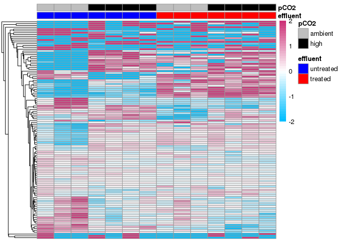
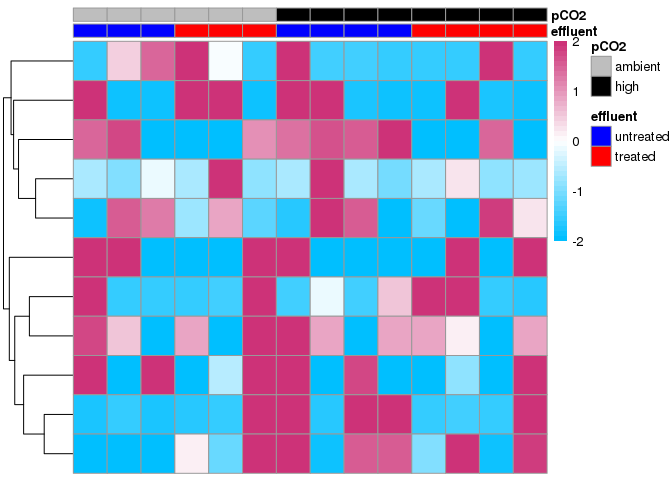
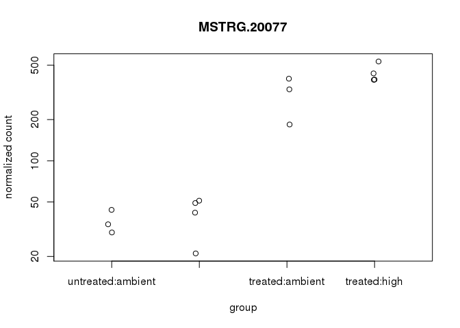
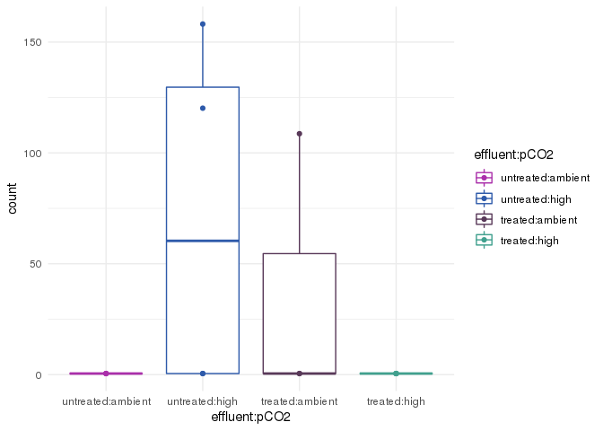
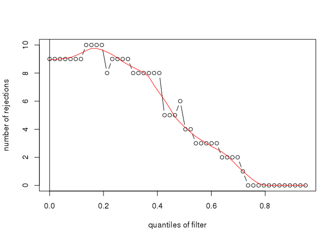

CASE-DESeq2-2
================
Maggie Schedl
4/13/2020

``` r
library(DESeq2)
```

    ## Loading required package: S4Vectors

    ## Loading required package: stats4

    ## Loading required package: BiocGenerics

    ## Loading required package: parallel

    ## 
    ## Attaching package: 'BiocGenerics'

    ## The following objects are masked from 'package:parallel':
    ## 
    ##     clusterApply, clusterApplyLB, clusterCall, clusterEvalQ,
    ##     clusterExport, clusterMap, parApply, parCapply, parLapply,
    ##     parLapplyLB, parRapply, parSapply, parSapplyLB

    ## The following objects are masked from 'package:stats':
    ## 
    ##     IQR, mad, sd, var, xtabs

    ## The following objects are masked from 'package:base':
    ## 
    ##     anyDuplicated, append, as.data.frame, basename, cbind, colnames,
    ##     dirname, do.call, duplicated, eval, evalq, Filter, Find, get, grep,
    ##     grepl, intersect, is.unsorted, lapply, Map, mapply, match, mget,
    ##     order, paste, pmax, pmax.int, pmin, pmin.int, Position, rank,
    ##     rbind, Reduce, rownames, sapply, setdiff, sort, table, tapply,
    ##     union, unique, unsplit, which, which.max, which.min

    ## 
    ## Attaching package: 'S4Vectors'

    ## The following object is masked from 'package:base':
    ## 
    ##     expand.grid

    ## Loading required package: IRanges

    ## Loading required package: GenomicRanges

    ## Loading required package: GenomeInfoDb

    ## Loading required package: SummarizedExperiment

    ## Loading required package: Biobase

    ## Welcome to Bioconductor
    ## 
    ##     Vignettes contain introductory material; view with
    ##     'browseVignettes()'. To cite Bioconductor, see
    ##     'citation("Biobase")', and for packages 'citation("pkgname")'.

    ## Loading required package: DelayedArray

    ## Loading required package: matrixStats

    ## 
    ## Attaching package: 'matrixStats'

    ## The following objects are masked from 'package:Biobase':
    ## 
    ##     anyMissing, rowMedians

    ## Loading required package: BiocParallel

    ## 
    ## Attaching package: 'DelayedArray'

    ## The following objects are masked from 'package:matrixStats':
    ## 
    ##     colMaxs, colMins, colRanges, rowMaxs, rowMins, rowRanges

    ## The following objects are masked from 'package:base':
    ## 
    ##     aperm, apply, rowsum

``` r
library(data.table)
```

    ## 
    ## Attaching package: 'data.table'

    ## The following object is masked from 'package:SummarizedExperiment':
    ## 
    ##     shift

    ## The following object is masked from 'package:GenomicRanges':
    ## 
    ##     shift

    ## The following object is masked from 'package:IRanges':
    ## 
    ##     shift

    ## The following objects are masked from 'package:S4Vectors':
    ## 
    ##     first, second

``` r
library(dplyr)
```

    ## 
    ## Attaching package: 'dplyr'

    ## The following objects are masked from 'package:data.table':
    ## 
    ##     between, first, last

    ## The following object is masked from 'package:matrixStats':
    ## 
    ##     count

    ## The following object is masked from 'package:Biobase':
    ## 
    ##     combine

    ## The following objects are masked from 'package:GenomicRanges':
    ## 
    ##     intersect, setdiff, union

    ## The following object is masked from 'package:GenomeInfoDb':
    ## 
    ##     intersect

    ## The following objects are masked from 'package:IRanges':
    ## 
    ##     collapse, desc, intersect, setdiff, slice, union

    ## The following objects are masked from 'package:S4Vectors':
    ## 
    ##     first, intersect, rename, setdiff, setequal, union

    ## The following objects are masked from 'package:BiocGenerics':
    ## 
    ##     combine, intersect, setdiff, union

    ## The following objects are masked from 'package:stats':
    ## 
    ##     filter, lag

    ## The following objects are masked from 'package:base':
    ## 
    ##     intersect, setdiff, setequal, union

``` r
library(tidyr)
```

    ## 
    ## Attaching package: 'tidyr'

    ## The following object is masked from 'package:S4Vectors':
    ## 
    ##     expand

``` r
library(reshape2)
```

    ## 
    ## Attaching package: 'reshape2'

    ## The following object is masked from 'package:tidyr':
    ## 
    ##     smiths

    ## The following objects are masked from 'package:data.table':
    ## 
    ##     dcast, melt

``` r
library(apeglm)
library(ggplot2)
library(vsn)
library(pheatmap)
library(RColorBrewer)
library(genefilter)
```

    ## 
    ## Attaching package: 'genefilter'

    ## The following objects are masked from 'package:matrixStats':
    ## 
    ##     rowSds, rowVars

``` r
library(rsconnect)
library(gplots)
```

    ## 
    ## Attaching package: 'gplots'

    ## The following object is masked from 'package:IRanges':
    ## 
    ##     space

    ## The following object is masked from 'package:S4Vectors':
    ## 
    ##     space

    ## The following object is masked from 'package:stats':
    ## 
    ##     lowess

``` r
library(ashr)
library(limma)
```

    ## 
    ## Attaching package: 'limma'

    ## The following object is masked from 'package:DESeq2':
    ## 
    ##     plotMA

    ## The following object is masked from 'package:BiocGenerics':
    ## 
    ##     plotMA

``` r
getwd()
```

    ## [1] "/home/mschedl/Working-CASE-RNA/histat/stringtie/restring"

``` r
#DIFFERENT SAMPLE INFO
Sample_info <- read.csv("sample_info.csv", header=TRUE, sep=",")
print(Sample_info)
```

    ##      sample treatment library extraction effluent    pCO2
    ## 1  CASE_J03      CASE   three        two     high    high
    ## 2  CASE_J09      CASE    four        two     high    high
    ## 3  CASE_J12      CASE     two      three     high    high
    ## 4  CASE_J13      CASE     two      three     high    high
    ## 5    CA_J06        CA   three        two  ambient    high
    ## 6    CA_J08        CA     one        two  ambient    high
    ## 7    CA_J11        CA    four      three  ambient    high
    ## 8    CA_J18        CA     two      three  ambient    high
    ## 9   CON_J02       CON   three        one  ambient ambient
    ## 10  CON_J05       CON     one        two  ambient ambient
    ## 11  CON_J10       CON    four        two  ambient ambient
    ## 12   SE_J01        SE     one        one     high ambient
    ## 13   SE_J04        SE    four      three     high ambient
    ## 14   SE_J07        SE   three        two     high ambient

``` r
#load in the transcript counts file, and set the row names as the transcript ID
CASE_GeneCountData <- as.data.frame(read.csv("gene_count_matrix.csv", row.names="gene_id"))
head(CASE_GeneCountData,10)
```

    ##             CASE_J03 CASE_J09 CASE_J12 CASE_J13 CA_J06 CA_J08 CA_J11 CA_J18
    ## gene26973          0        0        0        0      0      0      0      0
    ## gene33417          0        0        0        0      0      0      0      0
    ## gene33416          0        0        0        3      0      0      0      0
    ## MSTRG.10383      198      306      198      235    190    133    180    176
    ## MSTRG.28362       18        7       18       18      3      4     11     30
    ## MSTRG.10380        5       14        9       19      6     23     12      7
    ## MSTRG.32256        4        4        4        8     15      0     10      7
    ## MSTRG.18313       92      169      165      206    120    129    134    236
    ## MSTRG.10381      143      146       90      124     65     42     60     91
    ## MSTRG.19848       42       74       21       55     51     32     29     59
    ##             CON_J02 CON_J05 CON_J10 SE_J01 SE_J04 SE_J07
    ## gene26973         0       0       4      0      0      0
    ## gene33417         0       0       0      0      0      0
    ## gene33416         0       0       0      0      0     13
    ## MSTRG.10383     131     139     276    179    104    259
    ## MSTRG.28362      16       7       8     13      5      2
    ## MSTRG.10380      26       5       3     11      2     47
    ## MSTRG.32256       5       5       0      7     14      5
    ## MSTRG.18313     226     340     374    159     86    313
    ## MSTRG.10381      69      76     109     45     63     46
    ## MSTRG.19848      49      24      24     33     18     45

``` r
###filtering values for PoverA
#set filter values for PoverA, P percent of the samples have counts over A
filt <- filterfun(pOverA(0.214,5))

#create filter for the counts data
tfil <- genefilter(CASE_GeneCountData, filt)

#identify transcripts to keep by count filter
keep <- CASE_GeneCountData[tfil,]

#identify transcript list
gn.keep <- rownames(keep)

#data filtered in PoverA, P percent of the samples have counts over A
CASE_GeneCountData_Filt <- as.data.frame(CASE_GeneCountData[which(rownames(CASE_GeneCountData) %in% gn.keep),])
#write.csv(counts.5x, file="filtered_counts.csv")
head(CASE_GeneCountData_Filt,10)
```

    ##             CASE_J03 CASE_J09 CASE_J12 CASE_J13 CA_J06 CA_J08 CA_J11 CA_J18
    ## MSTRG.10383      198      306      198      235    190    133    180    176
    ## MSTRG.28362       18        7       18       18      3      4     11     30
    ## MSTRG.10380        5       14        9       19      6     23     12      7
    ## MSTRG.32256        4        4        4        8     15      0     10      7
    ## MSTRG.18313       92      169      165      206    120    129    134    236
    ## MSTRG.10381      143      146       90      124     65     42     60     91
    ## MSTRG.19848       42       74       21       55     51     32     29     59
    ## MSTRG.19849       50       38       37       75     21     33     43     52
    ## MSTRG.19846       26       94       79       78     44     59     31     59
    ## MSTRG.19847       12       27        4       11     26     11      3      2
    ##             CON_J02 CON_J05 CON_J10 SE_J01 SE_J04 SE_J07
    ## MSTRG.10383     131     139     276    179    104    259
    ## MSTRG.28362      16       7       8     13      5      2
    ## MSTRG.10380      26       5       3     11      2     47
    ## MSTRG.32256       5       5       0      7     14      5
    ## MSTRG.18313     226     340     374    159     86    313
    ## MSTRG.10381      69      76     109     45     63     46
    ## MSTRG.19848      49      24      24     33     18     45
    ## MSTRG.19849      49      30      60     37     50     39
    ## MSTRG.19846      80      22      12     46     30     79
    ## MSTRG.19847       0       3       0      4      5      7

``` r
rownames(Sample_info) <- Sample_info$sample
colnames(CASE_GeneCountData_Filt) <- Sample_info$sample
head(Sample_info)
```

    ##            sample treatment library extraction effluent pCO2
    ## CASE_J03 CASE_J03      CASE   three        two     high high
    ## CASE_J09 CASE_J09      CASE    four        two     high high
    ## CASE_J12 CASE_J12      CASE     two      three     high high
    ## CASE_J13 CASE_J13      CASE     two      three     high high
    ## CA_J06     CA_J06        CA   three        two  ambient high
    ## CA_J08     CA_J08        CA     one        two  ambient high

``` r
head(CASE_GeneCountData_Filt)
```

    ##             CASE_J03 CASE_J09 CASE_J12 CASE_J13 CA_J06 CA_J08 CA_J11 CA_J18
    ## MSTRG.10383      198      306      198      235    190    133    180    176
    ## MSTRG.28362       18        7       18       18      3      4     11     30
    ## MSTRG.10380        5       14        9       19      6     23     12      7
    ## MSTRG.32256        4        4        4        8     15      0     10      7
    ## MSTRG.18313       92      169      165      206    120    129    134    236
    ## MSTRG.10381      143      146       90      124     65     42     60     91
    ##             CON_J02 CON_J05 CON_J10 SE_J01 SE_J04 SE_J07
    ## MSTRG.10383     131     139     276    179    104    259
    ## MSTRG.28362      16       7       8     13      5      2
    ## MSTRG.10380      26       5       3     11      2     47
    ## MSTRG.32256       5       5       0      7     14      5
    ## MSTRG.18313     226     340     374    159     86    313
    ## MSTRG.10381      69      76     109     45     63     46

``` r
#The row and column names for the two data frames need to be exactly the same for the rest of the analysis, so it is good to check
all(rownames(Sample_info) %in% colnames(CASE_GeneCountData_Filt))  #Should return TRUE
```

    ## [1] TRUE

``` r
all(rownames(Sample_info) == colnames(CASE_GeneCountData_Filt))    # should return TRUE
```

    ## [1] TRUE

``` r
# Sample_info$group <- factor(paste0(Sample_info$effluent, Sample_info$pCO2)) #merge condition and time into group

Sample_info$effluent = factor(x = Sample_info$effluent,levels = c('ambient','high'))
Sample_info$pCO2 = factor(x = Sample_info$pCO2,levels = c('ambient','high'))

#Make matrix, there are multiple ways to make the matrix, but because I already start from a matrix I used DESeqDataSetFromMatrix
CASE_deseq_Matrix <- DESeqDataSetFromMatrix(countData = CASE_GeneCountData_Filt,
                              colData = Sample_info,
                              design = ~ effluent + pCO2 + effluent:pCO2 ) # column name of the treatment information as teh design 
CASE_deseq_Matrix
```

    ## class: DESeqDataSet 
    ## dim: 34582 14 
    ## metadata(1): version
    ## assays(1): counts
    ## rownames(34582): MSTRG.10383 MSTRG.28362 ... gene6081 MSTRG.10385
    ## rowData names(0):
    ## colnames(14): CASE_J03 CASE_J09 ... SE_J04 SE_J07
    ## colData names(6): sample treatment ... effluent pCO2

``` r
#extra filtering of low counts?
keep <- rowSums(counts(CASE_deseq_Matrix)) >= 10
CASE_deseq_Matrix <- CASE_deseq_Matrix[keep,]

CASE_deseq_Matrix # not any different
```

    ## class: DESeqDataSet 
    ## dim: 34582 14 
    ## metadata(1): version
    ## assays(1): counts
    ## rownames(34582): MSTRG.10383 MSTRG.28362 ... gene6081 MSTRG.10385
    ## rowData names(0):
    ## colnames(14): CASE_J03 CASE_J09 ... SE_J04 SE_J07
    ## colData names(6): sample treatment ... effluent pCO2

``` r
CASE_dds_2 <- DESeq(CASE_deseq_Matrix)
```

    ## estimating size factors

    ## estimating dispersions

    ## gene-wise dispersion estimates

    ## mean-dispersion relationship

    ## final dispersion estimates

    ## fitting model and testing

``` r
resultsNames(CASE_dds_2)
```

    ## [1] "Intercept"                "effluent_high_vs_ambient"
    ## [3] "pCO2_high_vs_ambient"     "effluenthigh.pCO2high"

``` r
full_results <- results(CASE_dds_2, alpha=0.1)
effluent_ambient <- results(CASE_dds_2, alpha=0.1, name = "effluent_high_vs_ambient")
pCO2_ambient <- results(CASE_dds_2, alpha=0.1, name = "pCO2_high_vs_ambient")
effluent_pCO2_interact <- results(CASE_dds_2, alpha=0.1, name = "effluenthigh.pCO2high")
```

``` r
summary(full_results)
```

    ## 
    ## out of 34582 with nonzero total read count
    ## adjusted p-value < 0.1
    ## LFC > 0 (up)       : 8, 0.023%
    ## LFC < 0 (down)     : 4, 0.012%
    ## outliers [1]       : 31, 0.09%
    ## low counts [2]     : 3349, 9.7%
    ## (mean count < 7)
    ## [1] see 'cooksCutoff' argument of ?results
    ## [2] see 'independentFiltering' argument of ?results

``` r
summary(effluent_ambient)
```

    ## 
    ## out of 34582 with nonzero total read count
    ## adjusted p-value < 0.1
    ## LFC > 0 (up)       : 34, 0.098%
    ## LFC < 0 (down)     : 47, 0.14%
    ## outliers [1]       : 31, 0.09%
    ## low counts [2]     : 3349, 9.7%
    ## (mean count < 7)
    ## [1] see 'cooksCutoff' argument of ?results
    ## [2] see 'independentFiltering' argument of ?results

``` r
summary(pCO2_ambient)
```

    ## 
    ## out of 34582 with nonzero total read count
    ## adjusted p-value < 0.1
    ## LFC > 0 (up)       : 27, 0.078%
    ## LFC < 0 (down)     : 74, 0.21%
    ## outliers [1]       : 31, 0.09%
    ## low counts [2]     : 0, 0%
    ## (mean count < 1)
    ## [1] see 'cooksCutoff' argument of ?results
    ## [2] see 'independentFiltering' argument of ?results

``` r
summary(effluent_pCO2_interact)
```

    ## 
    ## out of 34582 with nonzero total read count
    ## adjusted p-value < 0.1
    ## LFC > 0 (up)       : 8, 0.023%
    ## LFC < 0 (down)     : 4, 0.012%
    ## outliers [1]       : 31, 0.09%
    ## low counts [2]     : 3349, 9.7%
    ## (mean count < 7)
    ## [1] see 'cooksCutoff' argument of ?results
    ## [2] see 'independentFiltering' argument of ?results

what do those low counts mean?

what if independent filtering is off?

``` r
full_results <- results(CASE_dds_2, alpha=0.1)
effluent_ambient2 <- results(CASE_dds_2, alpha=0.1, independentFiltering = FALSE, name = "effluent_high_vs_ambient")
pCO2_ambient2 <- results(CASE_dds_2, alpha=0.1, independentFiltering = FALSE, name = "pCO2_high_vs_ambient")
effluent_pCO2_interact2 <- results(CASE_dds_2, alpha=0.1, independentFiltering = FALSE, name = "effluenthigh.pCO2high")

summary(effluent_ambient2)
```

    ## 
    ## out of 34582 with nonzero total read count
    ## adjusted p-value < 0.1
    ## LFC > 0 (up)       : 31, 0.09%
    ## LFC < 0 (down)     : 42, 0.12%
    ## outliers [1]       : 31, 0.09%
    ## low counts [2]     : 0, 0%
    ## (mean count < 0)
    ## [1] see 'cooksCutoff' argument of ?results
    ## [2] see 'independentFiltering' argument of ?results

``` r
summary(pCO2_ambient2)
```

    ## 
    ## out of 34582 with nonzero total read count
    ## adjusted p-value < 0.1
    ## LFC > 0 (up)       : 27, 0.078%
    ## LFC < 0 (down)     : 74, 0.21%
    ## outliers [1]       : 31, 0.09%
    ## low counts [2]     : 0, 0%
    ## (mean count < 0)
    ## [1] see 'cooksCutoff' argument of ?results
    ## [2] see 'independentFiltering' argument of ?results

``` r
summary(effluent_pCO2_interact2)
```

    ## 
    ## out of 34582 with nonzero total read count
    ## adjusted p-value < 0.1
    ## LFC > 0 (up)       : 7, 0.02%
    ## LFC < 0 (down)     : 4, 0.012%
    ## outliers [1]       : 31, 0.09%
    ## low counts [2]     : 0, 0%
    ## (mean count < 0)
    ## [1] see 'cooksCutoff' argument of ?results
    ## [2] see 'independentFiltering' argument of ?results

``` r
sig_effluent <- subset(effluent_ambient, padj<0.1) #identify signficant pvalues 
sig_pCO2 <- subset(pCO2_ambient, padj<0.1)
sig_interact <- subset(effluent_pCO2_interact, padj<0.1)

#combine all DEGs
combine <- rbind(sig_effluent, sig_pCO2, sig_interact)
combine_list <- CASE_deseq_Matrix[which(rownames(CASE_deseq_Matrix) %in% rownames(combine)),] #combined list from the original matrix so dupicates are removed 
combine_rlog <- rlog(combine_list, blind=FALSE)
```

``` r
plotPCA(combine_rlog, intgroup=c("effluent", "pCO2")) # same PCA as below but less pretty, use this for knowing the PC loadings for the labels in the below PCA
```


``` r
pcaData <- plotPCA(combine_rlog, intgroup=c("effluent", "pCO2"), returnData=TRUE)
percentVar <- round(100 * attr(pcaData, "percentVar"))
ggplot(pcaData, aes(PC1, PC2, color=effluent:pCO2)) +
  geom_point(size=3) +
  coord_fixed() + ylab("PC2: 16% Variance Explained") +
  xlab("PC1: 34% Variance Explained") +
  theme_linedraw() + scale_color_manual(values = c("ambient:ambient" = "#aa2faa", "ambient:high" = "#2e5aaa", "high:ambient" = "#593959", "high:high" = "#41a08e"))
```

 this is really nice clustering

``` r
sig.num <- sum(combine$padj <0.1, na.rm=T) 
topVarGenes <- head(order(rowVars(assay(combine_rlog)),decreasing=TRUE),sig.num) #sort by decreasing sig
mat <- assay(combine_rlog)[ topVarGenes, ] #make an expression object
mat <- mat - rowMeans(mat) #difference in expression compared to average across all samples
col.order <- c("CASE_J03", "CASE_J09", "CASE_J12", "CASE_J13", "CA_J06",   "CA_J08",   "CA_J11",   "CA_J18",   "CON_J02",  "CON_J05" , "CON_J10" , "SE_J01" ,  "SE_J04",   "SE_J07")
mat <- mat[,col.order]
df1 <- as.data.frame(colData(combine_rlog)[c("effluent", "pCO2")]) #make dataframe for column naming 


colfunc <- colorRampPalette(c("deepskyblue", "white", "violetred3")) #make function for the color gradient 
ann_colors <- list(effluent = c(ambient="blue", high="red"), pCO2 = c(ambient= "gray", high= "black"))
breakss <- c(-2, -1.9, -1.8, -1.7, -1.6, -1.5, -1.4, -1.3, -1.2, -1.1, -1, -.9, -.8, -.7, -.6, -.5, -.4, -.3, -.2, -.1, 0, .1, .2, .3, .4, .5, .6, .7, .8, .9, 1, 1.1, 1.2, 1.3, 1.4, 1.5, 1.6, 1.7, 1.8, 1.9, 2) #this looks very extra but this is how the colors in the heatmap were broken up 
pheatmap(mat, annotation_col=df1, annotation_colors=ann_colors, clustering_method = "average", 
         clustering_distance_rows="euclidean", show_rownames =FALSE, cluster_cols=T,
         show_colnames =F, breaks= breakss, color = colfunc(40)) 
```

 These actually cluster out by treatment?!?!

``` r
sig_effluen_num <- sum(effluent_ambient$padj <0.1, na.rm=T) #I don't know why you need this
ef_list <- CASE_deseq_Matrix[which(rownames(CASE_deseq_Matrix) %in% rownames(effluent_ambient)),]
r_ef_list <- rlog(ef_list, blind = FALSE)
topVarGenes <- head(order(rowVars(assay(r_ef_list)),decreasing=TRUE),sig_effluen_num) #can choose a subset of transcripts for viewing
mat <- assay(r_ef_list)[ topVarGenes, ] #make an expression object
mat <- mat - rowMeans(mat) #difference in expression compared to average across all samples
col.order <- c("CASE_J03", "CASE_J09", "CASE_J12", "CASE_J13", "CA_J06",   "CA_J08",   "CA_J11",   "CA_J18",   "CON_J02",  "CON_J05" , "CON_J10" , "SE_J01" ,  "SE_J04",   "SE_J07")
mat <- mat[,col.order]
df <- as.data.frame(colData(r_ef_list)[,c("effluent", "pCO2")]) #make dataframe
colfunc <- colorRampPalette(c("deepskyblue", "white", "violetred3")) #make function for the color gradient 
ann_colors <- list(effluent = c(ambient="blue", high="red"), pCO2 = c(ambient= "gray", high= "black"))
breakss <- c(-2, -1.9, -1.8, -1.7, -1.6, -1.5, -1.4, -1.3, -1.2, -1.1, -1, -.9, -.8, -.7, -.6, -.5, -.4, -.3, -.2, -.1, 0, .1, .2, .3, .4, .5, .6, .7, .8, .9, 1, 1.1, 1.2, 1.3, 1.4, 1.5, 1.6, 1.7, 1.8, 1.9, 2) #this looks very extra but this is how the colors in the heatmap were broken up 
pheatmap(mat, annotation_col=df1, annotation_colors=ann_colors, clustering_method = "average", 
         clustering_distance_rows="euclidean", show_rownames =FALSE, cluster_cols=T,
         show_colnames =F, breaks= breakss, color = colfunc(40)) 
```

 these don't. why??

Well, this is still right

``` r
#Shared MSTRG.20077 both very significantly upregulated in CASE and SE, gene21544, translates to steroid 17-alpha-hydroxylase/17,20 lyase-like (LOC111135334)

plotCounts(CASE_dds_2,"MSTRG.20077", intgroup=c("effluent", "pCO2"))
```


``` r
MSTRG_20077 <- plotCounts(CASE_dds_2,"MSTRG.20077", intgroup=c("effluent", "pCO2"), returnData=TRUE)
ggplot(MSTRG_20077, aes(x=effluent:pCO2, y=count, color=effluent:pCO2)) + geom_boxplot() +
  geom_point() + ylab("Normalized Counts") + xlab("Treatment") + ggtitle("steroid 17-alpha-hydroxylase/17,20 lyase-like (LOC111135334)") + scale_color_manual(values = c("ambient:ambient" = "#aa2faa", "ambient:high" = "#2e5aaa", "high:ambient" = "#593959", "high:high" = "#41a08e"))+ theme(legend.position = "none") + theme_minimal()
```


``` r
sigpCO2genes <- row.names(sig_pCO2) #just gets the names of the genes, which is all that is needed to compare
siginteract_genes <- row.names(sig_interact)
sigeff_genes <- row.names(sig_effluent)

comb3 <- c(sigpCO2genes, siginteract_genes, sigeff_genes) #combine the list

comb3_list <- CASE_deseq_Matrix[which(rownames(CASE_deseq_Matrix) %in% comb3),] #gets rid of any duplicates 

comb3_row <- row.names(comb3_list) #make just the names of the genes again

# Comparing each individual list with the combined list
sigpCO2_genes.2 <- comb3_row %in% sigpCO2genes
siginteract_genes.2 <- comb3_row %in% siginteract_genes 
sigeff_genes.2 <- comb3_row %in% sigeff_genes


# Generating venn counts to plot venn diagram
counts3 <- cbind(sigpCO2_genes.2, sigeff_genes.2, siginteract_genes.2)
ven3 <- vennCounts(counts3)
vennDiagram(ven3, cex = 1,names = c("pCO2", "effluent", "interaction"), circle.col = c("#2e5eaa", "#593959", "#40a08e"))
```



``` r
metadata(effluent_pCO2_interact)$alpha
```

    ## [1] 0.1

``` r
metadata(effluent_pCO2_interact)$filterThreshold
```

    ## 9.693878% 
    ##  6.959244

``` r
plot(metadata(effluent_pCO2_interact)$filterNumRej, 
     type="b", ylab="number of rejections",
     xlab="quantiles of filter")
lines(metadata(effluent_pCO2_interact)$lo.fit, col="red")
abline(v=metadata(effluent_pCO2_interact)$filterTheta)
```



``` r
W <- effluent_pCO2_interact$stat
maxCooks <- apply(assays(CASE_dds_2)[["cooks"]],1,max)
idx <- !is.na(W)
plot(rank(W[idx]), maxCooks[idx], xlab="rank of Wald statistic", 
     ylab="maximum Cook's distance per gene",
     ylim=c(0,5), cex=.4, col=rgb(0,0,0,.3))
m <- ncol(CASE_dds_2)
p <- 3
abline(h=qf(.99, p, m - p))
```


``` r
rlog <- rlog(CASE_dds_2, blind = FALSE)
plotPCA(rlog, intgroup=c("effluent", "pCO2"))
```



``` r
vst <- vst(CASE_dds_2, blind = FALSE)
plotPCA(vst, intgroup=c("effluent", "pCO2"))
```


