DESeq2-CASE-RNA
================
Maggie Schedl
6/21/2019

Install Packages

``` r
if (!requireNamespace("BiocManager", quietly = TRUE))
    install.packages("BiocManager")

BiocManager::install("DESeq2")
```

    ## Bioconductor version 3.8 (BiocManager 1.30.4), R 3.5.1 (2018-07-02)

    ## Installing package(s) 'DESeq2'

    ## installation path not writeable, unable to update packages: bigreadr,
    ##   cluster, ellipsis, mvtnorm, segmented

Load Libraries Needed

``` r
library(DESeq2)
```

    ## Loading required package: S4Vectors

    ## Loading required package: stats4

    ## Loading required package: BiocGenerics

    ## Loading required package: parallel

    ## 
    ## Attaching package: 'BiocGenerics'

    ## The following objects are masked from 'package:parallel':
    ## 
    ##     clusterApply, clusterApplyLB, clusterCall, clusterEvalQ,
    ##     clusterExport, clusterMap, parApply, parCapply, parLapply,
    ##     parLapplyLB, parRapply, parSapply, parSapplyLB

    ## The following objects are masked from 'package:stats':
    ## 
    ##     IQR, mad, sd, var, xtabs

    ## The following objects are masked from 'package:base':
    ## 
    ##     anyDuplicated, append, as.data.frame, basename, cbind,
    ##     colMeans, colnames, colSums, dirname, do.call, duplicated,
    ##     eval, evalq, Filter, Find, get, grep, grepl, intersect,
    ##     is.unsorted, lapply, lengths, Map, mapply, match, mget, order,
    ##     paste, pmax, pmax.int, pmin, pmin.int, Position, rank, rbind,
    ##     Reduce, rowMeans, rownames, rowSums, sapply, setdiff, sort,
    ##     table, tapply, union, unique, unsplit, which, which.max,
    ##     which.min

    ## 
    ## Attaching package: 'S4Vectors'

    ## The following object is masked from 'package:base':
    ## 
    ##     expand.grid

    ## Loading required package: IRanges

    ## Loading required package: GenomicRanges

    ## Loading required package: GenomeInfoDb

    ## Loading required package: SummarizedExperiment

    ## Loading required package: Biobase

    ## Welcome to Bioconductor
    ## 
    ##     Vignettes contain introductory material; view with
    ##     'browseVignettes()'. To cite Bioconductor, see
    ##     'citation("Biobase")', and for packages 'citation("pkgname")'.

    ## Loading required package: DelayedArray

    ## Loading required package: matrixStats

    ## 
    ## Attaching package: 'matrixStats'

    ## The following objects are masked from 'package:Biobase':
    ## 
    ##     anyMissing, rowMedians

    ## Loading required package: BiocParallel

    ## 
    ## Attaching package: 'DelayedArray'

    ## The following objects are masked from 'package:matrixStats':
    ## 
    ##     colMaxs, colMins, colRanges, rowMaxs, rowMins, rowRanges

    ## The following objects are masked from 'package:base':
    ## 
    ##     aperm, apply

``` r
library(data.table)
```

    ## 
    ## Attaching package: 'data.table'

    ## The following object is masked from 'package:SummarizedExperiment':
    ## 
    ##     shift

    ## The following object is masked from 'package:GenomicRanges':
    ## 
    ##     shift

    ## The following object is masked from 'package:IRanges':
    ## 
    ##     shift

    ## The following objects are masked from 'package:S4Vectors':
    ## 
    ##     first, second

``` r
library(dplyr)
```

    ## 
    ## Attaching package: 'dplyr'

    ## The following objects are masked from 'package:data.table':
    ## 
    ##     between, first, last

    ## The following object is masked from 'package:matrixStats':
    ## 
    ##     count

    ## The following object is masked from 'package:Biobase':
    ## 
    ##     combine

    ## The following objects are masked from 'package:GenomicRanges':
    ## 
    ##     intersect, setdiff, union

    ## The following object is masked from 'package:GenomeInfoDb':
    ## 
    ##     intersect

    ## The following objects are masked from 'package:IRanges':
    ## 
    ##     collapse, desc, intersect, setdiff, slice, union

    ## The following objects are masked from 'package:S4Vectors':
    ## 
    ##     first, intersect, rename, setdiff, setequal, union

    ## The following objects are masked from 'package:BiocGenerics':
    ## 
    ##     combine, intersect, setdiff, union

    ## The following objects are masked from 'package:stats':
    ## 
    ##     filter, lag

    ## The following objects are masked from 'package:base':
    ## 
    ##     intersect, setdiff, setequal, union

``` r
library(tidyr)
```

    ## 
    ## Attaching package: 'tidyr'

    ## The following object is masked from 'package:S4Vectors':
    ## 
    ##     expand

``` r
library(reshape2)
```

    ## 
    ## Attaching package: 'reshape2'

    ## The following object is masked from 'package:tidyr':
    ## 
    ##     smiths

    ## The following objects are masked from 'package:data.table':
    ## 
    ##     dcast, melt

``` r
library(apeglm)
library(ggplot2)
library(vsn)
library(pheatmap)
library(RColorBrewer)
library(genefilter)
```

    ## 
    ## Attaching package: 'genefilter'

    ## The following objects are masked from 'package:matrixStats':
    ## 
    ##     rowSds, rowVars

``` r
library(rsconnect)
library(gplots)
```

    ## 
    ## Attaching package: 'gplots'

    ## The following object is masked from 'package:IRanges':
    ## 
    ##     space

    ## The following object is masked from 'package:S4Vectors':
    ## 
    ##     space

    ## The following object is masked from 'package:stats':
    ## 
    ##     lowess

``` r
library(ashr)
library(limma)
```

    ## 
    ## Attaching package: 'limma'

    ## The following object is masked from 'package:DESeq2':
    ## 
    ##     plotMA

    ## The following object is masked from 'package:BiocGenerics':
    ## 
    ##     plotMA

Bring in the csv files of gene counts (from the prepDE.py script) and the metadata table. I then did a preliminary filtering of the counts with P over A, Meaning that I wanted to remove all rows that have less than 21.4% of the samples with less than 5 counts. 21.4% was chosen because that is 3/14, or the minimum ratio of samples per one treatment.

``` r
#load in the treatment, library, and extraction data
CASE_treatment <- read.csv("treatment_data.csv", header=TRUE, sep=",")
print(CASE_treatment)
```

    ##      sample treatment library extraction
    ## 1  CASE_J03      CASE   three        two
    ## 2  CASE_J09      CASE    four        two
    ## 3  CASE_J12      CASE     two      three
    ## 4  CASE_J13      CASE     two      three
    ## 5    CA_J06        CA   three        two
    ## 6    CA_J08        CA     one        two
    ## 7    CA_J11        CA    four      three
    ## 8    CA_J18        CA     two      three
    ## 9   CON_J02       CON   three        one
    ## 10  CON_J05       CON     one        two
    ## 11  CON_J10       CON    four        two
    ## 12   SE_J01        SE     one        one
    ## 13   SE_J04        SE    four      three
    ## 14   SE_J07        SE   three        two

``` r
#load in the transcript counts file, and set the row names as the transcript ID
CASE_GeneCountData <- as.data.frame(read.csv("gene_count_matrix.csv", row.names="gene_id"))
head(CASE_GeneCountData,10)
```

    ##             CASE_J03 CASE_J09 CASE_J12 CASE_J13 CA_J06 CA_J08 CA_J11
    ## gene26973          0        0        0        0      0      0      0
    ## gene33417          0        0        0        0      0      0      0
    ## gene33416          0        0        0        3      0      0      0
    ## MSTRG.10383      198      306      198      235    190    133    180
    ## MSTRG.28362       18        7       18       18      3      4     11
    ## MSTRG.10380        5       14        9       19      6     23     12
    ## MSTRG.32256        4        4        4        8     15      0     10
    ## MSTRG.18313       92      169      165      206    120    129    134
    ## MSTRG.10381      143      146       90      124     65     42     60
    ## MSTRG.19848       42       74       21       55     51     32     29
    ##             CA_J18 CON_J02 CON_J05 CON_J10 SE_J01 SE_J04 SE_J07
    ## gene26973        0       0       0       4      0      0      0
    ## gene33417        0       0       0       0      0      0      0
    ## gene33416        0       0       0       0      0      0     13
    ## MSTRG.10383    176     131     139     276    179    104    259
    ## MSTRG.28362     30      16       7       8     13      5      2
    ## MSTRG.10380      7      26       5       3     11      2     47
    ## MSTRG.32256      7       5       5       0      7     14      5
    ## MSTRG.18313    236     226     340     374    159     86    313
    ## MSTRG.10381     91      69      76     109     45     63     46
    ## MSTRG.19848     59      49      24      24     33     18     45

``` r
###filtering values for PoverA
#set filter values for PoverA, P percent of the samples have counts over A
filt <- filterfun(pOverA(0.214,5))

#create filter for the counts data
tfil <- genefilter(CASE_GeneCountData, filt)

#identify transcripts to keep by count filter
keep <- CASE_GeneCountData[tfil,]

#identify transcript list
gn.keep <- rownames(keep)

#data filtered in PoverA, P percent of the samples have counts over A
CASE_GeneCountData_Filt <- as.data.frame(CASE_GeneCountData[which(rownames(CASE_GeneCountData) %in% gn.keep),])
#write.csv(counts.5x, file="filtered_counts.csv")
head(CASE_GeneCountData_Filt,10)
```

    ##             CASE_J03 CASE_J09 CASE_J12 CASE_J13 CA_J06 CA_J08 CA_J11
    ## MSTRG.10383      198      306      198      235    190    133    180
    ## MSTRG.28362       18        7       18       18      3      4     11
    ## MSTRG.10380        5       14        9       19      6     23     12
    ## MSTRG.32256        4        4        4        8     15      0     10
    ## MSTRG.18313       92      169      165      206    120    129    134
    ## MSTRG.10381      143      146       90      124     65     42     60
    ## MSTRG.19848       42       74       21       55     51     32     29
    ## MSTRG.19849       50       38       37       75     21     33     43
    ## MSTRG.19846       26       94       79       78     44     59     31
    ## MSTRG.19847       12       27        4       11     26     11      3
    ##             CA_J18 CON_J02 CON_J05 CON_J10 SE_J01 SE_J04 SE_J07
    ## MSTRG.10383    176     131     139     276    179    104    259
    ## MSTRG.28362     30      16       7       8     13      5      2
    ## MSTRG.10380      7      26       5       3     11      2     47
    ## MSTRG.32256      7       5       5       0      7     14      5
    ## MSTRG.18313    236     226     340     374    159     86    313
    ## MSTRG.10381     91      69      76     109     45     63     46
    ## MSTRG.19848     59      49      24      24     33     18     45
    ## MSTRG.19849     52      49      30      60     37     50     39
    ## MSTRG.19846     59      80      22      12     46     30     79
    ## MSTRG.19847      2       0       3       0      4      5      7

There are very specific row and column naming requirements for DESeq2, so this code makes sure that the column names of the gene count matrix match EXACTLY with the rows in the treatment data matrix.

Please look at the vignette for DESeq2 <http://bioconductor.org/packages/release/bioc/vignettes/DESeq2/inst/doc/DESeq2.html#multi-factor-designs> for more examples of most of this code.

``` r
rownames(CASE_treatment) <- CASE_treatment$sample
colnames(CASE_GeneCountData_Filt) <- CASE_treatment$sample
head(CASE_treatment)
```

    ##            sample treatment library extraction
    ## CASE_J03 CASE_J03      CASE   three        two
    ## CASE_J09 CASE_J09      CASE    four        two
    ## CASE_J12 CASE_J12      CASE     two      three
    ## CASE_J13 CASE_J13      CASE     two      three
    ## CA_J06     CA_J06        CA   three        two
    ## CA_J08     CA_J08        CA     one        two

``` r
head(CASE_GeneCountData_Filt)
```

    ##             CASE_J03 CASE_J09 CASE_J12 CASE_J13 CA_J06 CA_J08 CA_J11
    ## MSTRG.10383      198      306      198      235    190    133    180
    ## MSTRG.28362       18        7       18       18      3      4     11
    ## MSTRG.10380        5       14        9       19      6     23     12
    ## MSTRG.32256        4        4        4        8     15      0     10
    ## MSTRG.18313       92      169      165      206    120    129    134
    ## MSTRG.10381      143      146       90      124     65     42     60
    ##             CA_J18 CON_J02 CON_J05 CON_J10 SE_J01 SE_J04 SE_J07
    ## MSTRG.10383    176     131     139     276    179    104    259
    ## MSTRG.28362     30      16       7       8     13      5      2
    ## MSTRG.10380      7      26       5       3     11      2     47
    ## MSTRG.32256      7       5       5       0      7     14      5
    ## MSTRG.18313    236     226     340     374    159     86    313
    ## MSTRG.10381     91      69      76     109     45     63     46

``` r
write.csv(CASE_GeneCountData_Filt,"filtered_genecount.csv")
write.csv(CASE_treatment,"named_treatment.csv")

write.table(CASE_GeneCountData_Filt,"filtered_genecount.txt",quote=FALSE,col.names=TRUE,row.names=TRUE,sep="\t") #these were written out just in case they were needed for later
write.table(CASE_treatment,"named_treatment.txt",quote=FALSE,col.names=TRUE,row.names=TRUE,sep="\t")

#The row and column names for the two data frames need to be exactly the same for the rest of the analysis, so it is good to check
all(rownames(CASE_treatment) %in% colnames(CASE_GeneCountData_Filt))  #Should return TRUE
```

    ## [1] TRUE

``` r
all(rownames(CASE_treatment) == colnames(CASE_GeneCountData_Filt))    # should return TRUE
```

    ## [1] TRUE

Creating the DESeq2 matrix and determing the design. The first two sections of code make the matrix and level it for the different treatments. However, "Experiments with more than one factor influencing the counts can be analyzed using design formula that include the additional variables. We can account for the different types of sequencing, and get a clearer picture of the differences attributable to the treatment. As condition is the variable of interest, we put it at the end of the formula. Thus the results function will by default pull the condition results unless contrast or name arguments are specified." Generally, it was very hard to determine what the best model was for our data, and we compared a just ~treatment design to a ~extraction + treatment design. We also made a model that considered extraction effects as well, but ultimatly decided to go with the model that took into account only library and treatment as to not over or under perameterize.

``` r
#Make matrix, there are multiple ways to make the matrix, but because I already start from a matrix I used DESeqDataSetFromMatrix
CASE_deseq_Matrix <- DESeqDataSetFromMatrix(countData = CASE_GeneCountData_Filt,
                              colData = CASE_treatment,
                              design = ~ treatment ) # column name of the treatment information as teh design 
CASE_deseq_Matrix
```

    ## class: DESeqDataSet 
    ## dim: 34582 14 
    ## metadata(1): version
    ## assays(1): counts
    ## rownames(34582): MSTRG.10383 MSTRG.28362 ... gene6081 MSTRG.10385
    ## rowData names(0):
    ## colnames(14): CASE_J03 CASE_J09 ... SE_J04 SE_J07
    ## colData names(4): sample treatment library extraction

``` r
# Tell the matrix what the factors in the treatment variable are and level the matrix by the treatment
CASE_deseq_Matrix$treatment <- factor(CASE_deseq_Matrix$treatment, levels = c("CON","CA", "SE", "CASE"))
levels(CASE_deseq_Matrix$treatment)
```

    ## [1] "CON"  "CA"   "SE"   "CASE"

``` r
CASE_deseq_Matrix 
```

    ## class: DESeqDataSet 
    ## dim: 34582 14 
    ## metadata(1): version
    ## assays(1): counts
    ## rownames(34582): MSTRG.10383 MSTRG.28362 ... gene6081 MSTRG.10385
    ## rowData names(0):
    ## colnames(14): CASE_J03 CASE_J09 ... SE_J04 SE_J07
    ## colData names(4): sample treatment library extraction

``` r
#this is an unfactored design, which we ended up not going forward with analyzing, see further down in this script

# Manual says to copy the previous matrix and re-level it, but make sure treatment is the last variable in the design 
CASE_deseq_Matrix_Factors <- CASE_deseq_Matrix
CASE_deseq_Matrix_Factors$library <- factor(CASE_deseq_Matrix_Factors$library, levels = c("one","two", "three", "four"))
levels(CASE_deseq_Matrix_Factors$library) # change the levels to a different variable
```

    ## [1] "one"   "two"   "three" "four"

``` r
design(CASE_deseq_Matrix_Factors) <- formula(~ library + treatment) # remake design with library first
CASE_deseq_Matrix_Factors
```

    ## class: DESeqDataSet 
    ## dim: 34582 14 
    ## metadata(1): version
    ## assays(1): counts
    ## rownames(34582): MSTRG.10383 MSTRG.28362 ... gene6081 MSTRG.10385
    ## rowData names(0):
    ## colnames(14): CASE_J03 CASE_J09 ... SE_J04 SE_J07
    ## colData names(4): sample treatment library extraction

At first we ran DESeq2 on both matrixes

``` r
CASE_DDSeq_Factors <- DESeq(CASE_deseq_Matrix_Factors) #with library as factor
```

    ## estimating size factors

    ## estimating dispersions

    ## gene-wise dispersion estimates

    ## mean-dispersion relationship

    ## final dispersion estimates

    ## fitting model and testing

``` r
CASE_DDSeq <- DESeq(CASE_deseq_Matrix) #just treatment in model
```

    ## estimating size factors

    ## estimating dispersions

    ## gene-wise dispersion estimates

    ## mean-dispersion relationship

    ## final dispersion estimates

    ## fitting model and testing

To investigate the models, logfold shrinkage was viewed with MAplots "In DESeq2, the function plotMA shows the log2 fold changes attributable to a given variable over the mean of normalized counts for all the samples in the DESeqDataSet. Points will be colored red if the adjusted p value is less than 0.1. Points which fall out of the window are plotted as open triangles pointing either up or down." Using the ashr shrinkage option allows for specifying the contrasts in the results object.

``` r
FCASE <- lfcShrink(CASE_DDSeq_Factors, contrast =c("treatment","CASE","CON"), type="ashr")
```

    ## using 'ashr' for LFC shrinkage. If used in published research, please cite:
    ##     Stephens, M. (2016) False discovery rates: a new deal. Biostatistics, 18:2.
    ##     https://doi.org/10.1093/biostatistics/kxw041

``` r
CASE <- lfcShrink(CASE_DDSeq, contrast =c("treatment","CASE","CON"), type="ashr")
```

    ## using 'ashr' for LFC shrinkage. If used in published research, please cite:
    ##     Stephens, M. (2016) False discovery rates: a new deal. Biostatistics, 18:2.
    ##     https://doi.org/10.1093/biostatistics/kxw041

``` r
DESeq2::plotMA(FCASE, ylim=c(-5,5))
```

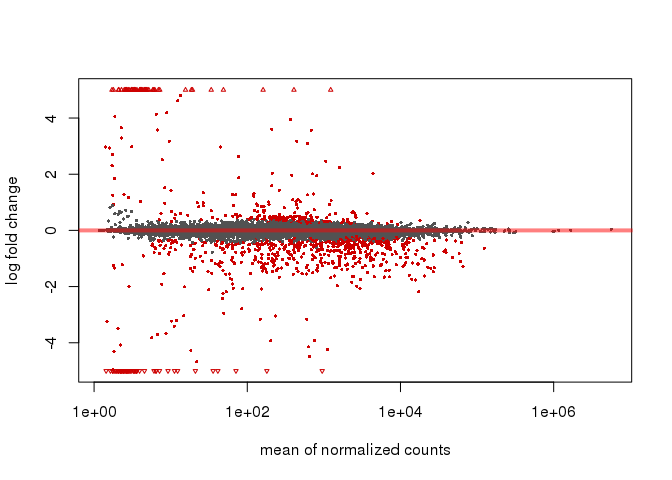

``` r
DESeq2::plotMA(CASE, ylim=c(-5,5))
```

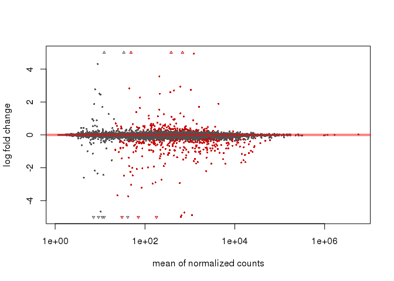

Ultimately we decided to go with the model made with the factored design. The results from the treatment-only design for CASE came up with a lot of "low count" values (seen in the grey points on the left side of the MAplot), but not any of the other comparisons.

Creating the results sets specifying the contrasts for the log2foldchanges and adjusted p values. We set the alpha value to be a more stringent 0.05. It is important to specify the correct order in the contrasts, with the name of the numerator level for the fold change, and the name of the denominator level for the fold change for the comparison. So control as the denominator.

``` r
#results with the library factor set
resultsNames(CASE_DDSeq_Factors)
```

    ## [1] "Intercept"             "library_two_vs_one"    "library_three_vs_one" 
    ## [4] "library_four_vs_one"   "treatment_CA_vs_CON"   "treatment_SE_vs_CON"  
    ## [7] "treatment_CASE_vs_CON"

``` r
results_CA_F <- results(CASE_DDSeq_Factors, alpha=0.05, contrast=c("treatment","CA","CON"))
results_SE_F <- results(CASE_DDSeq_Factors, alpha=0.05, contrast=c("treatment","SE","CON"))
results_CASE_F <- results(CASE_DDSeq_Factors, alpha=0.05, contrast=c("treatment","CASE","CON"))
```

Using the summary function will tell you how many are significantly up or down regulated

``` r
summary(results_CA_F) # 142 up, 349 down
```

    ## 
    ## out of 34582 with nonzero total read count
    ## adjusted p-value < 0.05
    ## LFC > 0 (up)       : 142, 0.41%
    ## LFC < 0 (down)     : 349, 1%
    ## outliers [1]       : 0, 0%
    ## low counts [2]     : 0, 0%
    ## (mean count < 1)
    ## [1] see 'cooksCutoff' argument of ?results
    ## [2] see 'independentFiltering' argument of ?results

``` r
summary(results_SE_F) # 142 up, 237 down
```

    ## 
    ## out of 34582 with nonzero total read count
    ## adjusted p-value < 0.05
    ## LFC > 0 (up)       : 142, 0.41%
    ## LFC < 0 (down)     : 237, 0.69%
    ## outliers [1]       : 0, 0%
    ## low counts [2]     : 0, 0%
    ## (mean count < 1)
    ## [1] see 'cooksCutoff' argument of ?results
    ## [2] see 'independentFiltering' argument of ?results

``` r
summary(results_CASE_F) # 162 up, 433 down
```

    ## 
    ## out of 34582 with nonzero total read count
    ## adjusted p-value < 0.05
    ## LFC > 0 (up)       : 162, 0.47%
    ## LFC < 0 (down)     : 433, 1.3%
    ## outliers [1]       : 0, 0%
    ## low counts [2]     : 0, 0%
    ## (mean count < 1)
    ## [1] see 'cooksCutoff' argument of ?results
    ## [2] see 'independentFiltering' argument of ?results

Then each results was subsetted to only be the significant DEGs and then ordered by adjusted p value (lowest one first)

``` r
sig_CA <- subset(results_CA_F, padj<0.05) #identify signficant pvalues with 5%FDR
sig_SE <- subset(results_SE_F, padj<0.05)
sig_CASE <- subset(results_CASE_F, padj<0.05)

#order by padj
ordered_sig_CA <-sig_CA[ order(sig_CA$padj ), ] 
ordered_sig_SE <-sig_SE[ order( sig_SE$padj ), ]
ordered_sig_CASE <-sig_CASE[ order( sig_CASE$padj ), ]

#these ordered lists were written to files for potential later use
write.table(ordered_sig_CA,"ordered_sig_CA.txt",quote=FALSE,col.names=TRUE,row.names=TRUE,sep="\t")
write.table(ordered_sig_SE,"ordered_sig_SE.txt",quote=FALSE,col.names=TRUE,row.names=TRUE,sep="\t")
write.table(ordered_sig_CASE,"ordered_sig_CASE.txt",quote=FALSE,col.names=TRUE,row.names=TRUE,sep="\t")
```

It isn't really clear how to do this, but for most of the analysis/visualization we wanted to compare the treatments accross all significant DEGs between all the treatments. So I combinded the significant subsets and removed duplicates by using the original matrix, as well as regularize log transformed the list for the PCA and heatmap visualization.

``` r
#combine sifnificant DEGs for all treatments 
three <- rbind(sig_SE, sig_CA, sig_CASE)
all_three_sig_list <- CASE_deseq_Matrix_Factors[which(rownames(CASE_deseq_Matrix_Factors) %in% rownames(three)),] #combined list from the original matrix so dupicates are removed 
three_rlog <- rlog(all_three_sig_list, blind=FALSE) #setting blind to FALSE takes into account levels and contrasts
```

PCA of significant DEGs for all treatments

``` r
plotPCA(three_rlog, intgroup=c("treatment")) # same PCA as below but less pretty, use this for knowing the PC loadings for the labels in the below PCA
```

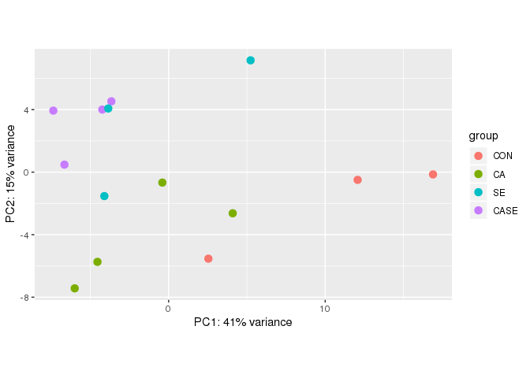

``` r
pcaData <- plotPCA(three_rlog, intgroup=c("treatment"), returnData=TRUE)
percentVar <- round(100 * attr(pcaData, "percentVar"))
ggplot(pcaData, aes(PC1, PC2, color=treatment)) +
  geom_point(size=3) +
  coord_fixed() + ylab("PC2: 15% Variance Explained") +
  xlab("PC1: 41% Variance Explained") +
  theme_linedraw() + scale_color_manual(values = c("CON" = "#aa2faa", "CA" = "#2e5aaa", "SE" = "#593959", "CASE" = "#41a08e"))
```

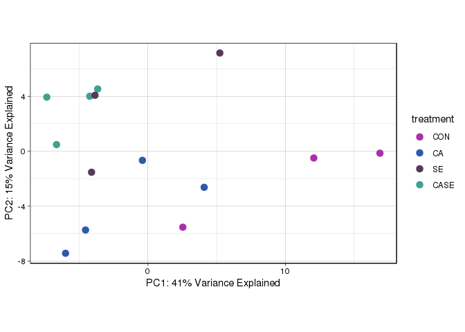

``` r
#ggsave("CASE_PCA.jpg", plot = last_plot(), device = NULL, path = NULL,
  #scale = 1, width = NA, height = NA, units = c("in", "cm", "mm"),
  #dpi = 600, limitsize = TRUE)
```

Heatmap of rlog transformed difference in expression compared to the average across all samples, using adjusted p value of 0.00001 or less. Many thanks to Hollie Putnam for the code of how to make this heatmap.

``` r
sig.num <- sum(three$padj <0.00001, na.rm=T) #set the p value cut off very low here, ended up being 212 of the total 988 
topVarGenes <- head(order(rowVars(assay(three_rlog)),decreasing=TRUE),sig.num) #sort by decreasing sig
mat <- assay(three_rlog)[ topVarGenes, ] #make an expression object
mat <- mat - rowMeans(mat) #difference in expression compared to average across all samples
col.order <- c("CASE_J03", "CASE_J09", "CASE_J12", "CASE_J13", "CA_J06",   "CA_J08",   "CA_J11",   "CA_J18",   "CON_J02",  "CON_J05" , "CON_J10" , "SE_J01" ,  "SE_J04",   "SE_J07")
mat <- mat[,col.order]
df1 <- as.data.frame(colData(three_rlog)[c("treatment")]) #make dataframe for column naming 


colfunc <- colorRampPalette(c("deepskyblue", "white", "violetred3")) #make function for the color gradient 
ann_colors <- list( treatment= c(CASE="#41a08e", CA ="#2e5aaa", CON= "#aa2faa", SE= "#593959"))
breakss <- c(-2, -1.9, -1.8, -1.7, -1.6, -1.5, -1.4, -1.3, -1.2, -1.1, -1, -.9, -.8, -.7, -.6, -.5, -.4, -.3, -.2, -.1, 0, .1, .2, .3, .4, .5, .6, .7, .8, .9, 1, 1.1, 1.2, 1.3, 1.4, 1.5, 1.6, 1.7, 1.8, 1.9, 2) #this looks very extra but this is how the colors in the heatmap were broken up 
pheatmap(mat, annotation_col=df1, annotation_colors=ann_colors, clustering_method = "average", 
         clustering_distance_rows="euclidean", show_rownames =FALSE, cluster_cols=F,
         show_colnames =F, breaks= breakss, color = colfunc(40)) 
```

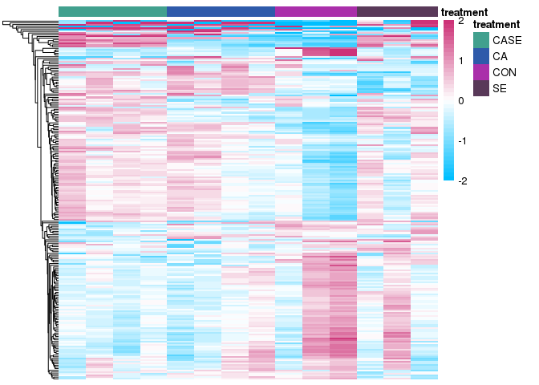

Making a venn diagram of the significant DEGs and seeing how many overlap between the treatments. Using modified code from here: <https://www.biostars.org/p/288028/>

``` r
sigCA_genes <- row.names(sig_CA) #just gets the names of the genes, which is all that is needed to compare
sigCASE_genes <- row.names(sig_CASE)
sigSE_genes <- row.names(sig_SE)

comb3 <- c(sigCA_genes, sigCASE_genes, sigSE_genes) #combine the list

comb3_list <- CASE_deseq_Matrix_Factors[which(rownames(CASE_deseq_Matrix_Factors) %in% comb3),] #gets rid of any duplicates 

comb3_row <- row.names(comb3_list) #make just the names of the genes again

# Comparing each individual list with the combined list
sigCA_genes.2 <- comb3_row %in% sigCA_genes
sigCASE_genes.2 <- comb3_row %in% sigCASE_genes 
sigSE_genes.2 <- comb3_row %in% sigSE_genes


# Generating venn counts to plot venn diagram
counts3 <- cbind(sigCA_genes.2, sigSE_genes.2, sigCASE_genes.2)
ven3 <- vennCounts(counts3)
vennDiagram(ven3, cex = 1,names = c("CA", "SE", "CASE"), circle.col = c("#2e5eaa", "#593959", "#40a08e"))
```

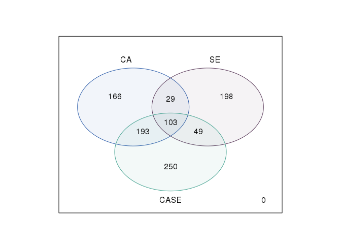

The plotCounts function will plot the normalized counts for any of the gene names you give it. You can specify for the smallest adjusted pvalue.

``` r
plotCounts(CASE_DDSeq_Factors, gene=which.min(results_SE_F$padj), intgroup="treatment")
```

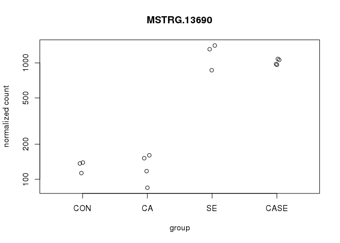

``` r
plotCounts(CASE_DDSeq_Factors, gene=which.min(results_CA_F$padj), intgroup="treatment")
```

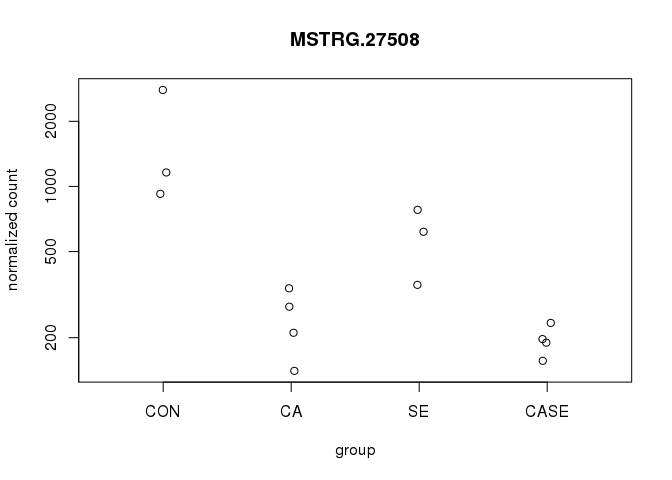

``` r
plotCounts(CASE_DDSeq_Factors, gene=which.min(results_CASE_F$padj), intgroup="treatment")
```


The problem with my data is that the gene\_id always came out at a StringTie merged name, this may have been the way I ran StringTie, but it was also because there were a lot of novel transcripts in my data. The way to find out if one of the MSTRG strings had an annotated gene is a little clunky, and would go like this in the terminal:

grep MSTRG.20077 C\_Vir\_ST\_merged\_NO\_A\_test.gtf

then copy the ref\_gene\_id if there was one

grep gene21544 ref\_C\_virginica-3.0\_top\_level.gff3

then there would be a GenBank ID: XM\_022485299.1

Which I would search in Genbank to see what the function was

For MSTRG.20077 it was: PREDICTED: Crassostrea virginica steroid 17-alpha-hydroxylase/17,20 lyase-like (LOC111135334), mRNA

Then I could Google "steroid 17-alpha-hydroxylase/17,20 lyase-like" and from UniProt it gives some function information "Conversion of pregnenolone and progesterone to their 17-alpha-hydroxylated products and subsequently to dehydroepiandrosterone (DHEA) and androstenedione. Catalyzes both the 17-alpha-hydroxylation and the 17,20-lyase reaction. Involved in sexual development during fetal life and at puberty in humans"

While it wasn't the most significantly differentially expressed for either CASE or SE, it has an interesting story. For CASE the adjuseted pvalue for MSTRG.20077 is: 2.23e-30, and a 3.62 log2FoldChange compared to control. For SE the adjusted pvalue was 3.78e-24, and 3.06 log2FoldChange compared to control.

And sometimes the MSTRG string is not something that is annotated but that's ok!

``` r
#Shared MSTRG.20077 both very significantly upregulated in CASE and SE, gene21544, translates to steroid 17-alpha-hydroxylase/17,20 lyase-like (LOC111135334)
MSTRG_20077 <- plotCounts(CASE_DDSeq_Factors,"MSTRG.20077", intgroup="treatment", returnData=TRUE)
ggplot(MSTRG_20077, aes(x=treatment, y=count, color=treatment)) + geom_boxplot() +
  geom_point() + ylab("Normalized Counts") + xlab("Treatment") + ggtitle("steroid 17-alpha-hydroxylase/17,20 lyase-like (LOC111135334)") + scale_color_manual(values = c("CON" = "#aa2faa", "CA" = "#2e5aaa", "SE" = "#593959", "CASE" = "#41a08e"))+ theme(legend.position = "none") + theme_minimal()
```

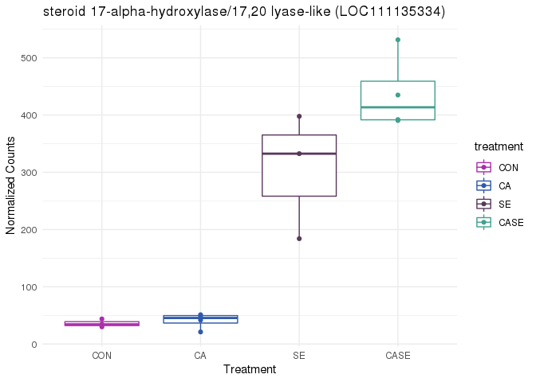

``` r
#ggsave("17-alpha-hydroxylase.png", plot = last_plot(), device = NULL, path = NULL,
  #scale = 1, width = NA, height = NA, units = c("in", "cm", "mm"),
  #dpi = 600, limitsize = TRUE)


# most significant for CA is MSTRG.27508, which is gene31143, which translates to leucine-rich repeat extensin-like protein 6 (LOC111108572)
# UniProt: Modulates cell morphogenesis by regulating cell wall formation and assembly, and/or growth polarization
MSTRG.27508 <- plotCounts(CASE_DDSeq_Factors, "MSTRG.27508", intgroup="treatment", returnData=TRUE)
ggplot(MSTRG.27508, aes(x=treatment, y=count, color=treatment)) + geom_boxplot() +
  geom_point() + ylab("Normalized Counts") + xlab("Treatment") + ggtitle("leucine-rich repeat extensin-like protein 6 (LOC111108572)") + scale_color_manual(values = c("CON" = "#aa2faa", "CA" = "#2e5aaa", "SE" = "#593959", "CASE" = "#41a08e"))+ theme(legend.position = "none") + theme_minimal()
```

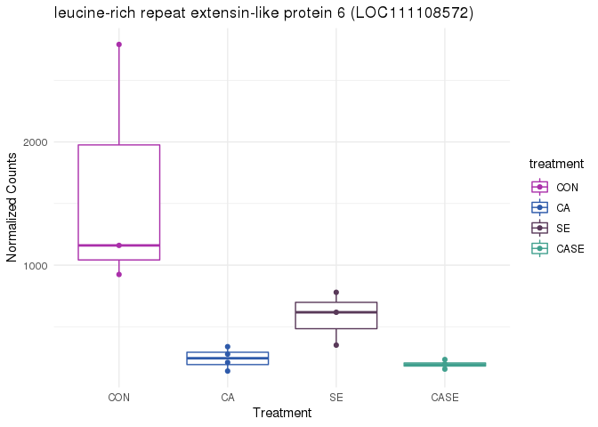

``` r
#ggsave("leucine-rich.png", plot = last_plot(), device = NULL, path = NULL,
  #scale = 1, width = NA, height = NA, units = c("in", "cm", "mm"),
  #dpi = 600, limitsize = TRUE)


#actual shared and most sig between CASE and SE is MSTRG.13690 which is gene14730 which is uncharacterized LOC111130853 Long Non Coding RNA 
MSTRG.13690 <- plotCounts(CASE_DDSeq_Factors, "MSTRG.13690", intgroup="treatment", returnData=TRUE)
ggplot(MSTRG.13690, aes(x=treatment, y=count, color=treatment)) + geom_boxplot() +
  geom_point() + ylab("Normalized Counts") + xlab("Treatment") + ggtitle("Uncharacterized LOC111130853 Long Non-Coding RNA") + scale_color_manual(values = c("CON" = "#aa2faa", "CA" = "#2e5aaa", "SE" = "#593959", "CASE" = "#41a08e"))+ theme(legend.position = "none") + theme_minimal()
```

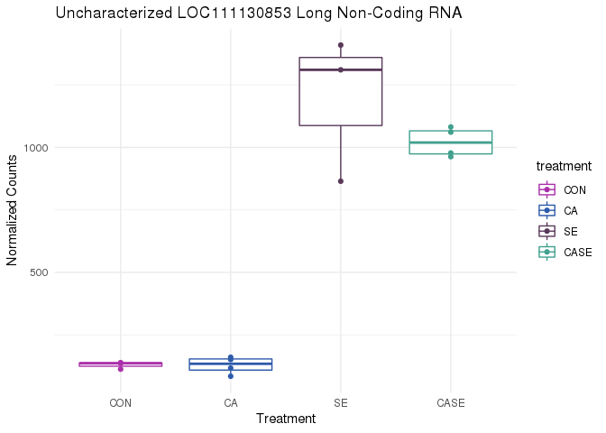

``` r
#ggsave("LOC111130853.jpg", plot = last_plot(), device = NULL, path = NULL,
  #scale = 1, width = NA, height = NA, units = c("in", "cm", "mm"),
  #dpi = 600, limitsize = TRUE)
```

This plot is of the normalized counts of the top 20 significant DEGs across all samples. Code was modified from this website: <https://hbctraining.github.io/Intro-to-R-with-DGE/lessons/B1_DGE_visualizing_results.html>

``` r
## Order significant results by padj values
three_ordered <- three[order(three$padj), ]
three_list_ordered <- CASE_deseq_Matrix_Factors[which(rownames(CASE_deseq_Matrix_Factors) %in% rownames(three_ordered)),]
top20_3_ordered_genes <- rownames(three_list_ordered[1:20, ])
top20_3_list_ordered_genes <- rownames(three_list_ordered[1:20, ])

## normalized counts for top 20 significant genes
#dds_sf <- estimateSizeFactors(CASE_deseq_Matrix_Factors)
ddss_sf <-counts(CASE_DDSeq_Factors, normalized=TRUE)
top20_3_counts <- ddss_sf[top20_3_list_ordered_genes, ]
#dim(top20_sigsig_ordered_genes)

## use melt to modify the format of the data frame
melted_top20_3_counts <- data.frame(melt(top20_3_counts))


#here I would write the csv, add in an extra column with treatment information because I don't know how to do that in R honestly, then read it back in 
# write.csv(melted_top20_3_counts,"melted_top20_3_counts.csv")
#scp -P zzzz mschedl@KITT.uri.edu:/home/mschedl/Working-CASE-RNA/histat/stringtie/restring/melted_top20_3_counts.csv /Users/maggieschedl/Desktop
#scp -P zzzz /Users/maggieschedl/Desktop/melted_top20_3_counts.csv mschedl@KITT.uri.edu:/home/mschedl/Working-CASE-RNA/histat/stringtie/restring/

melted_top20_3_counts<- read.csv(file="melted_top20_3_counts.csv", header=TRUE, sep=",")
melted_top20_3_counts$X <- NULL
colnames(melted_top20_3_counts) <- c("Gene", "samplename", "Normalized_counts", "Treatment")

## plot using ggplot2
ggplot(melted_top20_3_counts) +
        geom_point(aes(x = Gene, y = Normalized_counts, color = Treatment)) +
        scale_y_log10() +
        xlab("Genes") +
        ylab("Normalized Counts") +
        ggtitle("Top 20 Significant DE Genes") +
        theme_bw() +
    theme(axis.text.x = element_text(angle = 45, hjust = 1)) +
    theme(plot.title=element_text(hjust=0.5)) +
  scale_color_manual(values = c("CON" = "#aa2faa", "CA" = "#2e5aaa", "SE" = "#593959", "CASE" = "#41a08e")) 
```

    ## Warning: Transformation introduced infinite values in continuous y-axis

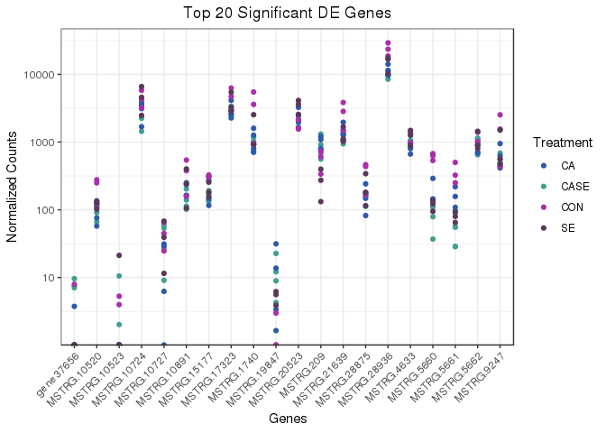

``` r
#ggsave("TOP_20.jpg", plot = last_plot(), device = NULL, path = NULL,
  #scale = 1, width = NA, height = NA, units = c("in", "cm", "mm"),
  #dpi = 600, limitsize = TRUE)
```
