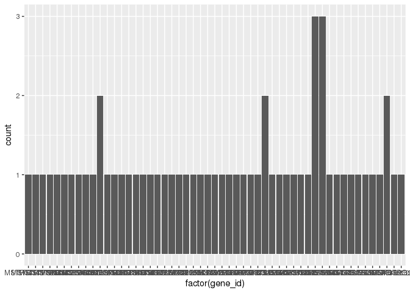
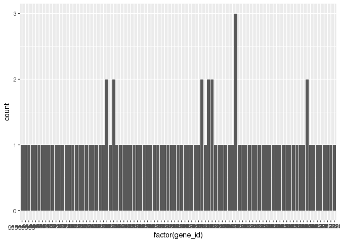

Problems
================
Maggie Schedl
5/19/2020

``` r
getwd()
```

    ## [1] "/home/mschedl/Working-CASE-RNA/histat/stringtie/restring/GOGO"

``` r
library("DESeq2")
```

    ## Loading required package: S4Vectors

    ## Loading required package: stats4

    ## Loading required package: BiocGenerics

    ## Loading required package: parallel

    ## 
    ## Attaching package: 'BiocGenerics'

    ## The following objects are masked from 'package:parallel':
    ## 
    ##     clusterApply, clusterApplyLB, clusterCall, clusterEvalQ,
    ##     clusterExport, clusterMap, parApply, parCapply, parLapply,
    ##     parLapplyLB, parRapply, parSapply, parSapplyLB

    ## The following objects are masked from 'package:stats':
    ## 
    ##     IQR, mad, sd, var, xtabs

    ## The following objects are masked from 'package:base':
    ## 
    ##     anyDuplicated, append, as.data.frame, basename, cbind, colnames,
    ##     dirname, do.call, duplicated, eval, evalq, Filter, Find, get, grep,
    ##     grepl, intersect, is.unsorted, lapply, Map, mapply, match, mget,
    ##     order, paste, pmax, pmax.int, pmin, pmin.int, Position, rank,
    ##     rbind, Reduce, rownames, sapply, setdiff, sort, table, tapply,
    ##     union, unique, unsplit, which, which.max, which.min

    ## 
    ## Attaching package: 'S4Vectors'

    ## The following object is masked from 'package:base':
    ## 
    ##     expand.grid

    ## Loading required package: IRanges

    ## Loading required package: GenomicRanges

    ## Loading required package: GenomeInfoDb

    ## Loading required package: SummarizedExperiment

    ## Loading required package: Biobase

    ## Welcome to Bioconductor
    ## 
    ##     Vignettes contain introductory material; view with
    ##     'browseVignettes()'. To cite Bioconductor, see
    ##     'citation("Biobase")', and for packages 'citation("pkgname")'.

    ## Loading required package: DelayedArray

    ## Loading required package: matrixStats

    ## 
    ## Attaching package: 'matrixStats'

    ## The following objects are masked from 'package:Biobase':
    ## 
    ##     anyMissing, rowMedians

    ## Loading required package: BiocParallel

    ## 
    ## Attaching package: 'DelayedArray'

    ## The following objects are masked from 'package:matrixStats':
    ## 
    ##     colMaxs, colMins, colRanges, rowMaxs, rowMins, rowRanges

    ## The following objects are masked from 'package:base':
    ## 
    ##     aperm, apply, rowsum

``` r
library("tidyverse")
```

    ## ── Attaching packages ──────────────────────────────────────────────────────────────────────────────────────────────────────────────── tidyverse 1.3.0 ──

    ## ✓ ggplot2 3.3.0     ✓ purrr   0.3.3
    ## ✓ tibble  3.0.1     ✓ dplyr   0.8.5
    ## ✓ tidyr   1.0.2     ✓ stringr 1.4.0
    ## ✓ readr   1.3.1     ✓ forcats 0.5.0

    ## ── Conflicts ─────────────────────────────────────────────────────────────────────────────────────────────────────────────────── tidyverse_conflicts() ──
    ## x dplyr::collapse()   masks IRanges::collapse()
    ## x dplyr::combine()    masks Biobase::combine(), BiocGenerics::combine()
    ## x dplyr::count()      masks matrixStats::count()
    ## x dplyr::desc()       masks IRanges::desc()
    ## x tidyr::expand()     masks S4Vectors::expand()
    ## x dplyr::filter()     masks stats::filter()
    ## x dplyr::first()      masks S4Vectors::first()
    ## x dplyr::lag()        masks stats::lag()
    ## x ggplot2::Position() masks BiocGenerics::Position(), base::Position()
    ## x purrr::reduce()     masks GenomicRanges::reduce(), IRanges::reduce()
    ## x dplyr::rename()     masks S4Vectors::rename()
    ## x purrr::simplify()   masks DelayedArray::simplify()
    ## x dplyr::slice()      masks IRanges::slice()

``` r
library("dplyr")
library("pheatmap")
library("RColorBrewer")
library("genefilter")
```

    ## 
    ## Attaching package: 'genefilter'

    ## The following object is masked from 'package:readr':
    ## 
    ##     spec

    ## The following objects are masked from 'package:matrixStats':
    ## 
    ##     rowSds, rowVars

``` r
library("ggplot2")
library("gplots")
```

    ## 
    ## Attaching package: 'gplots'

    ## The following object is masked from 'package:IRanges':
    ## 
    ##     space

    ## The following object is masked from 'package:S4Vectors':
    ## 
    ##     space

    ## The following object is masked from 'package:stats':
    ## 
    ##     lowess

``` r
library("limma")
```

    ## 
    ## Attaching package: 'limma'

    ## The following object is masked from 'package:DESeq2':
    ## 
    ##     plotMA

    ## The following object is masked from 'package:BiocGenerics':
    ## 
    ##     plotMA

``` r
library("spdep") 
```

    ## Loading required package: sp

    ## 
    ## Attaching package: 'sp'

    ## The following object is masked from 'package:IRanges':
    ## 
    ##     %over%

    ## Loading required package: spData

    ## To access larger datasets in this package, install the spDataLarge
    ## package with: `install.packages('spDataLarge',
    ## repos='https://nowosad.github.io/drat/', type='source')`

    ## Loading required package: sf

    ## Linking to GEOS 3.4.2, GDAL 2.2.3, PROJ 4.8.0

``` r
library("adegenet") 
```

    ## Loading required package: ade4

    ## 
    ## Attaching package: 'ade4'

    ## The following object is masked from 'package:spdep':
    ## 
    ##     mstree

    ## The following object is masked from 'package:GenomicRanges':
    ## 
    ##     score

    ## The following object is masked from 'package:BiocGenerics':
    ## 
    ##     score

    ## Registered S3 method overwritten by 'ape':
    ##   method   from 
    ##   plot.mst spdep

    ## 
    ##    /// adegenet 2.1.2 is loaded ////////////
    ## 
    ##    > overview: '?adegenet'
    ##    > tutorials/doc/questions: 'adegenetWeb()' 
    ##    > bug reports/feature requests: adegenetIssues()

``` r
library("goseq")
```

    ## Loading required package: BiasedUrn

    ## Loading required package: geneLenDataBase

    ## 
    ## Attaching package: 'geneLenDataBase'

    ## The following object is masked from 'package:S4Vectors':
    ## 
    ##     unfactor

    ## 

``` r
library("forcats")
library("gridExtra")
```

    ## 
    ## Attaching package: 'gridExtra'

    ## The following object is masked from 'package:dplyr':
    ## 
    ##     combine

    ## The following object is masked from 'package:Biobase':
    ## 
    ##     combine

    ## The following object is masked from 'package:BiocGenerics':
    ## 
    ##     combine

``` r
library("ape")
library("Rgb")
```

what I need to do is match the gene\_id (sometimes MSTRG\#\# sometimes gene\#\#) in my filtered counts files and my list of DEGs to their associated XP terms because the list of GO terms is organized by XPs

The steps I planned to do for this were: 1. search the merged annotated gtf file (c\_vir\_merged\_compare\_No\_A.annotated.gtf) by gene\_id for all the either DEGs or the expressed genes (counts file). This just narrows that gtf file to be only the genes I used in the DE analysis or only the DE genes. 2. Then I wanted to use the gene\_name column from the subsetted merged gtf file (LOC\#\#\#) as a search in the reference annotation gff3 file (ref\_C\_virginica-3.0\_top\_level.gff3) I chose LOC\#\#\# because those terms are in the reference annot file, another term in the merged gtf file is XLOC, but those numbers are not in the reference file so I didn't want to use those, and that even though ref\_gene\_id is in the reference annotation gff3 file, a lot of genes don't have them but do have a LOC\#\#\#. I don't know why this is but it seemed like I would loose information if I used this to search. 3. Search the reference annotation file by LOC to get a list of XPs

``` r
# read in All expressed genes in all treatments/control
filtered_counts <- read.csv("../filtered_counts.csv", header = TRUE, sep = ",") 
dim(filtered_counts)
```

    ## [1] 34582    15

``` r
head(filtered_counts)
```

    ##             X CASE_J03 CASE_J09 CASE_J12 CASE_J13 CA_J06 CA_J08 CA_J11 CA_J18
    ## 1 MSTRG.10383      198      306      198      235    190    133    180    176
    ## 2 MSTRG.28362       18        7       18       18      3      4     11     30
    ## 3 MSTRG.10380        5       14        9       19      6     23     12      7
    ## 4 MSTRG.32256        4        4        4        8     15      0     10      7
    ## 5 MSTRG.18313       92      169      165      206    120    129    134    236
    ## 6 MSTRG.10381      143      146       90      124     65     42     60     91
    ##   CON_J02 CON_J05 CON_J10 SE_J01 SE_J04 SE_J07
    ## 1     131     139     276    179    104    259
    ## 2      16       7       8     13      5      2
    ## 3      26       5       3     11      2     47
    ## 4       5       5       0      7     14      5
    ## 5     226     340     374    159     86    313
    ## 6      69      76     109     45     63     46

``` r
colnames(filtered_counts) <- c("gene_id", "CASE_J03", "CASE_J09", "CASE_J12", "CASE_J13", "CA_J06",   "CA_J08", "CA_J11", "CA_J18",  "CON_J02", "CON_J05", "CON_J10", "SE_J01",  "SE_J04", "SE_J07")
head(filtered_counts)
```

    ##       gene_id CASE_J03 CASE_J09 CASE_J12 CASE_J13 CA_J06 CA_J08 CA_J11 CA_J18
    ## 1 MSTRG.10383      198      306      198      235    190    133    180    176
    ## 2 MSTRG.28362       18        7       18       18      3      4     11     30
    ## 3 MSTRG.10380        5       14        9       19      6     23     12      7
    ## 4 MSTRG.32256        4        4        4        8     15      0     10      7
    ## 5 MSTRG.18313       92      169      165      206    120    129    134    236
    ## 6 MSTRG.10381      143      146       90      124     65     42     60     91
    ##   CON_J02 CON_J05 CON_J10 SE_J01 SE_J04 SE_J07
    ## 1     131     139     276    179    104    259
    ## 2      16       7       8     13      5      2
    ## 3      26       5       3     11      2     47
    ## 4       5       5       0      7     14      5
    ## 5     226     340     374    159     86    313
    ## 6      69      76     109     45     63     46

``` r
dim(filtered_counts) # 34582 genes 
```

    ## [1] 34582    15

``` r
# read in DEGs from Effluent treatment 

eff_DEGlist <- read.table("Sig_Eff.txt", sep = "\t")
head(eff_DEGlist)
```

    ##               baseMean log2FoldChange     lfcSE      stat       pvalue
    ## MSTRG.5660  231.894424     -2.3767115 0.3910817 -6.077276 1.222413e-09
    ## MSTRG.5661  147.427949     -2.1869064 0.3979359 -5.495625 3.893283e-08
    ## MSTRG.5748   49.369374     -3.3216411 0.6341290 -5.238116 1.622242e-07
    ## MSTRG.11988  77.270849      2.7481591 0.5467485  5.026368 4.998563e-07
    ## MSTRG.2697  246.885372     -0.7205848 0.1719588 -4.190451 2.784007e-05
    ## MSTRG.19761   7.460919      6.1810312 1.4373915  4.300173 1.706652e-05
    ##                     padj
    ## MSTRG.5660  3.519634e-06
    ## MSTRG.5661  8.407301e-05
    ## MSTRG.5748  2.950004e-04
    ## MSTRG.11988 8.635267e-04
    ## MSTRG.2697  2.003963e-02
    ## MSTRG.19761 1.281881e-02

``` r
eff_DEGlist$gene_id <- rownames(eff_DEGlist)
head(eff_DEGlist)
```

    ##               baseMean log2FoldChange     lfcSE      stat       pvalue
    ## MSTRG.5660  231.894424     -2.3767115 0.3910817 -6.077276 1.222413e-09
    ## MSTRG.5661  147.427949     -2.1869064 0.3979359 -5.495625 3.893283e-08
    ## MSTRG.5748   49.369374     -3.3216411 0.6341290 -5.238116 1.622242e-07
    ## MSTRG.11988  77.270849      2.7481591 0.5467485  5.026368 4.998563e-07
    ## MSTRG.2697  246.885372     -0.7205848 0.1719588 -4.190451 2.784007e-05
    ## MSTRG.19761   7.460919      6.1810312 1.4373915  4.300173 1.706652e-05
    ##                     padj     gene_id
    ## MSTRG.5660  3.519634e-06  MSTRG.5660
    ## MSTRG.5661  8.407301e-05  MSTRG.5661
    ## MSTRG.5748  2.950004e-04  MSTRG.5748
    ## MSTRG.11988 8.635267e-04 MSTRG.11988
    ## MSTRG.2697  2.003963e-02  MSTRG.2697
    ## MSTRG.19761 1.281881e-02 MSTRG.19761

``` r
dim(eff_DEGlist) # 58 genes
```

    ## [1] 58  7

``` r
# read in annotated merged gtf file from stringtie. Has both the MSTGR infomation and annotation information

Merged_AnnotGTF <- read.gtf("c_vir_merged_compare_No_A.annotated.gtf", attr = c("split"), features = NULL, quiet = FALSE)
```

    ## File parsing ... 1252376 rows processed
    ## Attribute splitting ... 4253247 pairs processed
    ## Attribute sorting ... 10 tags found
    ## Attribute binding ...
    ## done

``` r
head(Merged_AnnotGTF)
```

    ##       seqname    source    feature start  end score strand frame transcript_id
    ## 1 NC_007175.2 StringTie transcript     1 1623    NA      +    NA     gene39493
    ## 2 NC_007175.2 StringTie       exon     1 1623    NA      +    NA     gene39493
    ## 3 NC_007175.2 StringTie transcript     1 9254    NA      +    NA     MSTRG.1.1
    ## 4 NC_007175.2 StringTie       exon     1 4212    NA      +    NA     MSTRG.1.1
    ## 5 NC_007175.2 StringTie       exon  4243 4515    NA      +    NA     MSTRG.1.1
    ## 6 NC_007175.2 StringTie       exon  8426 9254    NA      +    NA     MSTRG.1.1
    ##   gene_id gene_name        xloc ref_gene_id contained_in   cmp_ref class_code
    ## 1 MSTRG.1      COX1 XLOC_000001   gene39493    MSTRG.1.1 gene39493          =
    ## 2 MSTRG.1      <NA>        <NA>        <NA>         <NA>      <NA>       <NA>
    ## 3 MSTRG.1      <NA> XLOC_000001        <NA>         <NA>  rna67204          k
    ## 4 MSTRG.1      <NA>        <NA>        <NA>         <NA>      <NA>       <NA>
    ## 5 MSTRG.1      <NA>        <NA>        <NA>         <NA>      <NA>       <NA>
    ## 6 MSTRG.1      <NA>        <NA>        <NA>         <NA>      <NA>       <NA>
    ##   tss_id exon_number
    ## 1   TSS1          NA
    ## 2   <NA>           1
    ## 3   TSS1          NA
    ## 4   <NA>           1
    ## 5   <NA>           2
    ## 6   <NA>           3

``` r
dim(Merged_AnnotGTF) # 1252376 correct same as file in KITT
```

    ## [1] 1252376      18

``` r
# have to cut down to transcript because exon contains no extra information
Merged_AnnotGTF_transcript <- Merged_AnnotGTF %>%
  filter(feature == 'transcript')
head(Merged_AnnotGTF_transcript)
```

    ##       seqname    source    feature start  end score strand frame transcript_id
    ## 1 NC_007175.2 StringTie transcript     1 1623    NA      +    NA     gene39493
    ## 2 NC_007175.2 StringTie transcript     1 9254    NA      +    NA     MSTRG.1.1
    ## 3 NC_007175.2 StringTie transcript  1710 8997    NA      +    NA      rna67202
    ## 4 NC_007175.2 StringTie transcript  1728 9513    NA      +    NA     MSTRG.1.4
    ## 5 NC_007175.2 StringTie transcript  1729 3429    NA      +    NA     MSTRG.1.8
    ## 6 NC_007175.2 StringTie transcript  1729 9513    NA      +    NA     MSTRG.1.6
    ##   gene_id gene_name        xloc ref_gene_id contained_in   cmp_ref class_code
    ## 1 MSTRG.1      COX1 XLOC_000001   gene39493    MSTRG.1.1 gene39493          =
    ## 2 MSTRG.1      <NA> XLOC_000001        <NA>         <NA>  rna67204          k
    ## 3 MSTRG.1      <NA> XLOC_000001        <NA>         <NA>  rna67202          =
    ## 4 MSTRG.1      <NA> XLOC_000001        <NA>         <NA>  rna67205          k
    ## 5 MSTRG.1      COX3 XLOC_000001        <NA>         <NA> gene39494          k
    ## 6 MSTRG.1      <NA> XLOC_000001        <NA>         <NA>  rna67205          k
    ##   tss_id exon_number
    ## 1   TSS1          NA
    ## 2   TSS1          NA
    ## 3   TSS2          NA
    ## 4   TSS2          NA
    ## 5   TSS2          NA
    ## 6   TSS2          NA

``` r
dim(Merged_AnnotGTF_transcript) # 108646 cut down a lot
```

    ## [1] 108646     18

``` r
# going to get rid of a few columns that don't have any information 

Merged_AnnotGTF_transcript <- Merged_AnnotGTF_transcript[,c(1,4:5,9:14)] 
head(Merged_AnnotGTF_transcript)
```

    ##       seqname start  end transcript_id gene_id gene_name        xloc
    ## 1 NC_007175.2     1 1623     gene39493 MSTRG.1      COX1 XLOC_000001
    ## 2 NC_007175.2     1 9254     MSTRG.1.1 MSTRG.1      <NA> XLOC_000001
    ## 3 NC_007175.2  1710 8997      rna67202 MSTRG.1      <NA> XLOC_000001
    ## 4 NC_007175.2  1728 9513     MSTRG.1.4 MSTRG.1      <NA> XLOC_000001
    ## 5 NC_007175.2  1729 3429     MSTRG.1.8 MSTRG.1      COX3 XLOC_000001
    ## 6 NC_007175.2  1729 9513     MSTRG.1.6 MSTRG.1      <NA> XLOC_000001
    ##   ref_gene_id contained_in
    ## 1   gene39493    MSTRG.1.1
    ## 2        <NA>         <NA>
    ## 3        <NA>         <NA>
    ## 4        <NA>         <NA>
    ## 5        <NA>         <NA>
    ## 6        <NA>         <NA>

``` r
# I think I want to remove mitochondrial sequences because I dont think theyre in the GO term 
Merged_AnnotGTF_transcript_autosome <- subset(Merged_AnnotGTF_transcript, seqname!="NC_007175.2")
head(Merged_AnnotGTF_transcript_autosome)
```

    ##        seqname  start    end transcript_id  gene_id    gene_name        xloc
    ## 57 NC_035780.1  13578  14594          rna0    gene0 LOC111116054 XLOC_000022
    ## 58 NC_035780.1  28961  33324          rna1 MSTRG.22 LOC111126949 XLOC_000023
    ## 59 NC_035780.1  28991  33251    MSTRG.22.2 MSTRG.22 LOC111126949 XLOC_000023
    ## 60 NC_035780.1  99840 106460          rna5 MSTRG.24 LOC111120752 XLOC_000024
    ## 61 NC_035780.1 105234 106397    MSTRG.24.2 MSTRG.24 LOC111120752 XLOC_000024
    ## 62 NC_035780.1 151859 157536          rna7    gene6 LOC111128953 XLOC_000025
    ##    ref_gene_id contained_in
    ## 57       gene0         <NA>
    ## 58       gene1         <NA>
    ## 59        <NA>         <NA>
    ## 60       gene4         <NA>
    ## 61        <NA>         <NA>
    ## 62       gene6         <NA>

``` r
dim(Merged_AnnotGTF_transcript_autosome) # 108590
```

    ## [1] 108590      9

``` r
Merged_Eff_DEGS <- filter(Merged_AnnotGTF_transcript_autosome, gene_id%in%eff_DEGlist$gene_id) #MAKE SURE TO USE AUTOSOMES
head(Merged_Eff_DEGS)
```

    ##       seqname    start      end transcript_id    gene_id    gene_name
    ## 1 NC_035780.1 27166322 27205832  MSTRG.1518.1 MSTRG.1518 LOC111106743
    ## 2 NC_035780.1 43139609 43141639  MSTRG.2339.1 MSTRG.2339         <NA>
    ## 3 NC_035780.1 50204024 50209149       rna5063 MSTRG.2697 LOC111111394
    ## 4 NC_035780.1 50205303 50209436       rna5064 MSTRG.2697 LOC111111394
    ## 5 NC_035780.1 54882465 54885129       rna5508 MSTRG.2917 LOC111129118
    ## 6 NC_035780.1 54882465 54885129       rna5509 MSTRG.2917 LOC111129118
    ##          xloc ref_gene_id contained_in
    ## 1 XLOC_000878        <NA>         <NA>
    ## 2 XLOC_001347        <NA>         <NA>
    ## 3 XLOC_001581    gene2989         <NA>
    ## 4 XLOC_001581    gene2989         <NA>
    ## 5 XLOC_001716    gene3235         <NA>
    ## 6 XLOC_001716    gene3235         <NA>

``` r
dim(Merged_Eff_DEGS)
```

    ## [1] 124   9

``` r
# there are NAs in the gene_name column, so those won't be helpful so I'm going to drop those

Merged_Eff_DEGS_LOC <- drop_na(Merged_Eff_DEGS, gene_name)
dim(Merged_Eff_DEGS_LOC) #119 
```

    ## [1] 119   9

``` r
#the question now is where are there more than 58 lines? 
print(Merged_Eff_DEGS_LOC)
```

    ##         seqname     start       end transcript_id     gene_id    gene_name
    ## 1   NC_035780.1  27166322  27205832  MSTRG.1518.1  MSTRG.1518 LOC111106743
    ## 3   NC_035780.1  50204024  50209149       rna5063  MSTRG.2697 LOC111111394
    ## 4   NC_035780.1  50205303  50209436       rna5064  MSTRG.2697 LOC111111394
    ## 5   NC_035780.1  54882465  54885129       rna5508  MSTRG.2917 LOC111129118
    ## 6   NC_035780.1  54882465  54885129       rna5509  MSTRG.2917 LOC111129118
    ## 7   NC_035780.1  54882465  54885129       rna5507  MSTRG.2917 LOC111129118
    ## 8   NC_035780.1  54882465  54885129       rna5506  MSTRG.2917 LOC111129118
    ## 9   NC_035780.1  54882548  54885129  MSTRG.2917.5  MSTRG.2917 LOC111129118
    ## 10  NC_035780.1  55865137  55873430  MSTRG.2984.1  MSTRG.2984 LOC111125708
    ## 11  NC_035780.1  55867872  55873360       rna5639  MSTRG.2984 LOC111125708
    ## 12  NC_035780.1  58094031  58102490       rna5864  MSTRG.3127 LOC111135605
    ## 13  NC_035780.1  58094031  58102490  MSTRG.3127.1  MSTRG.3127 LOC111135605
    ## 14  NC_035780.1  14673319  14677651       rna1589   MSTRG.904 LOC111114926
    ## 15  NC_035780.1  14673319  14678528       rna1588   MSTRG.904 LOC111114926
    ## 16  NC_035780.1  47170612  47171644       rna4744  MSTRG.2530 LOC111112982
    ## 17  NC_035780.1  10668181  10669205   MSTRG.654.1   MSTRG.654 LOC111119437
    ## 18  NC_035780.1  11573130  11574199   MSTRG.713.1   MSTRG.713 LOC111121406
    ## 19  NC_035781.1   4423121   4425347  MSTRG.3878.1  MSTRG.3878 LOC111119513
    ## 20  NC_035781.1   4423300   4425347       rna7233  MSTRG.3878 LOC111119513
    ## 21  NC_035781.1   5411781   5414055      gene4328  MSTRG.3954 LOC111120887
    ## 22  NC_035781.1  23346042  23347663       rna9332  MSTRG.5082 LOC111118166
    ## 23  NC_035781.1  32968175  32969876      rna10393  MSTRG.5661 LOC111119547
    ## 24  NC_035781.1  32968175  32981272      rna10392  MSTRG.5661 LOC111119547
    ## 25  NC_035781.1  32980416  32980817      rna10394  MSTRG.5661 LOC111119547
    ## 26  NC_035781.1  32980437  32987269  MSTRG.5661.4  MSTRG.5661 LOC111119545
    ## 27  NC_035781.1  32985923  32987278      rna10397  MSTRG.5661 LOC111119545
    ## 28  NC_035781.1  32985923  32990021  MSTRG.5661.5  MSTRG.5661 LOC111119545
    ## 29  NC_035781.1  32985925  32989578  MSTRG.5661.7  MSTRG.5661 LOC111119546
    ## 30  NC_035781.1  32987559  32990019      rna10398  MSTRG.5661 LOC111119546
    ## 31  NC_035781.1  32988574  32990019      rna10399  MSTRG.5661 LOC111119546
    ## 32  NC_035781.1  34122098  34123369      rna10563  MSTRG.5748 LOC111119445
    ## 33  NC_035781.1  34746970  34748234      rna10655  MSTRG.5781 LOC111121566
    ## 34  NC_035781.1  38107679  38118195      rna10926  MSTRG.5955 LOC111122036
    ## 35  NC_035781.1  47617094  47626206  MSTRG.6536.1  MSTRG.6536 LOC111117808
    ## 36  NC_035781.1  47622397  47626206      rna11941  MSTRG.6536 LOC111117808
    ## 37  NC_035781.1   4418973   4421249       rna7232  MSTRG.3877 LOC111119512
    ## 38  NC_035781.1   5407191   5409474       rna7340  MSTRG.3953 LOC111121335
    ## 40  NC_035781.1  32964265  32966016      rna10391  MSTRG.5660 LOC111121218
    ## 41  NC_035781.1  32964265  32985030  MSTRG.5660.1  MSTRG.5660 LOC111119544
    ## 42  NC_035781.1  32977345  32979166      rna10395  MSTRG.5660 LOC111119543
    ## 43  NC_035781.1  32977406  32985035  MSTRG.5660.4  MSTRG.5660 LOC111119543
    ## 44  NC_035781.1  32978430  32985030  MSTRG.5660.5  MSTRG.5660 LOC111119544
    ## 45  NC_035781.1  32983370  32985064      rna10396  MSTRG.5660 LOC111119544
    ## 46  NC_035781.1  47501884  47507433  MSTRG.6525.1  MSTRG.6525 LOC111120005
    ## 47  NC_035782.1  16288100  16292582      rna15062  MSTRG.8122 LOC111122513
    ## 48  NC_035782.1  16862649  16881101      rna15150  MSTRG.8152 LOC111124965
    ## 49  NC_035782.1  16862653  16870331      rna15151  MSTRG.8152 LOC111124965
    ## 50  NC_035782.1  16876588  16880875      rna15154  MSTRG.8152 LOC111124966
    ## 51  NC_035782.1  18851794  18863592  MSTRG.8323.1  MSTRG.8323 LOC111127402
    ## 52  NC_035782.1  18852261  18863487      rna15434  MSTRG.8323 LOC111127402
    ## 53  NC_035782.1  65523720  65716771 MSTRG.11171.1 MSTRG.11171 LOC111127224
    ## 54  NC_035783.1   4371886   4372934      rna22510 MSTRG.12104 LOC111131297
    ## 55  NC_035783.1   4371944   4372992 MSTRG.12104.2 MSTRG.12104 LOC111131297
    ## 57  NC_035783.1  23638942  23639631 MSTRG.13316.1 MSTRG.13316 LOC111129490
    ## 58  NC_035783.1  31423218  31438551      rna25717 MSTRG.13792 LOC111130669
    ## 59  NC_035783.1  31425007  31438548 MSTRG.13792.3 MSTRG.13792 LOC111130669
    ## 60  NC_035783.1  31425007  31438597 MSTRG.13792.2 MSTRG.13792 LOC111130669
    ## 61  NC_035783.1  31425026  31438568 MSTRG.13792.4 MSTRG.13792 LOC111130669
    ## 62  NC_035783.1  31425038  31438577 MSTRG.13792.5 MSTRG.13792 LOC111130669
    ## 63  NC_035783.1  57068842  57081939 MSTRG.15300.1 MSTRG.15300 LOC111129857
    ## 64  NC_035783.1  57071229  57082009 MSTRG.15300.2 MSTRG.15300 LOC111129857
    ## 65  NC_035783.1  57071229  57082585 MSTRG.15300.3 MSTRG.15300 LOC111129857
    ## 66  NC_035783.1  57071766  57081816      rna28371 MSTRG.15300 LOC111129857
    ## 67  NC_035783.1   2407246   2414438      rna22293 MSTRG.11988 LOC111128920
    ## 68  NC_035783.1   2407341   2414270 MSTRG.11988.2 MSTRG.11988 LOC111128920
    ## 69  NC_035783.1  19897083  19914815 MSTRG.13103.1 MSTRG.13103 LOC111127744
    ## 70  NC_035783.1  27916774  27918347 MSTRG.13541.2 MSTRG.13541 LOC111129586
    ## 71  NC_035783.1  27916774  27918358 MSTRG.13541.1 MSTRG.13541 LOC111129586
    ## 72  NC_035783.1  27916804  27918358      rna25246 MSTRG.13541 LOC111129586
    ## 73  NC_035783.1  29540259  29545364 MSTRG.13655.1 MSTRG.13655 LOC111129435
    ## 74  NC_035783.1  29966947  29973136 MSTRG.13690.1 MSTRG.13690 LOC111130853
    ## 75  NC_035783.1  29966969  29973087 MSTRG.13690.2 MSTRG.13690 LOC111130853
    ## 76  NC_035783.1  29967240  29971087      rna25529 MSTRG.13690 LOC111130853
    ## 77  NC_035783.1  29967240  29972228      rna25528 MSTRG.13690 LOC111130853
    ## 78  NC_035783.1  29967240  29973087      rna25527 MSTRG.13690 LOC111130853
    ## 79  NC_035783.1  29967240  29973136      rna25526 MSTRG.13690 LOC111130853
    ## 81  NC_035783.1  32835047  32861377 MSTRG.13878.1 MSTRG.13878 LOC111130548
    ## 82  NC_035783.1  32835602  32838062 MSTRG.13878.2 MSTRG.13878 LOC111130548
    ## 83  NC_035783.1  32835713  32861377     gene14926 MSTRG.13878 LOC111130548
    ## 84  NC_035783.1  43335200  43358475 MSTRG.14533.1 MSTRG.14533 LOC111131442
    ## 85  NC_035783.1  43335300  43358835 MSTRG.14533.2 MSTRG.14533 LOC111131442
    ## 86  NC_035783.1  43335333  43349626      rna27157 MSTRG.14533 LOC111131442
    ## 87  NC_035783.1  43354819  43373201      rna27158 MSTRG.14533 LOC111131443
    ## 88  NC_035783.1  50486482  50486837 MSTRG.14897.1 MSTRG.14897 LOC111129919
    ## 89  NC_035784.1  12121333  12129721      rna30170 MSTRG.16274 LOC111134699
    ## 90  NC_035784.1  12122990  12129721      rna30171 MSTRG.16274 LOC111134699
    ## 91  NC_035784.1  12126044  12129721      rna30172 MSTRG.16274 LOC111134699
    ## 92  NC_035784.1  69759007  69767129 MSTRG.19929.1 MSTRG.19929 LOC111099125
    ## 93  NC_035784.1  69759317  69767117      rna37143 MSTRG.19929 LOC111099125
    ## 94  NC_035784.1  69759495  69767117      rna37144 MSTRG.19929 LOC111099125
    ## 95  NC_035784.1  69759496  69767117      rna37145 MSTRG.19929 LOC111099125
    ## 96  NC_035784.1  69759591  69767117      rna37146 MSTRG.19929 LOC111099125
    ## 97  NC_035784.1  69759636  69767117      rna37147 MSTRG.19929 LOC111099125
    ## 98  NC_035784.1  69762674  69767098 MSTRG.19929.7 MSTRG.19929 LOC111099125
    ## 99  NC_035784.1  29127296  29128759 MSTRG.17368.1 MSTRG.17368 LOC111132291
    ## 100 NC_035784.1  66843797  66924235      rna36758 MSTRG.19761 LOC111134534
    ## 101 NC_035784.1  66843797  66924235      rna36757 MSTRG.19761 LOC111134534
    ## 102 NC_035784.1  66843797  66924236      rna36756 MSTRG.19761 LOC111134534
    ## 103 NC_035784.1  66846075  66924244      rna36759 MSTRG.19761 LOC111134534
    ## 104 NC_035784.1  72405593  72410698      rna37420 MSTRG.20077 LOC111135334
    ## 105 NC_035784.1  72405593  72416198 MSTRG.20077.1 MSTRG.20077 LOC111135334
    ## 106 NC_035785.1  30985201  31034196      rna42386 MSTRG.22426 LOC111100994
    ## 107 NC_035785.1  31023486  31034196      rna42387 MSTRG.22426 LOC111100994
    ## 108 NC_035786.1   1358304   1361536 MSTRG.23415.1 MSTRG.23415 LOC111104062
    ## 110 NC_035787.1  53387921  53397780      rna54834 MSTRG.27960 LOC111108346
    ## 111 NC_035787.1  53388719  53390421 MSTRG.27960.2 MSTRG.27960 LOC111108346
    ## 112 NC_035787.1  53403748  53405239      rna54835 MSTRG.27962 LOC111108345
    ## 113 NC_035787.1   8371925   8383444      rna50217 MSTRG.25907 LOC111108640
    ## 114 NC_035787.1  14192179  14195756 MSTRG.26189.1 MSTRG.26189 LOC111106031
    ## 115 NC_035787.1  14192184  14195804      rna50835 MSTRG.26189 LOC111106031
    ## 116 NC_035787.1  52200098  52208305 MSTRG.27893.1 MSTRG.27893 LOC111106005
    ## 117 NC_035787.1  52202293  52208305      rna54662 MSTRG.27893 LOC111106005
    ## 118 NC_035787.1  52202702  52205665 MSTRG.27893.3 MSTRG.27893 LOC111106005
    ## 119 NC_035788.1  94461727  94471291      rna64298 MSTRG.32334 LOC111115785
    ## 120 NC_035788.1  75656660  75673804      rna62734 MSTRG.31515 LOC111115106
    ## 121 NC_035788.1  94864309  94911396 MSTRG.32348.1 MSTRG.32348 LOC111114819
    ## 122 NC_035788.1  94865136  94911349 MSTRG.32348.2 MSTRG.32348 LOC111114344
    ## 123 NC_035788.1 102469830 102870291      rna64887 MSTRG.32593 LOC111112667
    ## 124 NC_035788.1 102849676 102870291      rna64888 MSTRG.32593 LOC111112667
    ##            xloc ref_gene_id  contained_in
    ## 1   XLOC_000878        <NA>          <NA>
    ## 3   XLOC_001581    gene2989          <NA>
    ## 4   XLOC_001581    gene2989          <NA>
    ## 5   XLOC_001716    gene3235          <NA>
    ## 6   XLOC_001716    gene3235          <NA>
    ## 7   XLOC_001716    gene3235          <NA>
    ## 8   XLOC_001716    gene3235          <NA>
    ## 9   XLOC_001716        <NA>          <NA>
    ## 10  XLOC_001752        <NA>          <NA>
    ## 11  XLOC_001752    gene3313          <NA>
    ## 12  XLOC_001819    gene3469          <NA>
    ## 13  XLOC_001819        <NA>          <NA>
    ## 14  XLOC_002543     gene905          <NA>
    ## 15  XLOC_002543     gene905          <NA>
    ## 16  XLOC_003544    gene2787          <NA>
    ## 17  XLOC_004219        <NA>          <NA>
    ## 18  XLOC_004229        <NA>          <NA>
    ## 19  XLOC_004743        <NA>          <NA>
    ## 20  XLOC_004743    gene4259          <NA>
    ## 21  XLOC_004778    gene4328          <NA>
    ## 22  XLOC_005379    gene5478          <NA>
    ## 23  XLOC_005693    gene6114          <NA>
    ## 24  XLOC_005693    gene6114          <NA>
    ## 25  XLOC_005693    gene6114          <NA>
    ## 26  XLOC_005693        <NA>          <NA>
    ## 27  XLOC_005693    gene6117          <NA>
    ## 28  XLOC_005693        <NA>          <NA>
    ## 29  XLOC_005693        <NA>          <NA>
    ## 30  XLOC_005693    gene6118          <NA>
    ## 31  XLOC_005693    gene6118          <NA>
    ## 32  XLOC_005735    gene6209          <NA>
    ## 33  XLOC_005754    gene6251          <NA>
    ## 34  XLOC_005849    gene6431          <NA>
    ## 35  XLOC_006177        <NA>          <NA>
    ## 36  XLOC_006177    gene7095          <NA>
    ## 37  XLOC_006841    gene4258          <NA>
    ## 38  XLOC_006875    gene4327          <NA>
    ## 40  XLOC_007810    gene6113          <NA>
    ## 41  XLOC_007810        <NA>          <NA>
    ## 42  XLOC_007810    gene6115          <NA>
    ## 43  XLOC_007810        <NA>          <NA>
    ## 44  XLOC_007810        <NA>          <NA>
    ## 45  XLOC_007810    gene6116          <NA>
    ## 46  XLOC_008295        <NA>          <NA>
    ## 47  XLOC_009591    gene8904          <NA>
    ## 48  XLOC_009613    gene8940          <NA>
    ## 49  XLOC_009613    gene8940          <NA>
    ## 50  XLOC_009613    gene8942          <NA>
    ## 51  XLOC_009704        <NA>          <NA>
    ## 52  XLOC_009704    gene9126  MSTRG.8323.1
    ## 53  XLOC_013635        <NA>          <NA>
    ## 54  XLOC_014549   gene13062          <NA>
    ## 55  XLOC_014549        <NA>          <NA>
    ## 57  XLOC_015195        <NA>          <NA>
    ## 58  XLOC_015471   gene14839          <NA>
    ## 59  XLOC_015471        <NA>          <NA>
    ## 60  XLOC_015471        <NA>          <NA>
    ## 61  XLOC_015471        <NA>          <NA>
    ## 62  XLOC_015471        <NA>          <NA>
    ## 63  XLOC_016328        <NA>          <NA>
    ## 64  XLOC_016328        <NA>          <NA>
    ## 65  XLOC_016328        <NA>          <NA>
    ## 66  XLOC_016328   gene16480          <NA>
    ## 67  XLOC_016494   gene12921          <NA>
    ## 68  XLOC_016494        <NA>          <NA>
    ## 69  XLOC_017093        <NA>          <NA>
    ## 70  XLOC_017335        <NA>          <NA>
    ## 71  XLOC_017335        <NA>          <NA>
    ## 72  XLOC_017335   gene14565          <NA>
    ## 73  XLOC_017387        <NA>          <NA>
    ## 74  XLOC_017402        <NA>          <NA>
    ## 75  XLOC_017402        <NA>          <NA>
    ## 76  XLOC_017402   gene14730          <NA>
    ## 77  XLOC_017402   gene14730          <NA>
    ## 78  XLOC_017402   gene14730 MSTRG.13690.2
    ## 79  XLOC_017402   gene14730 MSTRG.13690.1
    ## 81  XLOC_017501        <NA>          <NA>
    ## 82  XLOC_017501        <NA>          <NA>
    ## 83  XLOC_017501   gene14926 MSTRG.13878.1
    ## 84  XLOC_017962        <NA>          <NA>
    ## 85  XLOC_017962        <NA>          <NA>
    ## 86  XLOC_017962   gene15688          <NA>
    ## 87  XLOC_017962   gene15689          <NA>
    ## 88  XLOC_018788        <NA>          <NA>
    ## 89  XLOC_019312   gene17534          <NA>
    ## 90  XLOC_019312   gene17534          <NA>
    ## 91  XLOC_019312   gene17534          <NA>
    ## 92  XLOC_021343        <NA>          <NA>
    ## 93  XLOC_021343   gene21386          <NA>
    ## 94  XLOC_021343   gene21386          <NA>
    ## 95  XLOC_021343   gene21386          <NA>
    ## 96  XLOC_021343   gene21386          <NA>
    ## 97  XLOC_021343   gene21386          <NA>
    ## 98  XLOC_021343        <NA>          <NA>
    ## 99  XLOC_023119        <NA>          <NA>
    ## 100 XLOC_024461   gene21201          <NA>
    ## 101 XLOC_024461   gene21201          <NA>
    ## 102 XLOC_024461   gene21201          <NA>
    ## 103 XLOC_024461   gene21201          <NA>
    ## 104 XLOC_024656   gene21544 MSTRG.20077.1
    ## 105 XLOC_024656        <NA>          <NA>
    ## 106 XLOC_028168   gene24451          <NA>
    ## 107 XLOC_028168   gene24451          <NA>
    ## 108 XLOC_030661        <NA>          <NA>
    ## 110 XLOC_034243   gene31742          <NA>
    ## 111 XLOC_034243        <NA>          <NA>
    ## 112 XLOC_034244   gene31743          <NA>
    ## 113 XLOC_035083   gene29003          <NA>
    ## 114 XLOC_035290        <NA>          <NA>
    ## 115 XLOC_035290   gene29385          <NA>
    ## 116 XLOC_036443        <NA>          <NA>
    ## 117 XLOC_036443   gene31653          <NA>
    ## 118 XLOC_036443        <NA>          <NA>
    ## 119 XLOC_040030   gene37514          <NA>
    ## 120 XLOC_042115   gene36563          <NA>
    ## 121 XLOC_042608        <NA>          <NA>
    ## 122 XLOC_042608        <NA>          <NA>
    ## 123 XLOC_042824   gene37885          <NA>
    ## 124 XLOC_042824   gene37885          <NA>

``` r
# there are multiple entires of the same LOCs, this is because of the transcript_id
# I want there to be only one LOC
# confusing but it ptobably doesn't matter which transcript it came from because the LOC# is the same
# so remove duplicated LOcs 

Merged_Eff_DEGS_LOC_U <- Merged_Eff_DEGS_LOC[!duplicated(Merged_Eff_DEGS_LOC$gene_name), ]

dim(Merged_Eff_DEGS_LOC_U) # 60
```

    ## [1] 60  9

``` r
print(Merged_Eff_DEGS_LOC_U)
```

    ##         seqname     start       end transcript_id     gene_id    gene_name
    ## 1   NC_035780.1  27166322  27205832  MSTRG.1518.1  MSTRG.1518 LOC111106743
    ## 3   NC_035780.1  50204024  50209149       rna5063  MSTRG.2697 LOC111111394
    ## 5   NC_035780.1  54882465  54885129       rna5508  MSTRG.2917 LOC111129118
    ## 10  NC_035780.1  55865137  55873430  MSTRG.2984.1  MSTRG.2984 LOC111125708
    ## 12  NC_035780.1  58094031  58102490       rna5864  MSTRG.3127 LOC111135605
    ## 14  NC_035780.1  14673319  14677651       rna1589   MSTRG.904 LOC111114926
    ## 16  NC_035780.1  47170612  47171644       rna4744  MSTRG.2530 LOC111112982
    ## 17  NC_035780.1  10668181  10669205   MSTRG.654.1   MSTRG.654 LOC111119437
    ## 18  NC_035780.1  11573130  11574199   MSTRG.713.1   MSTRG.713 LOC111121406
    ## 19  NC_035781.1   4423121   4425347  MSTRG.3878.1  MSTRG.3878 LOC111119513
    ## 21  NC_035781.1   5411781   5414055      gene4328  MSTRG.3954 LOC111120887
    ## 22  NC_035781.1  23346042  23347663       rna9332  MSTRG.5082 LOC111118166
    ## 23  NC_035781.1  32968175  32969876      rna10393  MSTRG.5661 LOC111119547
    ## 26  NC_035781.1  32980437  32987269  MSTRG.5661.4  MSTRG.5661 LOC111119545
    ## 29  NC_035781.1  32985925  32989578  MSTRG.5661.7  MSTRG.5661 LOC111119546
    ## 32  NC_035781.1  34122098  34123369      rna10563  MSTRG.5748 LOC111119445
    ## 33  NC_035781.1  34746970  34748234      rna10655  MSTRG.5781 LOC111121566
    ## 34  NC_035781.1  38107679  38118195      rna10926  MSTRG.5955 LOC111122036
    ## 35  NC_035781.1  47617094  47626206  MSTRG.6536.1  MSTRG.6536 LOC111117808
    ## 37  NC_035781.1   4418973   4421249       rna7232  MSTRG.3877 LOC111119512
    ## 38  NC_035781.1   5407191   5409474       rna7340  MSTRG.3953 LOC111121335
    ## 40  NC_035781.1  32964265  32966016      rna10391  MSTRG.5660 LOC111121218
    ## 41  NC_035781.1  32964265  32985030  MSTRG.5660.1  MSTRG.5660 LOC111119544
    ## 42  NC_035781.1  32977345  32979166      rna10395  MSTRG.5660 LOC111119543
    ## 46  NC_035781.1  47501884  47507433  MSTRG.6525.1  MSTRG.6525 LOC111120005
    ## 47  NC_035782.1  16288100  16292582      rna15062  MSTRG.8122 LOC111122513
    ## 48  NC_035782.1  16862649  16881101      rna15150  MSTRG.8152 LOC111124965
    ## 50  NC_035782.1  16876588  16880875      rna15154  MSTRG.8152 LOC111124966
    ## 51  NC_035782.1  18851794  18863592  MSTRG.8323.1  MSTRG.8323 LOC111127402
    ## 53  NC_035782.1  65523720  65716771 MSTRG.11171.1 MSTRG.11171 LOC111127224
    ## 54  NC_035783.1   4371886   4372934      rna22510 MSTRG.12104 LOC111131297
    ## 57  NC_035783.1  23638942  23639631 MSTRG.13316.1 MSTRG.13316 LOC111129490
    ## 58  NC_035783.1  31423218  31438551      rna25717 MSTRG.13792 LOC111130669
    ## 63  NC_035783.1  57068842  57081939 MSTRG.15300.1 MSTRG.15300 LOC111129857
    ## 67  NC_035783.1   2407246   2414438      rna22293 MSTRG.11988 LOC111128920
    ## 69  NC_035783.1  19897083  19914815 MSTRG.13103.1 MSTRG.13103 LOC111127744
    ## 70  NC_035783.1  27916774  27918347 MSTRG.13541.2 MSTRG.13541 LOC111129586
    ## 73  NC_035783.1  29540259  29545364 MSTRG.13655.1 MSTRG.13655 LOC111129435
    ## 74  NC_035783.1  29966947  29973136 MSTRG.13690.1 MSTRG.13690 LOC111130853
    ## 81  NC_035783.1  32835047  32861377 MSTRG.13878.1 MSTRG.13878 LOC111130548
    ## 84  NC_035783.1  43335200  43358475 MSTRG.14533.1 MSTRG.14533 LOC111131442
    ## 87  NC_035783.1  43354819  43373201      rna27158 MSTRG.14533 LOC111131443
    ## 88  NC_035783.1  50486482  50486837 MSTRG.14897.1 MSTRG.14897 LOC111129919
    ## 89  NC_035784.1  12121333  12129721      rna30170 MSTRG.16274 LOC111134699
    ## 92  NC_035784.1  69759007  69767129 MSTRG.19929.1 MSTRG.19929 LOC111099125
    ## 99  NC_035784.1  29127296  29128759 MSTRG.17368.1 MSTRG.17368 LOC111132291
    ## 100 NC_035784.1  66843797  66924235      rna36758 MSTRG.19761 LOC111134534
    ## 104 NC_035784.1  72405593  72410698      rna37420 MSTRG.20077 LOC111135334
    ## 106 NC_035785.1  30985201  31034196      rna42386 MSTRG.22426 LOC111100994
    ## 108 NC_035786.1   1358304   1361536 MSTRG.23415.1 MSTRG.23415 LOC111104062
    ## 110 NC_035787.1  53387921  53397780      rna54834 MSTRG.27960 LOC111108346
    ## 112 NC_035787.1  53403748  53405239      rna54835 MSTRG.27962 LOC111108345
    ## 113 NC_035787.1   8371925   8383444      rna50217 MSTRG.25907 LOC111108640
    ## 114 NC_035787.1  14192179  14195756 MSTRG.26189.1 MSTRG.26189 LOC111106031
    ## 116 NC_035787.1  52200098  52208305 MSTRG.27893.1 MSTRG.27893 LOC111106005
    ## 119 NC_035788.1  94461727  94471291      rna64298 MSTRG.32334 LOC111115785
    ## 120 NC_035788.1  75656660  75673804      rna62734 MSTRG.31515 LOC111115106
    ## 121 NC_035788.1  94864309  94911396 MSTRG.32348.1 MSTRG.32348 LOC111114819
    ## 122 NC_035788.1  94865136  94911349 MSTRG.32348.2 MSTRG.32348 LOC111114344
    ## 123 NC_035788.1 102469830 102870291      rna64887 MSTRG.32593 LOC111112667
    ##            xloc ref_gene_id  contained_in
    ## 1   XLOC_000878        <NA>          <NA>
    ## 3   XLOC_001581    gene2989          <NA>
    ## 5   XLOC_001716    gene3235          <NA>
    ## 10  XLOC_001752        <NA>          <NA>
    ## 12  XLOC_001819    gene3469          <NA>
    ## 14  XLOC_002543     gene905          <NA>
    ## 16  XLOC_003544    gene2787          <NA>
    ## 17  XLOC_004219        <NA>          <NA>
    ## 18  XLOC_004229        <NA>          <NA>
    ## 19  XLOC_004743        <NA>          <NA>
    ## 21  XLOC_004778    gene4328          <NA>
    ## 22  XLOC_005379    gene5478          <NA>
    ## 23  XLOC_005693    gene6114          <NA>
    ## 26  XLOC_005693        <NA>          <NA>
    ## 29  XLOC_005693        <NA>          <NA>
    ## 32  XLOC_005735    gene6209          <NA>
    ## 33  XLOC_005754    gene6251          <NA>
    ## 34  XLOC_005849    gene6431          <NA>
    ## 35  XLOC_006177        <NA>          <NA>
    ## 37  XLOC_006841    gene4258          <NA>
    ## 38  XLOC_006875    gene4327          <NA>
    ## 40  XLOC_007810    gene6113          <NA>
    ## 41  XLOC_007810        <NA>          <NA>
    ## 42  XLOC_007810    gene6115          <NA>
    ## 46  XLOC_008295        <NA>          <NA>
    ## 47  XLOC_009591    gene8904          <NA>
    ## 48  XLOC_009613    gene8940          <NA>
    ## 50  XLOC_009613    gene8942          <NA>
    ## 51  XLOC_009704        <NA>          <NA>
    ## 53  XLOC_013635        <NA>          <NA>
    ## 54  XLOC_014549   gene13062          <NA>
    ## 57  XLOC_015195        <NA>          <NA>
    ## 58  XLOC_015471   gene14839          <NA>
    ## 63  XLOC_016328        <NA>          <NA>
    ## 67  XLOC_016494   gene12921          <NA>
    ## 69  XLOC_017093        <NA>          <NA>
    ## 70  XLOC_017335        <NA>          <NA>
    ## 73  XLOC_017387        <NA>          <NA>
    ## 74  XLOC_017402        <NA>          <NA>
    ## 81  XLOC_017501        <NA>          <NA>
    ## 84  XLOC_017962        <NA>          <NA>
    ## 87  XLOC_017962   gene15689          <NA>
    ## 88  XLOC_018788        <NA>          <NA>
    ## 89  XLOC_019312   gene17534          <NA>
    ## 92  XLOC_021343        <NA>          <NA>
    ## 99  XLOC_023119        <NA>          <NA>
    ## 100 XLOC_024461   gene21201          <NA>
    ## 104 XLOC_024656   gene21544 MSTRG.20077.1
    ## 106 XLOC_028168   gene24451          <NA>
    ## 108 XLOC_030661        <NA>          <NA>
    ## 110 XLOC_034243   gene31742          <NA>
    ## 112 XLOC_034244   gene31743          <NA>
    ## 113 XLOC_035083   gene29003          <NA>
    ## 114 XLOC_035290        <NA>          <NA>
    ## 116 XLOC_036443        <NA>          <NA>
    ## 119 XLOC_040030   gene37514          <NA>
    ## 120 XLOC_042115   gene36563          <NA>
    ## 121 XLOC_042608        <NA>          <NA>
    ## 122 XLOC_042608        <NA>          <NA>
    ## 123 XLOC_042824   gene37885          <NA>

``` r
# this is still 2 more than the number of DEGs 
# AND there were NAs so it should be less than 58!
```

``` r
# What is going on? 
# can I visualize this?

# subset for easy plotting into just the gene_id and gene_name lines
ID_name <- Merged_Eff_DEGS_LOC_U[,5:6] 
# plot MSTRG on the x axis and a histogram of counts of LOCs as the bars
# I think there should be just one for each
ggplot(ID_name, aes(x = factor(gene_id))) +
    geom_bar()
```



``` r
# but there is not 
```

do basically the same thing as above for the all genes list

``` r
Merged_all_genes <- filter(Merged_AnnotGTF_transcript_autosome, gene_id%in%filtered_counts$gene_id)
head(Merged_all_genes)
```

    ##       seqname  start    end transcript_id  gene_id    gene_name        xloc
    ## 1 NC_035780.1  28961  33324          rna1 MSTRG.22 LOC111126949 XLOC_000023
    ## 2 NC_035780.1  28991  33251    MSTRG.22.2 MSTRG.22 LOC111126949 XLOC_000023
    ## 3 NC_035780.1  99840 106460          rna5 MSTRG.24 LOC111120752 XLOC_000024
    ## 4 NC_035780.1 105234 106397    MSTRG.24.2 MSTRG.24 LOC111120752 XLOC_000024
    ## 5 NC_035780.1 164820 166793          rna9 MSTRG.27 LOC111105685 XLOC_000026
    ## 6 NC_035780.1 223358 237571    MSTRG.34.1 MSTRG.34 LOC111109550 XLOC_000027
    ##   ref_gene_id contained_in
    ## 1       gene1         <NA>
    ## 2        <NA>         <NA>
    ## 3       gene4         <NA>
    ## 4        <NA>         <NA>
    ## 5       gene8         <NA>
    ## 6        <NA>         <NA>

``` r
dim(Merged_all_genes) # 93864 which is more than 34582 and I know there are NAs in there
```

    ## [1] 93864     9

``` r
# there are NAs in the gene_name column, so those won't be helpful so I'm going to drop those

Merged_all_genes_LOC <- drop_na(Merged_all_genes, gene_name)
dim(Merged_all_genes_LOC) #90263 less but not a lot less
```

    ## [1] 90263     9

``` r
# again 
# remove duplicated LOcs 

Merged_all_genes_LOC_U <- Merged_all_genes_LOC[!duplicated(Merged_all_genes_LOC$gene_name), ]

dim(Merged_all_genes_LOC_U) # 29403 
```

    ## [1] 29403     9

``` r
# this is less than the number of expressed genes
# but this doesn't mean it's ok 
# because there could have been a lot of NAs
```

``` r
# subset for easy plotting into just the gene_id and gene_name lines
ID_name2 <- Merged_all_genes_LOC_U[,5:6] 


# plot MSTRG on the x axis and a histogram of counts of LOCs as the bars
# there should be just one for each
# this may not work because of so many genes
# so maybe I should subset again to only 100 genes
# randomly pick 1000-1100 rows
ID_name2.1 <- ID_name2[1000:1100,]

ggplot(ID_name2.1, aes(x = factor(gene_id))) +
    geom_bar()
```



``` r
# yes the same problem is in here

# one gene_id could have multiple LOCs
```

``` r
# how large is this problem?
# make a list of TRUE and FALSE if the gene_id is in there twice or more times
duuplicated <- duplicated(ID_name2$gene_id)
# calculate how many trues
length(duuplicated[duuplicated== TRUE])
```

    ## [1] 1791

``` r
# 1791!! so many 
```

``` r
# why I think this is a problem
# If I filtered by removing duplicated MSTRGs that would remove some LOC###, probably only keeping the first one
# the problem is that the LOC### I would remove exist in the reference annotation file, and they could have different XPs
# I don't know which was the one that was actually expressed

# I know MSTRG.5661 has multiple LOCS
grep("MSTRG.5661", Merged_all_genes_LOC_U$gene_id)
```

    ## [1] 4153 4154 4155

``` r
# three different ones
Merged_all_genes_LOC_U[4153:4155,]
```

    ##           seqname    start      end transcript_id    gene_id    gene_name
    ## 13239 NC_035781.1 32968175 32969876      rna10393 MSTRG.5661 LOC111119547
    ## 13242 NC_035781.1 32980437 32987269  MSTRG.5661.4 MSTRG.5661 LOC111119545
    ## 13245 NC_035781.1 32985925 32989578  MSTRG.5661.7 MSTRG.5661 LOC111119546
    ##              xloc ref_gene_id contained_in
    ## 13239 XLOC_005693    gene6114         <NA>
    ## 13242 XLOC_005693        <NA>         <NA>
    ## 13245 XLOC_005693        <NA>         <NA>

``` r
# LOC111119547 LOC111119545 LOC111119546
```

``` r
# what does MSTRG.5661 look like in the reference file?

# reference annotation clean up
reference_annot <- read.gtf("ref_C_virginica-3.0_top_level.gff3", attr = c("split"), features = NULL, quiet = FALSE)
```

    ## File parsing ... 1513272 rows processed
    ## Attribute splitting ... 11600739 pairs processed
    ## Attribute sorting ... 42 tags found
    ## Attribute binding ...
    ## done

``` r
reference_annot_s <- reference_annot[,c(1,3,4,5,10,11,21,25,26)] 
head(reference_annot_s)
```

    ##       seqname feature start      end                                  Dbxref
    ## 1 NC_035780.1  region     1 65668440                              taxon:6565
    ## 2 NC_035780.1    gene 13578    14594                        GeneID:111116054
    ## 3 NC_035780.1 lnc_RNA 13578    14594 GeneID:111116054,Genbank:XR_002636969.1
    ## 4 NC_035780.1    exon 13578    13603 GeneID:111116054,Genbank:XR_002636969.1
    ## 5 NC_035780.1    exon 14237    14290 GeneID:111116054,Genbank:XR_002636969.1
    ## 6 NC_035780.1    exon 14557    14594 GeneID:111116054,Genbank:XR_002636969.1
    ##             Name         gene                      product  transcript_id
    ## 1              1         <NA>                         <NA>           <NA>
    ## 2   LOC111116054 LOC111116054                         <NA>           <NA>
    ## 3 XR_002636969.1 LOC111116054 uncharacterized LOC111116054 XR_002636969.1
    ## 4           <NA> LOC111116054 uncharacterized LOC111116054 XR_002636969.1
    ## 5           <NA> LOC111116054 uncharacterized LOC111116054 XR_002636969.1
    ## 6           <NA> LOC111116054 uncharacterized LOC111116054 XR_002636969.1

``` r
# filter down to just XP in the Name column
reference_annot_XP <- reference_annot_s %>%
  filter(str_detect(Name,'XP_...........'))
# 645355
head(reference_annot_XP)
```

    ##       seqname feature start   end                                  Dbxref
    ## 1 NC_035780.1     CDS 30535 31557 GeneID:111126949,Genbank:XP_022327646.1
    ## 2 NC_035780.1     CDS 31736 31887 GeneID:111126949,Genbank:XP_022327646.1
    ## 3 NC_035780.1     CDS 31977 32565 GeneID:111126949,Genbank:XP_022327646.1
    ## 4 NC_035780.1     CDS 32959 33204 GeneID:111126949,Genbank:XP_022327646.1
    ## 5 NC_035780.1     CDS 64123 64219 GeneID:111110729,Genbank:XP_022303032.1
    ## 6 NC_035780.1     CDS 43262 44358 GeneID:111110729,Genbank:XP_022303032.1
    ##             Name         gene                            product transcript_id
    ## 1 XP_022327646.1 LOC111126949                 UNC5C-like protein          <NA>
    ## 2 XP_022327646.1 LOC111126949                 UNC5C-like protein          <NA>
    ## 3 XP_022327646.1 LOC111126949                 UNC5C-like protein          <NA>
    ## 4 XP_022327646.1 LOC111126949                 UNC5C-like protein          <NA>
    ## 5 XP_022303032.1 LOC111110729 FMRFamide receptor-like isoform X1          <NA>
    ## 6 XP_022303032.1 LOC111110729 FMRFamide receptor-like isoform X1          <NA>

``` r
# ok don't really need all of these
reference_annot_XP <- reference_annot_XP[,c(1:4,6:7)] 
head(reference_annot_XP)
```

    ##       seqname feature start   end           Name         gene
    ## 1 NC_035780.1     CDS 30535 31557 XP_022327646.1 LOC111126949
    ## 2 NC_035780.1     CDS 31736 31887 XP_022327646.1 LOC111126949
    ## 3 NC_035780.1     CDS 31977 32565 XP_022327646.1 LOC111126949
    ## 4 NC_035780.1     CDS 32959 33204 XP_022327646.1 LOC111126949
    ## 5 NC_035780.1     CDS 64123 64219 XP_022303032.1 LOC111110729
    ## 6 NC_035780.1     CDS 43262 44358 XP_022303032.1 LOC111110729

``` r
# is there one XP for every LOC?
reference_annot_XP_LOC <- reference_annot_XP[!duplicated(reference_annot_XP$gene), ]
dim(reference_annot_XP_LOC) 
```

    ## [1] 34596     6

``` r
# 34596
reference_annot_XP_XP <- reference_annot_XP[!duplicated(reference_annot_XP$Name), ]
dim(reference_annot_XP_XP)
```

    ## [1] 60201     6

``` r
# 60201 
# no, looks like there are more XPs than LOCs  
# XP means protein, so I guess this means that there can be multiple proteins for a gene 
# in theory they wouldn't be that different and would have the same GO terms maybe?
# Does this make my problem worse?
# because now I could have multiple LOCs for an expressed gene and then multiple XPs for those??? 
grep("LOC111119547", reference_annot_XP_XP$gene)
```

    ## [1] 9530 9531

``` r
reference_annot_XP_XP[9530:9531,]
```

    ##            seqname feature    start      end           Name         gene
    ## 101630 NC_035781.1     CDS 32968321 32968363 XP_022315501.1 LOC111119547
    ## 101634 NC_035781.1     CDS 32968321 32968363 XP_022315502.1 LOC111119547

``` r
# wow from my first search yes this is what happened
# XP_022315501.1
# XP_022315502.1
grep("LOC111119545", reference_annot_XP_XP$gene)
```

    ## [1] 9534

``` r
reference_annot_XP_XP[9534,]
```

    ##            seqname feature    start      end           Name         gene
    ## 101646 NC_035781.1     CDS 32985960 32986053 XP_022315498.1 LOC111119545

``` r
# only one XP
# XP_022315498.1
grep("LOC111119546", reference_annot_XP_XP$gene)
```

    ## [1] 9535 9536

``` r
reference_annot_XP_XP[9535:9536,]
```

    ##            seqname feature    start      end           Name         gene
    ## 101650 NC_035781.1     CDS 32988809 32988974 XP_022315500.1 LOC111119546
    ## 101653 NC_035781.1     CDS 32988574 32988652 XP_022315499.1 LOC111119546

``` r
# XP_022315500.1
# XP_022315499.1

# 5 different XP notations from one MSTRG 

# don't know what to do about this
```
