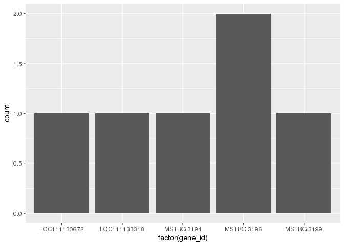
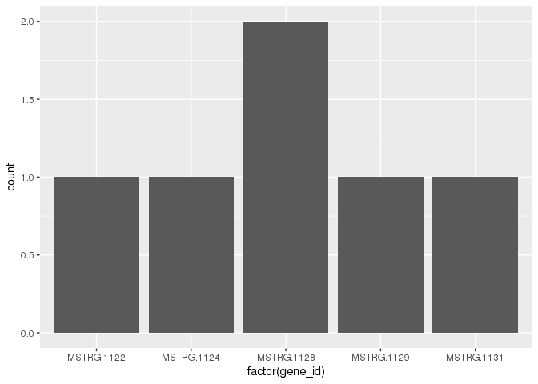
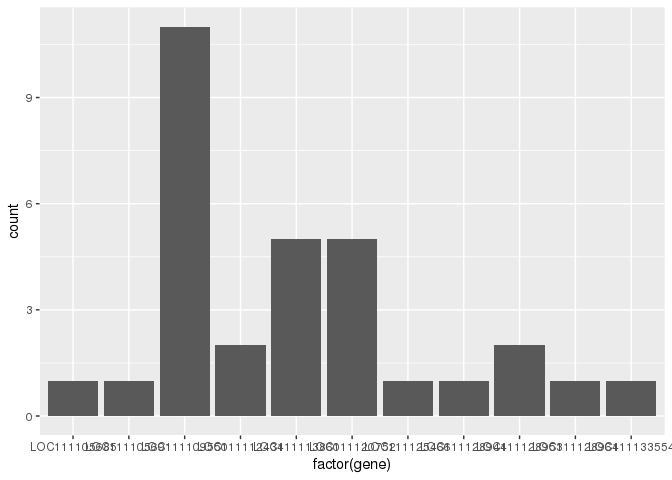

GO-Term-Match
================
Maggie Schedl
6/25/2020

``` r
library("DESeq2")
```

    ## Loading required package: S4Vectors

    ## Loading required package: stats4

    ## Loading required package: BiocGenerics

    ## Loading required package: parallel

    ## 
    ## Attaching package: 'BiocGenerics'

    ## The following objects are masked from 'package:parallel':
    ## 
    ##     clusterApply, clusterApplyLB, clusterCall, clusterEvalQ,
    ##     clusterExport, clusterMap, parApply, parCapply, parLapply,
    ##     parLapplyLB, parRapply, parSapply, parSapplyLB

    ## The following objects are masked from 'package:stats':
    ## 
    ##     IQR, mad, sd, var, xtabs

    ## The following objects are masked from 'package:base':
    ## 
    ##     anyDuplicated, append, as.data.frame, basename, cbind, colnames,
    ##     dirname, do.call, duplicated, eval, evalq, Filter, Find, get, grep,
    ##     grepl, intersect, is.unsorted, lapply, Map, mapply, match, mget,
    ##     order, paste, pmax, pmax.int, pmin, pmin.int, Position, rank,
    ##     rbind, Reduce, rownames, sapply, setdiff, sort, table, tapply,
    ##     union, unique, unsplit, which, which.max, which.min

    ## 
    ## Attaching package: 'S4Vectors'

    ## The following object is masked from 'package:base':
    ## 
    ##     expand.grid

    ## Loading required package: IRanges

    ## Loading required package: GenomicRanges

    ## Loading required package: GenomeInfoDb

    ## Loading required package: SummarizedExperiment

    ## Loading required package: Biobase

    ## Welcome to Bioconductor
    ## 
    ##     Vignettes contain introductory material; view with
    ##     'browseVignettes()'. To cite Bioconductor, see
    ##     'citation("Biobase")', and for packages 'citation("pkgname")'.

    ## Loading required package: DelayedArray

    ## Loading required package: matrixStats

    ## 
    ## Attaching package: 'matrixStats'

    ## The following objects are masked from 'package:Biobase':
    ## 
    ##     anyMissing, rowMedians

    ## Loading required package: BiocParallel

    ## 
    ## Attaching package: 'DelayedArray'

    ## The following objects are masked from 'package:matrixStats':
    ## 
    ##     colMaxs, colMins, colRanges, rowMaxs, rowMins, rowRanges

    ## The following objects are masked from 'package:base':
    ## 
    ##     aperm, apply, rowsum

``` r
library("tidyverse")
```

    ## ── Attaching packages ────────────────────────────────────────────────────────────────────────────────────────────────────────────────────────── tidyverse 1.3.0 ──

    ## ✓ ggplot2 3.3.0     ✓ purrr   0.3.3
    ## ✓ tibble  3.0.1     ✓ dplyr   0.8.5
    ## ✓ tidyr   1.0.2     ✓ stringr 1.4.0
    ## ✓ readr   1.3.1     ✓ forcats 0.5.0

    ## ── Conflicts ───────────────────────────────────────────────────────────────────────────────────────────────────────────────────────────── tidyverse_conflicts() ──
    ## x dplyr::collapse()   masks IRanges::collapse()
    ## x dplyr::combine()    masks Biobase::combine(), BiocGenerics::combine()
    ## x dplyr::count()      masks matrixStats::count()
    ## x dplyr::desc()       masks IRanges::desc()
    ## x tidyr::expand()     masks S4Vectors::expand()
    ## x dplyr::filter()     masks stats::filter()
    ## x dplyr::first()      masks S4Vectors::first()
    ## x dplyr::lag()        masks stats::lag()
    ## x ggplot2::Position() masks BiocGenerics::Position(), base::Position()
    ## x purrr::reduce()     masks GenomicRanges::reduce(), IRanges::reduce()
    ## x dplyr::rename()     masks S4Vectors::rename()
    ## x purrr::simplify()   masks DelayedArray::simplify()
    ## x dplyr::slice()      masks IRanges::slice()

``` r
library("dplyr")
library("pheatmap")
library("RColorBrewer")
library("genefilter")
```

    ## 
    ## Attaching package: 'genefilter'

    ## The following object is masked from 'package:readr':
    ## 
    ##     spec

    ## The following objects are masked from 'package:matrixStats':
    ## 
    ##     rowSds, rowVars

``` r
library("ggplot2")
library("gplots")
```

    ## 
    ## Attaching package: 'gplots'

    ## The following object is masked from 'package:IRanges':
    ## 
    ##     space

    ## The following object is masked from 'package:S4Vectors':
    ## 
    ##     space

    ## The following object is masked from 'package:stats':
    ## 
    ##     lowess

``` r
library("limma")
```

    ## 
    ## Attaching package: 'limma'

    ## The following object is masked from 'package:DESeq2':
    ## 
    ##     plotMA

    ## The following object is masked from 'package:BiocGenerics':
    ## 
    ##     plotMA

``` r
library("spdep") 
```

    ## Loading required package: sp

    ## 
    ## Attaching package: 'sp'

    ## The following object is masked from 'package:IRanges':
    ## 
    ##     %over%

    ## Loading required package: spData

    ## To access larger datasets in this package, install the spDataLarge
    ## package with: `install.packages('spDataLarge',
    ## repos='https://nowosad.github.io/drat/', type='source')`

    ## Loading required package: sf

    ## Linking to GEOS 3.4.2, GDAL 2.2.3, PROJ 4.8.0

``` r
library("adegenet") 
```

    ## Loading required package: ade4

    ## 
    ## Attaching package: 'ade4'

    ## The following object is masked from 'package:spdep':
    ## 
    ##     mstree

    ## The following object is masked from 'package:GenomicRanges':
    ## 
    ##     score

    ## The following object is masked from 'package:BiocGenerics':
    ## 
    ##     score

    ## Registered S3 method overwritten by 'ape':
    ##   method   from 
    ##   plot.mst spdep

    ## 
    ##    /// adegenet 2.1.2 is loaded ////////////
    ## 
    ##    > overview: '?adegenet'
    ##    > tutorials/doc/questions: 'adegenetWeb()' 
    ##    > bug reports/feature requests: adegenetIssues()

``` r
library("goseq")
```

    ## Loading required package: BiasedUrn

    ## Loading required package: geneLenDataBase

    ## 
    ## Attaching package: 'geneLenDataBase'

    ## The following object is masked from 'package:S4Vectors':
    ## 
    ##     unfactor

    ## 

``` r
library("forcats")
library("gridExtra")
```

    ## 
    ## Attaching package: 'gridExtra'

    ## The following object is masked from 'package:dplyr':
    ## 
    ##     combine

    ## The following object is masked from 'package:Biobase':
    ## 
    ##     combine

    ## The following object is masked from 'package:BiocGenerics':
    ## 
    ##     combine

``` r
library("ape")
library("Rgb")
library("stringr")
```

There were some previous problems where transcripts spanned multiple genes in the genome. I only was able to figure that out by matching these transcripts to the file with GO terms and seeing that they came from two genes.

I want to see if I can find the same problem.

The general map of getting to a MSTRG\# to an XP notation goes like gene\_id (genecounts file) -&gt; gene\_id (merge annotation file) -&gt; LOC\#(reference annotation) -&gt; XP (GO term file) genecounts file has either an MSTRG\# or LOC\#, however some MSTRG\# have a corresponding LOC\# so it needs to be matched through the merged annotated file from stringtie, so it can be used to filter the reference annotation file. The reference annotation file, filtered by only the LOCs needed, gives a list of XP notations, which will be the way to match to the GO term file.

First I bring in the filtered counts file because it contains the list of genes that are being used in the DE analysis and the ultimately all downstream analysis.

``` r
filtered_counts <- read.csv("filtered_gene_counts_2020.csv", header = TRUE, sep = ",") 
# need to add the name for the first column
colnames(filtered_counts) <- c("gene_id", "CASE_J03", "CASE_J09", "CASE_J12", "CASE_J13", "CA_J06",   "CA_J08", "CA_J11", "CA_J18",  "CON_J02", "CON_J05", "CON_J10", "SE_J01",  "SE_J04", "SE_J07")
head(filtered_counts)
```

    ##                    gene_id CASE_J03 CASE_J09 CASE_J12 CASE_J13 CA_J06 CA_J08
    ## 1              MSTRG.18311     1241     1692     1181     1972    815   1002
    ## 2  MSTRG.1865|LOC111125944       30       22       30       94      4     18
    ## 3 MSTRG.21639|LOC111134460       13       11        0       13     10     30
    ## 4              MSTRG.28363      371      737      622      854    342    442
    ## 5 MSTRG.22377|LOC111138464       10        9        4        2      7      0
    ## 6 MSTRG.19617|LOC111136644        0        6       11        0      0     17
    ##   CA_J11 CA_J18 CON_J02 CON_J05 CON_J10 SE_J01 SE_J04 SE_J07
    ## 1   1225   2206    1091    1844    2491   1931   2552   1052
    ## 2     51     93      27      38      33     40     32     27
    ## 3      9     22      12      60      57     26      0     18
    ## 4    585   1071     512     624    1011    683    883    291
    ## 5      6     10       5       5       8      0      0      0
    ## 6     17      3       8       3       0      2      4      4

``` r
dim(filtered_counts) #21330
```

    ## [1] 21330    15

``` r
filtered_counts[25,]
```

    ##                           gene_id CASE_J03 CASE_J09 CASE_J12 CASE_J13 CA_J06
    ## 25 gene-LOC111100194|LOC111100194       19       12       10       11      9
    ##    CA_J08 CA_J11 CA_J18 CON_J02 CON_J05 CON_J10 SE_J01 SE_J04 SE_J07
    ## 25      9     10     17      18      15      25      7     11     12

This is interesting because the gene names have either the stringtie name or the stringtie name and the LOC name, or even the other combination. I don't know why they are named like this. Previous versions of doing this just have a nice list of MSTRG\#\#\#s

I will also need the annotated merged GTF file from gffcomprare because it will match the MSTRG with LOC and other information to be able to match to the genome and reference gtf file.

Bring in annotated gtf file

``` r
Merged_AnnotGTF <- read.gtf("Compare-merge-fFT-C.annotated.gtf", attr = c("split"), features = NULL, quiet = FALSE)
```

    ## File parsing ... 983900 rows processed
    ## Attribute splitting ... 3360725 pairs processed
    ## Attribute sorting ... 10 tags found
    ## Attribute binding ...
    ## done

``` r
head(Merged_AnnotGTF)
```

    ##       seqname    source    feature start  end score strand frame
    ## 1 NC_007175.2 StringTie transcript     1 1623    NA      +    NA
    ## 2 NC_007175.2 StringTie       exon     1 1623    NA      +    NA
    ## 3 NC_007175.2 StringTie transcript  1710 8997    NA      +    NA
    ## 4 NC_007175.2 StringTie       exon  1710 2430    NA      +    NA
    ## 5 NC_007175.2 StringTie       exon  8250 8997    NA      +    NA
    ## 6 NC_007175.2 StringTie transcript  2645 3429    NA      +    NA
    ##                transcript_id gene_id gene_name        xloc ref_gene_id
    ## 1                  gene-COX1 MSTRG.2      COX1 XLOC_000001   gene-COX1
    ## 2                  gene-COX1 MSTRG.2      <NA>        <NA>        <NA>
    ## 3 rna-NC_007175.2:1710..8997 MSTRG.3      <NA> XLOC_000002        <NA>
    ## 4 rna-NC_007175.2:1710..8997 MSTRG.3      <NA>        <NA>        <NA>
    ## 5 rna-NC_007175.2:1710..8997 MSTRG.3      <NA>        <NA>        <NA>
    ## 6                  gene-COX3 MSTRG.4      COX3 XLOC_000003   gene-COX3
    ##                      cmp_ref class_code tss_id exon_number contained_in
    ## 1                  gene-COX1          =   TSS1          NA         <NA>
    ## 2                       <NA>       <NA>   <NA>           1         <NA>
    ## 3 rna-NC_007175.2:1710..8997          =   TSS2          NA         <NA>
    ## 4                       <NA>       <NA>   <NA>           1         <NA>
    ## 5                       <NA>       <NA>   <NA>           2         <NA>
    ## 6                  gene-COX3          =   TSS3          NA         <NA>

``` r
dim(Merged_AnnotGTF) #983900
```

    ## [1] 983900     18

``` r
Merged_AnnotGTF_transcript <- Merged_AnnotGTF %>%
  filter(feature == 'transcript')
head(Merged_AnnotGTF_transcript)
```

    ##       seqname    source    feature start  end score strand frame
    ## 1 NC_007175.2 StringTie transcript     1 1623    NA      +    NA
    ## 2 NC_007175.2 StringTie transcript  1710 8997    NA      +    NA
    ## 3 NC_007175.2 StringTie transcript  2645 3429    NA      +    NA
    ## 4 NC_007175.2 StringTie transcript  3430 3495    NA      +    NA
    ## 5 NC_007175.2 StringTie transcript  3499 3567    NA      +    NA
    ## 6 NC_007175.2 StringTie transcript  3578 3646    NA      +    NA
    ##                transcript_id gene_id gene_name        xloc ref_gene_id
    ## 1                  gene-COX1 MSTRG.2      COX1 XLOC_000001   gene-COX1
    ## 2 rna-NC_007175.2:1710..8997 MSTRG.3      <NA> XLOC_000002        <NA>
    ## 3                  gene-COX3 MSTRG.4      COX3 XLOC_000003   gene-COX3
    ## 4 rna-NC_007175.2:3430..3495 MSTRG.5      <NA> XLOC_000004        <NA>
    ## 5 rna-NC_007175.2:3499..3567 MSTRG.6      <NA> XLOC_000005        <NA>
    ## 6 rna-NC_007175.2:3578..3646 MSTRG.7      <NA> XLOC_000006        <NA>
    ##                      cmp_ref class_code tss_id exon_number contained_in
    ## 1                  gene-COX1          =   TSS1          NA         <NA>
    ## 2 rna-NC_007175.2:1710..8997          =   TSS2          NA         <NA>
    ## 3                  gene-COX3          =   TSS3          NA         <NA>
    ## 4 rna-NC_007175.2:3430..3495          =   TSS4          NA         <NA>
    ## 5 rna-NC_007175.2:3499..3567          =   TSS5          NA         <NA>
    ## 6 rna-NC_007175.2:3578..3646          =   TSS6          NA         <NA>

``` r
dim(Merged_AnnotGTF_transcript) # 85417
```

    ## [1] 85417    18

``` r
# going to get rid of a few columns that don't have any information 

Merged_AnnotGTF_transcript <- Merged_AnnotGTF_transcript[,c(1,4:5,9:14)] 
head(Merged_AnnotGTF_transcript)
```

    ##       seqname start  end              transcript_id gene_id gene_name
    ## 1 NC_007175.2     1 1623                  gene-COX1 MSTRG.2      COX1
    ## 2 NC_007175.2  1710 8997 rna-NC_007175.2:1710..8997 MSTRG.3      <NA>
    ## 3 NC_007175.2  2645 3429                  gene-COX3 MSTRG.4      COX3
    ## 4 NC_007175.2  3430 3495 rna-NC_007175.2:3430..3495 MSTRG.5      <NA>
    ## 5 NC_007175.2  3499 3567 rna-NC_007175.2:3499..3567 MSTRG.6      <NA>
    ## 6 NC_007175.2  3578 3646 rna-NC_007175.2:3578..3646 MSTRG.7      <NA>
    ##          xloc ref_gene_id                    cmp_ref
    ## 1 XLOC_000001   gene-COX1                  gene-COX1
    ## 2 XLOC_000002        <NA> rna-NC_007175.2:1710..8997
    ## 3 XLOC_000003   gene-COX3                  gene-COX3
    ## 4 XLOC_000004        <NA> rna-NC_007175.2:3430..3495
    ## 5 XLOC_000005        <NA> rna-NC_007175.2:3499..3567
    ## 6 XLOC_000006        <NA> rna-NC_007175.2:3578..3646

``` r
# I think I want to remove mitochondrial sequences because I dont think theyre in the GO term 
# this is based on the XP_sequences_Cvirginica_GCF_002022765.2_GO.clean.tab file
Merged_AnnotGTF_transcript_autosome <- subset(Merged_AnnotGTF_transcript, seqname!="NC_007175.2")
head(Merged_AnnotGTF_transcript_autosome)
```

    ##        seqname  start    end      transcript_id           gene_id    gene_name
    ## 51 NC_035780.1  13578  14594 rna-XR_002636969.1 gene-LOC111116054 LOC111116054
    ## 52 NC_035780.1  28961  33324 rna-XM_022471938.1 gene-LOC111126949 LOC111126949
    ## 53 NC_035780.1  99840 106460 rna-XM_022461698.1          MSTRG.39 LOC111120752
    ## 54 NC_035780.1 151859 157536 rna-XM_022474931.1 gene-LOC111128953 LOC111128953
    ## 55 NC_035780.1 164820 166793 rna-XM_022440042.1          MSTRG.42 LOC111105685
    ## 56 NC_035780.1 207340 225102         MSTRG.46.1          MSTRG.46 LOC111113860
    ##           xloc       ref_gene_id            cmp_ref
    ## 51 XLOC_000039 gene-LOC111116054 rna-XR_002636969.1
    ## 52 XLOC_000040 gene-LOC111126949 rna-XM_022471938.1
    ## 53 XLOC_000041 gene-LOC111120752 rna-XM_022461698.1
    ## 54 XLOC_000042 gene-LOC111128953 rna-XM_022474931.1
    ## 55 XLOC_000043 gene-LOC111105685 rna-XM_022440042.1
    ## 56 XLOC_000044              <NA> rna-XM_022452155.1

``` r
dim(Merged_AnnotGTF_transcript_autosome) #85367
```

    ## [1] 85367     9

My guess is that gene\_id match in both of the files I have. it's either the MSTRG or the gene-LOC/LOC what matters is the LOC number. That so, I need to remove the gene- symbol from this column before I can get things to match up.

``` r
Merged_AnnotGTF_transcript_autosome[1:10,]
```

    ##        seqname  start    end      transcript_id           gene_id    gene_name
    ## 51 NC_035780.1  13578  14594 rna-XR_002636969.1 gene-LOC111116054 LOC111116054
    ## 52 NC_035780.1  28961  33324 rna-XM_022471938.1 gene-LOC111126949 LOC111126949
    ## 53 NC_035780.1  99840 106460 rna-XM_022461698.1          MSTRG.39 LOC111120752
    ## 54 NC_035780.1 151859 157536 rna-XM_022474931.1 gene-LOC111128953 LOC111128953
    ## 55 NC_035780.1 164820 166793 rna-XM_022440042.1          MSTRG.42 LOC111105685
    ## 56 NC_035780.1 207340 225102         MSTRG.46.1          MSTRG.46 LOC111113860
    ## 57 NC_035780.1 245535 253025         MSTRG.52.1          MSTRG.52 LOC111109452
    ## 58 NC_035780.1 258108 272827         MSTRG.53.1          MSTRG.53 LOC111124802
    ## 59 NC_035780.1 261376 272820         MSTRG.53.2          MSTRG.53 LOC111124802
    ## 60 NC_035780.1 266141 272827         MSTRG.53.3          MSTRG.53 LOC111124802
    ##           xloc       ref_gene_id            cmp_ref
    ## 51 XLOC_000039 gene-LOC111116054 rna-XR_002636969.1
    ## 52 XLOC_000040 gene-LOC111126949 rna-XM_022471938.1
    ## 53 XLOC_000041 gene-LOC111120752 rna-XM_022461698.1
    ## 54 XLOC_000042 gene-LOC111128953 rna-XM_022474931.1
    ## 55 XLOC_000043 gene-LOC111105685 rna-XM_022440042.1
    ## 56 XLOC_000044              <NA> rna-XM_022452155.1
    ## 57 XLOC_000045              <NA> rna-XM_022445568.1
    ## 58 XLOC_000046              <NA> rna-XM_022468012.1
    ## 59 XLOC_000046              <NA> rna-XM_022468012.1
    ## 60 XLOC_000046              <NA> rna-XM_022468012.1

``` r
# remove -gene
Merged_AnnotGTF_transcript_autosome_sub <-mapply(gsub, pattern = "gene-", replacement = "", Merged_AnnotGTF_transcript_autosome)
# re-make into dataframe and give column names 
Merged_AnnotGTF_transcript_autosome_sub <- as.data.frame(Merged_AnnotGTF_transcript_autosome_sub)
colnames(Merged_AnnotGTF_transcript_autosome_sub) <- c("seqname"   ,    "start" ,        "end"        ,   "transcript_id", "gene_id"   ,    "gene_name"   ,  "xloc"     ,     "ref_gene_id" ,  "cmp_ref")
Merged_AnnotGTF_transcript_autosome_sub[1:10,]
```

    ##        seqname  start    end      transcript_id      gene_id    gene_name
    ## 1  NC_035780.1  13578  14594 rna-XR_002636969.1 LOC111116054 LOC111116054
    ## 2  NC_035780.1  28961  33324 rna-XM_022471938.1 LOC111126949 LOC111126949
    ## 3  NC_035780.1  99840 106460 rna-XM_022461698.1     MSTRG.39 LOC111120752
    ## 4  NC_035780.1 151859 157536 rna-XM_022474931.1 LOC111128953 LOC111128953
    ## 5  NC_035780.1 164820 166793 rna-XM_022440042.1     MSTRG.42 LOC111105685
    ## 6  NC_035780.1 207340 225102         MSTRG.46.1     MSTRG.46 LOC111113860
    ## 7  NC_035780.1 245535 253025         MSTRG.52.1     MSTRG.52 LOC111109452
    ## 8  NC_035780.1 258108 272827         MSTRG.53.1     MSTRG.53 LOC111124802
    ## 9  NC_035780.1 261376 272820         MSTRG.53.2     MSTRG.53 LOC111124802
    ## 10 NC_035780.1 266141 272827         MSTRG.53.3     MSTRG.53 LOC111124802
    ##           xloc  ref_gene_id            cmp_ref
    ## 1  XLOC_000039 LOC111116054 rna-XR_002636969.1
    ## 2  XLOC_000040 LOC111126949 rna-XM_022471938.1
    ## 3  XLOC_000041 LOC111120752 rna-XM_022461698.1
    ## 4  XLOC_000042 LOC111128953 rna-XM_022474931.1
    ## 5  XLOC_000043 LOC111105685 rna-XM_022440042.1
    ## 6  XLOC_000044         <NA> rna-XM_022452155.1
    ## 7  XLOC_000045         <NA> rna-XM_022445568.1
    ## 8  XLOC_000046         <NA> rna-XM_022468012.1
    ## 9  XLOC_000046         <NA> rna-XM_022468012.1
    ## 10 XLOC_000046         <NA> rna-XM_022468012.1

``` r
# check that dimentions are the same
dim(Merged_AnnotGTF_transcript_autosome_sub) # 85367
```

    ## [1] 85367     9

Now to remove the extra characters in the counts file so it is a simple list of either MSTRG or LOC I Tried to remove everything after the | and the | The problem with r is that if I put the | in the code to remove, for some reason it can't recognize that it means | there must be a special r meaning for that symbol Luckily . means any character

``` r
filtered_counts$gene_id <- str_replace(filtered_counts$gene_id, ".LOC[0-9][0-9][0-9][0-9][0-9][0-9][0-9][0-9][0-9]", "")
filtered_counts[1:10,]
```

    ##        gene_id CASE_J03 CASE_J09 CASE_J12 CASE_J13 CA_J06 CA_J08 CA_J11 CA_J18
    ## 1  MSTRG.18311     1241     1692     1181     1972    815   1002   1225   2206
    ## 2   MSTRG.1865       30       22       30       94      4     18     51     93
    ## 3  MSTRG.21639       13       11        0       13     10     30      9     22
    ## 4  MSTRG.28363      371      737      622      854    342    442    585   1071
    ## 5  MSTRG.22377       10        9        4        2      7      0      6     10
    ## 6  MSTRG.19617        0        6       11        0      0     17     17      3
    ## 7  MSTRG.19845      802      915      657      814    726    636    725    961
    ## 8  MSTRG.19842     1409     1477     1216     1991   1051   1130   1290   2590
    ## 9  MSTRG.15172     2985     7135     3316     5990   2603   3716   6742  10679
    ## 10 MSTRG.15177     9970    12912     8401    14641   5745   5207   7318  17085
    ##    CON_J02 CON_J05 CON_J10 SE_J01 SE_J04 SE_J07
    ## 1     1091    1844    2491   1931   2552   1052
    ## 2       27      38      33     40     32     27
    ## 3       12      60      57     26      0     18
    ## 4      512     624    1011    683    883    291
    ## 5        5       5       8      0      0      0
    ## 6        8       3       0      2      4      4
    ## 7      858     644     623    870    557    880
    ## 8     1292    2102    2701   2027   2602   1297
    ## 9     4691   13884   24487   3255   8222   4954
    ## 10    6617   10531   15526  13024  13173   7644

``` r
# ok now some look like this gene|LOC111133234
filtered_counts$gene_id <- str_replace(filtered_counts$gene_id, "gene.", "")
filtered_counts[1:10,]
```

    ##        gene_id CASE_J03 CASE_J09 CASE_J12 CASE_J13 CA_J06 CA_J08 CA_J11 CA_J18
    ## 1  MSTRG.18311     1241     1692     1181     1972    815   1002   1225   2206
    ## 2   MSTRG.1865       30       22       30       94      4     18     51     93
    ## 3  MSTRG.21639       13       11        0       13     10     30      9     22
    ## 4  MSTRG.28363      371      737      622      854    342    442    585   1071
    ## 5  MSTRG.22377       10        9        4        2      7      0      6     10
    ## 6  MSTRG.19617        0        6       11        0      0     17     17      3
    ## 7  MSTRG.19845      802      915      657      814    726    636    725    961
    ## 8  MSTRG.19842     1409     1477     1216     1991   1051   1130   1290   2590
    ## 9  MSTRG.15172     2985     7135     3316     5990   2603   3716   6742  10679
    ## 10 MSTRG.15177     9970    12912     8401    14641   5745   5207   7318  17085
    ##    CON_J02 CON_J05 CON_J10 SE_J01 SE_J04 SE_J07
    ## 1     1091    1844    2491   1931   2552   1052
    ## 2       27      38      33     40     32     27
    ## 3       12      60      57     26      0     18
    ## 4      512     624    1011    683    883    291
    ## 5        5       5       8      0      0      0
    ## 6        8       3       0      2      4      4
    ## 7      858     644     623    870    557    880
    ## 8     1292    2102    2701   2027   2602   1297
    ## 9     4691   13884   24487   3255   8222   4954
    ## 10    6617   10531   15526  13024  13173   7644

``` r
filtered_counts[300:310,]
```

    ##          gene_id CASE_J03 CASE_J09 CASE_J12 CASE_J13 CA_J06 CA_J08 CA_J11
    ## 300  MSTRG.21637      910      984      910     1280    868    616    894
    ## 301  MSTRG.21635      915      928      690      810    622    495    592
    ## 302  MSTRG.21632     2248     2583     2240     2563   1899   2033   1905
    ## 303   MSTRG.7015      396      774      533      649    461    592    450
    ## 304  MSTRG.21631     3527     4237     3421     4392   2898   2755   3021
    ## 305  MSTRG.21638     2569     4075     2508     4702   1805   2224   2862
    ## 306   MSTRG.9246      476      521      403      514    248    366    436
    ## 307   MSTRG.9247     1129     1577     1220     1682    925    861   1066
    ## 308 LOC111101250        0        0        5        0      0     13      0
    ## 309   MSTRG.9249      333      721      556     1561    121    650   1534
    ## 310  MSTRG.28933      794      823      714      872    720    684    675
    ##     CA_J18 CON_J02 CON_J05 CON_J10 SE_J01 SE_J04 SE_J07
    ## 300   1227    1137     973    1231    799    749    729
    ## 301    893     756     584     649    786    636    708
    ## 302   2276    2709    2671    2265   2441   2088   3205
    ## 303    517     871     511     396    505    455    671
    ## 304   4323    3770    3350    4059   3774   3568   3633
    ## 305   5128    2769    3018    5253   3696   3931   1919
    ## 306    532     446     417     596    494    469    433
    ## 307   1630    1406    1361    1611   1453   1837   1397
    ## 308      0       0      10       0      6      0      6
    ## 309   2038     281    3552    5691    504   2161   1461
    ## 310    845     961     680     699    594    510   1057

``` r
# there is a problem with this line
# I don't know why this one is named like this, and I don't know how to search to see if there are others. But it seems weird to me that this could happen. 
filtered_counts[78,]
```

    ##                  gene_id CASE_J03 CASE_J09 CASE_J12 CASE_J13 CA_J06 CA_J08
    ## 78 MSTRG.17692|Trnat-ggu        6        6        5        4     10      4
    ##    CA_J11 CA_J18 CON_J02 CON_J05 CON_J10 SE_J01 SE_J04 SE_J07
    ## 78      7     14       4       4      11      6      9     10

``` r
# right now I just left it as is, but that means it won't match between the files
```

Now I took the gene\_ids in the counts file and filtered the merged gtf file by those names

``` r
Merged_annot_counts <- filter(Merged_AnnotGTF_transcript_autosome_sub, gene_id%in%filtered_counts$gene_id) 
head(Merged_annot_counts)
```

    ##       seqname  start    end      transcript_id      gene_id    gene_name
    ## 1 NC_035780.1 207340 225102         MSTRG.46.1     MSTRG.46 LOC111113860
    ## 2 NC_035780.1 245535 253025         MSTRG.52.1     MSTRG.52 LOC111109452
    ## 3 NC_035780.1 258108 272827         MSTRG.53.1     MSTRG.53 LOC111124802
    ## 4 NC_035780.1 261376 272820         MSTRG.53.2     MSTRG.53 LOC111124802
    ## 5 NC_035780.1 266141 272827         MSTRG.53.3     MSTRG.53 LOC111124802
    ## 6 NC_035780.1 281547 293861 rna-XM_022433686.1 LOC111101250 LOC111101250
    ##          xloc  ref_gene_id            cmp_ref
    ## 1 XLOC_000044         <NA> rna-XM_022452155.1
    ## 2 XLOC_000045         <NA> rna-XM_022445568.1
    ## 3 XLOC_000046         <NA> rna-XM_022468012.1
    ## 4 XLOC_000046         <NA> rna-XM_022468012.1
    ## 5 XLOC_000046         <NA> rna-XM_022468012.1
    ## 6 XLOC_000048 LOC111101250 rna-XM_022433686.1

``` r
dim(Merged_annot_counts) # 85367 down to 37656 but there must be duplicates because there are 21330 in the filtered counts file
```

    ## [1] 37656     9

``` r
# this is because the merged file contains the isoform/transcript information, see transcript_id column
Merged_annot_counts[1:10,]
```

    ##        seqname  start    end      transcript_id      gene_id    gene_name
    ## 1  NC_035780.1 207340 225102         MSTRG.46.1     MSTRG.46 LOC111113860
    ## 2  NC_035780.1 245535 253025         MSTRG.52.1     MSTRG.52 LOC111109452
    ## 3  NC_035780.1 258108 272827         MSTRG.53.1     MSTRG.53 LOC111124802
    ## 4  NC_035780.1 261376 272820         MSTRG.53.2     MSTRG.53 LOC111124802
    ## 5  NC_035780.1 266141 272827         MSTRG.53.3     MSTRG.53 LOC111124802
    ## 6  NC_035780.1 281547 293861 rna-XM_022433686.1 LOC111101250 LOC111101250
    ## 7  NC_035780.1 281696 293861 rna-XM_022433693.1 LOC111101250 LOC111101250
    ## 8  NC_035780.1 297131 311654 rna-XM_022433705.1     MSTRG.58 LOC111101262
    ## 9  NC_035780.1 372165 377040         MSTRG.64.1     MSTRG.64 LOC111101799
    ## 10 NC_035780.1 380438 392011         MSTRG.66.1     MSTRG.66 LOC111117743
    ##           xloc  ref_gene_id            cmp_ref
    ## 1  XLOC_000044         <NA> rna-XM_022452155.1
    ## 2  XLOC_000045         <NA> rna-XM_022445568.1
    ## 3  XLOC_000046         <NA> rna-XM_022468012.1
    ## 4  XLOC_000046         <NA> rna-XM_022468012.1
    ## 5  XLOC_000046         <NA> rna-XM_022468012.1
    ## 6  XLOC_000048 LOC111101250 rna-XM_022433686.1
    ## 7  XLOC_000048 LOC111101250 rna-XM_022433693.1
    ## 8  XLOC_000049 LOC111101262 rna-XM_022433705.1
    ## 9  XLOC_000053         <NA> rna-XM_022434407.1
    ## 10 XLOC_000054         <NA> rna-XM_022457001.1

The way to match this file with the reference annotation file is with the gene\_name. So I first removed the NAs in the gene\_name column, and then removed any duplicates (basically collapsed things with multiple isoforms)

``` r
# remove NAs in gene_name
Merged_annot_counts <- drop_na(Merged_annot_counts, gene_name)
dim(Merged_annot_counts) # 36972  so lost 684 MSTRGs
```

    ## [1] 36972     9

``` r
# remove duplicates in gene_name, meaning those were multiple transcripts in the same gene I guess 
Merged_annot_counts_u <- Merged_annot_counts[!duplicated(Merged_annot_counts$gene_name), ]
dim(Merged_annot_counts_u)
```

    ## [1] 14581     9

``` r
Merged_annot_counts_u[1:10,] 
```

    ##        seqname  start    end      transcript_id      gene_id    gene_name
    ## 1  NC_035780.1 207340 225102         MSTRG.46.1     MSTRG.46 LOC111113860
    ## 2  NC_035780.1 245535 253025         MSTRG.52.1     MSTRG.52 LOC111109452
    ## 3  NC_035780.1 258108 272827         MSTRG.53.1     MSTRG.53 LOC111124802
    ## 6  NC_035780.1 281547 293861 rna-XM_022433686.1 LOC111101250 LOC111101250
    ## 8  NC_035780.1 297131 311654 rna-XM_022433705.1     MSTRG.58 LOC111101262
    ## 9  NC_035780.1 372165 377040         MSTRG.64.1     MSTRG.64 LOC111101799
    ## 10 NC_035780.1 380438 392011         MSTRG.66.1     MSTRG.66 LOC111117743
    ## 11 NC_035780.1 394983 409273         MSTRG.68.1     MSTRG.68 LOC111117672
    ## 12 NC_035780.1 409477 415627 rna-XM_022452346.1     MSTRG.70 LOC111114053
    ## 13 NC_035780.1 573627 585411         MSTRG.75.1     MSTRG.75 LOC111114212
    ##           xloc  ref_gene_id            cmp_ref
    ## 1  XLOC_000044         <NA> rna-XM_022452155.1
    ## 2  XLOC_000045         <NA> rna-XM_022445568.1
    ## 3  XLOC_000046         <NA> rna-XM_022468012.1
    ## 6  XLOC_000048 LOC111101250 rna-XM_022433686.1
    ## 8  XLOC_000049 LOC111101262 rna-XM_022433705.1
    ## 9  XLOC_000053         <NA> rna-XM_022434407.1
    ## 10 XLOC_000054         <NA> rna-XM_022457001.1
    ## 11 XLOC_000055         <NA> rna-XM_022456873.1
    ## 12 XLOC_000056 LOC111114053 rna-XM_022452346.1
    ## 13 XLOC_000062         <NA> rna-XM_022452500.1

``` r
# now this is at 14581
```

First I did a check to see if there were multiple gene\_names for one gene\_id

``` r
# subset to just the gene_id and gene_name columns 
ID_name <- Merged_annot_counts_u[,5:6] 
# plot MSTRG on the x axis and a histogram of counts of LOCs as the bars
head(ID_name)
```

    ##        gene_id    gene_name
    ## 1     MSTRG.46 LOC111113860
    ## 2     MSTRG.52 LOC111109452
    ## 3     MSTRG.53 LOC111124802
    ## 6 LOC111101250 LOC111101250
    ## 8     MSTRG.58 LOC111101262
    ## 9     MSTRG.64 LOC111101799

``` r
# narrowed this down to a small range so I could find the name of the gene_id and look at what it says in the full file
ID_name2 <- ID_name[1035:1040,]
ggplot(ID_name2, aes(x = factor(gene_id))) +
    geom_bar()
```



``` r
# MSTRG.3196
# find the row names and then look at it
which(Merged_annot_counts_u == "MSTRG.3196", arr.ind = TRUE)
```

    ##       row col
    ## 1996 1038   5
    ## 1997 1039   5

``` r
Merged_annot_counts_u[1038:1039,]
```

    ##          seqname    start      end transcript_id    gene_id    gene_name
    ## 1996 NC_035780.1 60674480 60675294  MSTRG.3196.2 MSTRG.3196 LOC111137948
    ## 1997 NC_035780.1 60674480 60730001  MSTRG.3196.1 MSTRG.3196 LOC111137665
    ##             xloc ref_gene_id            cmp_ref
    ## 1996 XLOC_002484        <NA> rna-XM_022489708.1
    ## 1997 XLOC_002484        <NA> rna-XM_022489270.1

``` r
# the XLOC are the same
# XLOC means    A unique internal id for the super-locus containing these transcripts across all samples and the reference annotation
# what is a super-locus
```

What is superlocus? <https://ccb.jhu.edu/software/stringtie/gffcompare.shtml>

"The "super-locus" concept The XLOC\_ prefix is assigned to super-locus identifiers in many of the GffCompare output files. A super-locus is a region of the genome where predicted transcripts and reference transcripts get clustered (grouped or linked) together by exon overlaps. When multiple samples (multiple GTF files with assembled transfrags) are provided as input to GffCompare, this clustering is performed across all the samples. Due to the transitive nature of this clustering by exon overlaps, these super-loci can occasionally get very large, sometimes merging a few distinct reference gene regions together -- especially if there is a lot of transcription or alignment noise around the individual gene regions. Not all super-loci have reference transcripts assigned, sometimes they are just a bunch of transfrags clumped together, possibly from multiple samples, all linked together by exon overlaps, with no reference transcripts present in that region.""

Maybe my problem is that I'm using a file from gffcompare? I just liked that it had more annotation information. But I do think gffcompare might be doing some extra things to the file? But that's not the one that the second stringtie is on? Although maybe the thing it is doing is making the superlocus. Those two above have the same start position so...

What would happen if I used the merged gtf file that stringtie created but not the one gffcompare used?

``` r
Merged_GTF <- read.gtf("Cvir-merged-fFT-C.gtf", attr = c("split"), features = NULL, quiet = FALSE)
```

    ## File parsing ... 983900 rows processed
    ## Attribute splitting ... 4213725 pairs processed
    ## Attribute sorting ... 5 tags found
    ## Attribute binding ...
    ## done

``` r
head(Merged_GTF)
```

    ##       seqname    source    feature start   end score strand frame gene_id
    ## 1 NC_007175.2 StringTie transcript     1  7775  1000      -    NA MSTRG.1
    ## 2 NC_007175.2 StringTie       exon     1  4212  1000      -    NA MSTRG.1
    ## 3 NC_007175.2 StringTie       exon  4243  6532  1000      -    NA MSTRG.1
    ## 4 NC_007175.2 StringTie       exon  6628  7775  1000      -    NA MSTRG.1
    ## 5 NC_007175.2 StringTie transcript     2 17244  1000      -    NA MSTRG.1
    ## 6 NC_007175.2 StringTie       exon     2  1048  1000      -    NA MSTRG.1
    ##   transcript_id exon_number gene_name ref_gene_id
    ## 1     MSTRG.1.1          NA      <NA>        <NA>
    ## 2     MSTRG.1.1           1      <NA>        <NA>
    ## 3     MSTRG.1.1           2      <NA>        <NA>
    ## 4     MSTRG.1.1           3      <NA>        <NA>
    ## 5     MSTRG.1.2          NA      <NA>        <NA>
    ## 6     MSTRG.1.2           1      <NA>        <NA>

``` r
# only want the lines that say transcript not exon
Merged_GTF_transcript <- Merged_GTF %>%
  filter(feature == 'transcript')
head(Merged_GTF_transcript)
```

    ##       seqname    source    feature start   end score strand frame gene_id
    ## 1 NC_007175.2 StringTie transcript     1  7775  1000      -    NA MSTRG.1
    ## 2 NC_007175.2 StringTie transcript     2 17244  1000      -    NA MSTRG.1
    ## 3 NC_007175.2 StringTie transcript     2  8996  1000      -    NA MSTRG.1
    ## 4 NC_007175.2 StringTie transcript     2  7865  1000      -    NA MSTRG.1
    ## 5 NC_007175.2 StringTie transcript     9  5685  1000      -    NA MSTRG.1
    ## 6 NC_007175.2 StringTie transcript     9  5692  1000      -    NA MSTRG.1
    ##   transcript_id exon_number gene_name ref_gene_id
    ## 1     MSTRG.1.1          NA      <NA>        <NA>
    ## 2     MSTRG.1.2          NA      <NA>        <NA>
    ## 3     MSTRG.1.3          NA      <NA>        <NA>
    ## 4     MSTRG.1.4          NA      <NA>        <NA>
    ## 5     MSTRG.1.5          NA      <NA>        <NA>
    ## 6     MSTRG.1.6          NA      <NA>        <NA>

``` r
dim(Merged_GTF_transcript) # 85417 same as the annot version of this file thats good 
```

    ## [1] 85417    13

``` r
# again cut out the mitochondiral sequences
Merged_GTF_transcript_autosome <- subset(Merged_GTF_transcript, seqname!="NC_007175.2")

# cut down on some columns
Merged_GTF_transcript_autosome <- Merged_GTF_transcript_autosome[,c(1,4:5,9:10,12:13)] 
head(Merged_GTF_transcript_autosome)
```

    ##        seqname  start    end  gene_id      transcript_id    gene_name
    ## 51 NC_035780.1  99840 106460 MSTRG.39 rna-XM_022461698.1 LOC111120752
    ## 52 NC_035780.1  99871 106619 MSTRG.40         MSTRG.40.1         <NA>
    ## 53 NC_035780.1 163809 183798 MSTRG.41 rna-XM_022440054.1 LOC111105691
    ## 54 NC_035780.1 164820 166793 MSTRG.42 rna-XM_022440042.1 LOC111105685
    ## 55 NC_035780.1 169468 170178 MSTRG.43 rna-XR_002635081.1 LOC111105702
    ## 56 NC_035780.1 190449 193594 MSTRG.44 rna-XM_022482070.1 LOC111133554
    ##          ref_gene_id
    ## 51 gene-LOC111120752
    ## 52              <NA>
    ## 53 gene-LOC111105691
    ## 54 gene-LOC111105685
    ## 55 gene-LOC111105702
    ## 56 gene-LOC111133554

This looks great except that there are separate columns for the gene\_name and the gene\_id... I don't know how to combine or search for the MSTRG\#s that don't have their LOC in the right column MSTRG.1025 has a LOC\#.... Maybe it was in the filtered counts file with those smushed names I don't know how to separate them out though..

look at the original file again

``` r
counts <- read.csv("filtered_gene_counts_2020.csv", header = TRUE, sep = ",") 
# need to add the name for the first column
colnames(counts) <- c("gene_id", "CASE_J03", "CASE_J09", "CASE_J12", "CASE_J13", "CA_J06",   "CA_J08", "CA_J11", "CA_J18",  "CON_J02", "CON_J05", "CON_J10", "SE_J01",  "SE_J04", "SE_J07")
head(counts)
```

    ##                    gene_id CASE_J03 CASE_J09 CASE_J12 CASE_J13 CA_J06 CA_J08
    ## 1              MSTRG.18311     1241     1692     1181     1972    815   1002
    ## 2  MSTRG.1865|LOC111125944       30       22       30       94      4     18
    ## 3 MSTRG.21639|LOC111134460       13       11        0       13     10     30
    ## 4              MSTRG.28363      371      737      622      854    342    442
    ## 5 MSTRG.22377|LOC111138464       10        9        4        2      7      0
    ## 6 MSTRG.19617|LOC111136644        0        6       11        0      0     17
    ##   CA_J11 CA_J18 CON_J02 CON_J05 CON_J10 SE_J01 SE_J04 SE_J07
    ## 1   1225   2206    1091    1844    2491   1931   2552   1052
    ## 2     51     93      27      38      33     40     32     27
    ## 3      9     22      12      60      57     26      0     18
    ## 4    585   1071     512     624    1011    683    883    291
    ## 5      6     10       5       5       8      0      0      0
    ## 6     17      3       8       3       0      2      4      4

Maybe what I need to do is get rid of everything before the | not after Because then that's all the genes with a LOC in the annotation? I am not sure but I guess I'd want to check would have to separate out that column by |?? not sure how to do that

``` r
# maybe first cut down frame into that column

gene_id <- counts$gene_id
gene.id <- as.data.frame(gene_id)
head(gene.id)
```

    ##                    gene_id
    ## 1              MSTRG.18311
    ## 2  MSTRG.1865|LOC111125944
    ## 3 MSTRG.21639|LOC111134460
    ## 4              MSTRG.28363
    ## 5 MSTRG.22377|LOC111138464
    ## 6 MSTRG.19617|LOC111136644

``` r
dim(gene.id) #  21330 
```

    ## [1] 21330     1

``` r
# have to write table to use sed to make into two columns because r can't see the |
write.table(gene.id,"gene.id.txt", quote = FALSE, row.names = FALSE)
```

had to use command line to separate the columns: sed 's/|/ /g' gene.id.txt &gt; gene3.id.txt

``` r
counts3 <- read.delim("gene3.id.txt", sep = "\t", header = TRUE, row.names=NULL, na.strings = "")
head(counts3)
```

    ##     row.names      gene_id
    ## 1 MSTRG.18311         <NA>
    ## 2  MSTRG.1865 LOC111125944
    ## 3 MSTRG.21639 LOC111134460
    ## 4 MSTRG.28363         <NA>
    ## 5 MSTRG.22377 LOC111138464
    ## 6 MSTRG.19617 LOC111136644

``` r
# THIS WORKED 
dim(counts3) # 21330 great it's the same
```

    ## [1] 21330     2

``` r
colnames(counts3) <- c("gene_id", "gene_name")
head(counts3)
```

    ##       gene_id    gene_name
    ## 1 MSTRG.18311         <NA>
    ## 2  MSTRG.1865 LOC111125944
    ## 3 MSTRG.21639 LOC111134460
    ## 4 MSTRG.28363         <NA>
    ## 5 MSTRG.22377 LOC111138464
    ## 6 MSTRG.19617 LOC111136644

how to know if all lone MSTRG don't have an annotation only keep rows with an NA

``` r
# if there is one NA  it will be over 0 and make new dataframe
LOC_NA <- counts3[rowSums(is.na(counts3)) > 0,]
dim(LOC_NA) # 13060
```

    ## [1] 13060     2

``` r
head(LOC_NA)
```

    ##        gene_id gene_name
    ## 1  MSTRG.18311      <NA>
    ## 4  MSTRG.28363      <NA>
    ## 7  MSTRG.19845      <NA>
    ## 8  MSTRG.19842      <NA>
    ## 9  MSTRG.15172      <NA>
    ## 10 MSTRG.15177      <NA>

Filter merged gtf file by ones that shouldn't (?) have a gene name

``` r
merged_MSTRG <- filter(Merged_GTF_transcript_autosome, gene_id%in%LOC_NA$gene_id)
merged_MSTRG[20:30,]
```

    ##        seqname  start    end  gene_id      transcript_id    gene_name
    ## 20 NC_035780.1 595301 624902 MSTRG.77         MSTRG.77.3         <NA>
    ## 21 NC_035780.1 595331 624899 MSTRG.77         MSTRG.77.4         <NA>
    ## 22 NC_035780.1 595426 624899 MSTRG.77         MSTRG.77.5         <NA>
    ## 23 NC_035780.1 619194 624902 MSTRG.77         MSTRG.77.6         <NA>
    ## 24 NC_035780.1 625933 645475 MSTRG.79         MSTRG.79.1         <NA>
    ## 25 NC_035780.1 625933 645475 MSTRG.79         MSTRG.79.2         <NA>
    ## 26 NC_035780.1 682785 685732 MSTRG.81         MSTRG.81.1         <NA>
    ## 27 NC_035780.1 682820 724773 MSTRG.82         MSTRG.82.1         <NA>
    ## 28 NC_035780.1 682820 730982 MSTRG.82 rna-XM_022445033.1 LOC111108931
    ## 29 NC_035780.1 682820 686430 MSTRG.82 rna-XM_022445027.1 LOC111108931
    ## 30 NC_035780.1 682820 698004 MSTRG.82 rna-XM_022445020.1 LOC111108931
    ##          ref_gene_id
    ## 20              <NA>
    ## 21              <NA>
    ## 22              <NA>
    ## 23              <NA>
    ## 24              <NA>
    ## 25              <NA>
    ## 26              <NA>
    ## 27              <NA>
    ## 28 gene-LOC111108931
    ## 29 gene-LOC111108931
    ## 30 gene-LOC111108931

So... it is not the case that if it didn't have a LOC in the counts file it doesn't have one in the merged file... now why would it do some and not all? But it only seems to be happening to things that have something other than a MSTRG in the transcript\_id column, like rna-XM.

Ok well, that means the only thing I can search the merged file for the LOCs are the MSTRGs. Which is I think how I tried doing it in the first place

``` r
merged_gene_id <- filter(Merged_GTF_transcript_autosome, gene_id%in%counts3$gene_id)
merged_gene_id[1:10,]
```

    ##        seqname  start    end  gene_id      transcript_id    gene_name
    ## 1  NC_035780.1  99871 106619 MSTRG.40         MSTRG.40.1         <NA>
    ## 2  NC_035780.1 207340 225102 MSTRG.46         MSTRG.46.1         <NA>
    ## 3  NC_035780.1 219451 225076 MSTRG.48 rna-XM_022452155.1 LOC111113860
    ## 4  NC_035780.1 245532 253042 MSTRG.51 rna-XM_022445568.1 LOC111109452
    ## 5  NC_035780.1 245535 253025 MSTRG.52         MSTRG.52.1         <NA>
    ## 6  NC_035780.1 258108 272827 MSTRG.53         MSTRG.53.1         <NA>
    ## 7  NC_035780.1 261376 272820 MSTRG.53         MSTRG.53.2         <NA>
    ## 8  NC_035780.1 266141 272827 MSTRG.53         MSTRG.53.3         <NA>
    ## 9  NC_035780.1 258108 272839 MSTRG.54 rna-XM_022468012.1 LOC111124802
    ## 10 NC_035780.1 261478 272839 MSTRG.54 rna-XM_022468021.1 LOC111124802
    ##          ref_gene_id
    ## 1               <NA>
    ## 2               <NA>
    ## 3  gene-LOC111113860
    ## 4  gene-LOC111109452
    ## 5               <NA>
    ## 6               <NA>
    ## 7               <NA>
    ## 8               <NA>
    ## 9  gene-LOC111124802
    ## 10 gene-LOC111124802

``` r
dim(merged_gene_id) # 37659
```

    ## [1] 37659     7

``` r
# ok so there are lots of NAs in the gene_name, so drop those
merged_gene_id_LOC <- drop_na(merged_gene_id, gene_name)
head(merged_gene_id_LOC)
```

    ##        seqname  start    end  gene_id      transcript_id    gene_name
    ## 3  NC_035780.1 219451 225076 MSTRG.48 rna-XM_022452155.1 LOC111113860
    ## 4  NC_035780.1 245532 253042 MSTRG.51 rna-XM_022445568.1 LOC111109452
    ## 9  NC_035780.1 258108 272839 MSTRG.54 rna-XM_022468012.1 LOC111124802
    ## 10 NC_035780.1 261478 272839 MSTRG.54 rna-XM_022468021.1 LOC111124802
    ## 11 NC_035780.1 263244 272826 MSTRG.54 rna-XM_022468004.1 LOC111124802
    ## 12 NC_035780.1 263245 272839 MSTRG.54 rna-XM_022467995.1 LOC111124802
    ##          ref_gene_id
    ## 3  gene-LOC111113860
    ## 4  gene-LOC111109452
    ## 9  gene-LOC111124802
    ## 10 gene-LOC111124802
    ## 11 gene-LOC111124802
    ## 12 gene-LOC111124802

``` r
dim(merged_gene_id_LOC) # 20167
```

    ## [1] 20167     7

``` r
# again want to remove duplicated gene_names
merged_gene_id_LOCC_U <- merged_gene_id_LOC[!duplicated(merged_gene_id_LOC$gene_name), ]
head(merged_gene_id_LOCC_U)
```

    ##        seqname  start    end  gene_id      transcript_id    gene_name
    ## 3  NC_035780.1 219451 225076 MSTRG.48 rna-XM_022452155.1 LOC111113860
    ## 4  NC_035780.1 245532 253042 MSTRG.51 rna-XM_022445568.1 LOC111109452
    ## 9  NC_035780.1 258108 272839 MSTRG.54 rna-XM_022468012.1 LOC111124802
    ## 16 NC_035780.1 297131 311654 MSTRG.58 rna-XM_022433705.1 LOC111101262
    ## 20 NC_035780.1 372174 376974 MSTRG.65 rna-XM_022434407.1 LOC111101799
    ## 22 NC_035780.1 380454 392035 MSTRG.67 rna-XM_022457001.1 LOC111117743
    ##          ref_gene_id
    ## 3  gene-LOC111113860
    ## 4  gene-LOC111109452
    ## 9  gene-LOC111124802
    ## 16 gene-LOC111101262
    ## 20 gene-LOC111101799
    ## 22 gene-LOC111117743

``` r
dim(merged_gene_id_LOCC_U) # 9010
```

    ## [1] 9010    7

``` r
# ok well, this is interesting because doing basically the same thing on the annotated file it had 14581 at this point.....
```

Not sure what is different between the merged-annotated gtf file and the merged gtf file that the annotated version would have 5,000 more genes, of ones that are expressed in my dataset! The transcript abundances were calculated from the non-annotated version in stringtie! If they weren't in there how could they show up later? And with the filtering I really don't know how this happens. First the file is filtered by only MSTRGs that are in the counts file, then cut down to no repeated gene\_names. My guess is that it has to do with how the annotated merged gtf has LOCs for the gene\_name but some have none in the ref\_gene\_id column, which doesn't seem to be the case in the non-annotated merged gtf file. I don't know why that is or if the gffcompare program added LOCs where it shouldn't have or what.

Does the same thing happen where there are multiple gene\_names for gene\_id?

``` r
# subset to just the gene_id and gene_name columns 
ID_name3 <- merged_gene_id_LOCC_U[,4:6] 
# plot MSTRG on the x axis and a histogram of counts of LOCs as the bars
head(ID_name3)
```

    ##     gene_id      transcript_id    gene_name
    ## 3  MSTRG.48 rna-XM_022452155.1 LOC111113860
    ## 4  MSTRG.51 rna-XM_022445568.1 LOC111109452
    ## 9  MSTRG.54 rna-XM_022468012.1 LOC111124802
    ## 16 MSTRG.58 rna-XM_022433705.1 LOC111101262
    ## 20 MSTRG.65 rna-XM_022434407.1 LOC111101799
    ## 22 MSTRG.67 rna-XM_022457001.1 LOC111117743

``` r
ID_name3$transcript_id <- NULL
head(ID_name3)
```

    ##     gene_id    gene_name
    ## 3  MSTRG.48 LOC111113860
    ## 4  MSTRG.51 LOC111109452
    ## 9  MSTRG.54 LOC111124802
    ## 16 MSTRG.58 LOC111101262
    ## 20 MSTRG.65 LOC111101799
    ## 22 MSTRG.67 LOC111117743

``` r
# narrowed this down to a small range so I could find the name of the gene_id and look at what it says in the full file
ID_name4 <- ID_name3[285:290,]
ggplot(ID_name4, aes(x = factor(gene_id))) +
    geom_bar()
```



``` r
# yes
# MSTRG.1128
# find the row names and then look at it
which(merged_gene_id_LOCC_U == "MSTRG.1128", arr.ind = TRUE)
```

    ##      row col
    ## 1299 287   4
    ## 1301 288   4

``` r
merged_gene_id_LOCC_U[287:288,]
```

    ##          seqname    start      end    gene_id      transcript_id    gene_name
    ## 1299 NC_035780.1 19596391 19601870 MSTRG.1128 rna-XR_002636108.1 LOC111111751
    ## 1301 NC_035780.1 19670064 19676958 MSTRG.1128 rna-XR_002636111.1 LOC111111769
    ##            ref_gene_id
    ## 1299 gene-LOC111111751
    ## 1301 gene-LOC111111769

Ok well these don't even have overlapping strt and stop positions. So I'm not sure what is going on here... Are these in super loci? Check the annotated merged file

``` r
which(Merged_annot_counts_u == "MSTRG.1128", arr.ind = TRUE)
```

    ##       row col
    ## 2858 1301   5
    ## 2861 1302   5

``` r
Merged_annot_counts_u[1301:1302,]
```

    ##          seqname    start      end      transcript_id    gene_id    gene_name
    ## 2858 NC_035780.1 19596212 19672760       MSTRG.1128.1 MSTRG.1128 LOC111111751
    ## 2861 NC_035780.1 19670064 19676958 rna-XR_002636111.1 MSTRG.1128 LOC111111769
    ##             xloc  ref_gene_id            cmp_ref
    ## 2858 XLOC_003507         <NA> rna-XR_002636108.1
    ## 2861 XLOC_003507 LOC111111769 rna-XR_002636111.1

Yes they are both XLOC\_003507

So why does that happen? How are these exon overlaps of the start and stop don't overlap?

So, basically I don't know what's going on with that.

What about my ability to get XP notation? I am also having a problem where not all the LOC\# (from an unduplicated list) will match to the reference annotation. Which doesn't make sense to me. bring in the reference annotation file

``` r
reference_annot <- read.gtf("GCF_002022765.2_C_virginica-3.0_genomic.gff", attr = c("split"), features = NULL, quiet = FALSE)
```

    ## File parsing ... 1513272 rows processed
    ## Attribute splitting ... 11600739 pairs processed
    ## Attribute sorting ... 42 tags found
    ## Attribute binding ...
    ## done

``` r
head(reference_annot)
```

    ##       seqname source feature start      end score strand frame
    ## 1 NC_035780.1 RefSeq  region     1 65668440    NA      +    NA
    ## 2 NC_035780.1 Gnomon    gene 13578    14594    NA      +    NA
    ## 3 NC_035780.1 Gnomon lnc_RNA 13578    14594    NA      +    NA
    ## 4 NC_035780.1 Gnomon    exon 13578    13603    NA      +    NA
    ## 5 NC_035780.1 Gnomon    exon 14237    14290    NA      +    NA
    ## 6 NC_035780.1 Gnomon    exon 14557    14594    NA      +    NA
    ##                        ID                                  Dbxref
    ## 1 NC_035780.1:1..65668440                              taxon:6565
    ## 2       gene-LOC111116054                        GeneID:111116054
    ## 3      rna-XR_002636969.1 GeneID:111116054,Genbank:XR_002636969.1
    ## 4   exon-XR_002636969.1-1 GeneID:111116054,Genbank:XR_002636969.1
    ## 5   exon-XR_002636969.1-2 GeneID:111116054,Genbank:XR_002636969.1
    ## 6   exon-XR_002636969.1-3 GeneID:111116054,Genbank:XR_002636969.1
    ##             Name chromosome       collection country gbkey     genome
    ## 1              1          1 date=22-Mar-2015     USA   Src chromosome
    ## 2   LOC111116054         NA             <NA>    <NA>  Gene       <NA>
    ## 3 XR_002636969.1         NA             <NA>    <NA> ncRNA       <NA>
    ## 4           <NA>         NA             <NA>    <NA> ncRNA       <NA>
    ## 5           <NA>         NA             <NA>    <NA> ncRNA       <NA>
    ## 6           <NA>         NA             <NA>    <NA> ncRNA       <NA>
    ##        isolate
    ## 1 RU13XGHG1-28
    ## 2         <NA>
    ## 3         <NA>
    ## 4         <NA>
    ## 5         <NA>
    ## 6         <NA>
    ##                                                               isolation
    ## 1 source=Rutgers Haskin Shellfish Research Laboratory inbred lines (NJ)
    ## 2                                                                  <NA>
    ## 3                                                                  <NA>
    ## 4                                                                  <NA>
    ## 5                                                                  <NA>
    ## 6                                                                  <NA>
    ##      mol_type            tissue         gene gene_biotype             Parent
    ## 1 genomic DNA type=whole sample         <NA>         <NA>               <NA>
    ## 2        <NA>              <NA> LOC111116054       lncRNA               <NA>
    ## 3        <NA>              <NA> LOC111116054         <NA>  gene-LOC111116054
    ## 4        <NA>              <NA> LOC111116054         <NA> rna-XR_002636969.1
    ## 5        <NA>              <NA> LOC111116054         <NA> rna-XR_002636969.1
    ## 6        <NA>              <NA> LOC111116054         <NA> rna-XR_002636969.1
    ##                                                                                                                                                                   model_evidence
    ## 1                                                                                                                                                                           <NA>
    ## 2                                                                                                                                                                           <NA>
    ## 3 Supporting evidence includes similarity to: 100%25 coverage of the annotated genomic feature by RNAseq alignments%2C including 1 sample with support for all annotated introns
    ## 4                                                                                                                                                                           <NA>
    ## 5                                                                                                                                                                           <NA>
    ## 6                                                                                                                                                                           <NA>
    ##                        product  transcript_id protein_id partial start_range
    ## 1                         <NA>           <NA>       <NA>    <NA>        <NA>
    ## 2                         <NA>           <NA>       <NA>    <NA>        <NA>
    ## 3 uncharacterized LOC111116054 XR_002636969.1       <NA>    <NA>        <NA>
    ## 4 uncharacterized LOC111116054 XR_002636969.1       <NA>    <NA>        <NA>
    ## 5 uncharacterized LOC111116054 XR_002636969.1       <NA>    <NA>        <NA>
    ## 6 uncharacterized LOC111116054 XR_002636969.1       <NA>    <NA>        <NA>
    ##   Note exception transl_except pseudo end_range anticodon inference Target
    ## 1 <NA>      <NA>          <NA>   <NA>      <NA>      <NA>      <NA>   <NA>
    ## 2 <NA>      <NA>          <NA>   <NA>      <NA>      <NA>      <NA>   <NA>
    ## 3 <NA>      <NA>          <NA>   <NA>      <NA>      <NA>      <NA>   <NA>
    ## 4 <NA>      <NA>          <NA>   <NA>      <NA>      <NA>      <NA>   <NA>
    ## 5 <NA>      <NA>          <NA>   <NA>      <NA>      <NA>      <NA>   <NA>
    ## 6 <NA>      <NA>          <NA>   <NA>      <NA>      <NA>      <NA>   <NA>
    ##   for_remapping gap_count num_ident num_mismatch pct_coverage
    ## 1            NA        NA        NA           NA           NA
    ## 2            NA        NA        NA           NA           NA
    ## 3            NA        NA        NA           NA           NA
    ## 4            NA        NA        NA           NA           NA
    ## 5            NA        NA        NA           NA           NA
    ## 6            NA        NA        NA           NA           NA
    ##   pct_coverage_hiqual pct_identity_gap pct_identity_ungap rank  Gap Is_circular
    ## 1                  NA               NA                 NA   NA <NA>        <NA>
    ## 2                  NA               NA                 NA   NA <NA>        <NA>
    ## 3                  NA               NA                 NA   NA <NA>        <NA>
    ## 4                  NA               NA                 NA   NA <NA>        <NA>
    ## 5                  NA               NA                 NA   NA <NA>        <NA>
    ## 6                  NA               NA                 NA   NA <NA>        <NA>
    ##   transl_table codons
    ## 1           NA   <NA>
    ## 2           NA   <NA>
    ## 3           NA   <NA>
    ## 4           NA   <NA>
    ## 5           NA   <NA>
    ## 6           NA   <NA>

``` r
reference_annot_s <- reference_annot[,c(1,3,4,5,10,11,21,25,26)] 
reference_annot_s[1:10,]
```

    ##        seqname feature start      end                                  Dbxref
    ## 1  NC_035780.1  region     1 65668440                              taxon:6565
    ## 2  NC_035780.1    gene 13578    14594                        GeneID:111116054
    ## 3  NC_035780.1 lnc_RNA 13578    14594 GeneID:111116054,Genbank:XR_002636969.1
    ## 4  NC_035780.1    exon 13578    13603 GeneID:111116054,Genbank:XR_002636969.1
    ## 5  NC_035780.1    exon 14237    14290 GeneID:111116054,Genbank:XR_002636969.1
    ## 6  NC_035780.1    exon 14557    14594 GeneID:111116054,Genbank:XR_002636969.1
    ## 7  NC_035780.1    gene 28961    33324                        GeneID:111126949
    ## 8  NC_035780.1    mRNA 28961    33324 GeneID:111126949,Genbank:XM_022471938.1
    ## 9  NC_035780.1    exon 28961    29073 GeneID:111126949,Genbank:XM_022471938.1
    ## 10 NC_035780.1    exon 30524    31557 GeneID:111126949,Genbank:XM_022471938.1
    ##              Name         gene                      product  transcript_id
    ## 1               1         <NA>                         <NA>           <NA>
    ## 2    LOC111116054 LOC111116054                         <NA>           <NA>
    ## 3  XR_002636969.1 LOC111116054 uncharacterized LOC111116054 XR_002636969.1
    ## 4            <NA> LOC111116054 uncharacterized LOC111116054 XR_002636969.1
    ## 5            <NA> LOC111116054 uncharacterized LOC111116054 XR_002636969.1
    ## 6            <NA> LOC111116054 uncharacterized LOC111116054 XR_002636969.1
    ## 7    LOC111126949 LOC111126949                         <NA>           <NA>
    ## 8  XM_022471938.1 LOC111126949           UNC5C-like protein XM_022471938.1
    ## 9            <NA> LOC111126949           UNC5C-like protein XM_022471938.1
    ## 10           <NA> LOC111126949           UNC5C-like protein XM_022471938.1

``` r
# filter down to just XP in the Name column
# because the GO term file is id'd by th XP notation

# looks like gene is the column I'll want to match with because it has the LOCs
# I'm guessing there should be no NAs in there.. 
reference_annot_XP <- reference_annot_s %>%
  filter(str_detect(Name,'XP_...........'))
# 645355
reference_annot_XP[1:10,]
```

    ##        seqname feature start   end                                  Dbxref
    ## 1  NC_035780.1     CDS 30535 31557 GeneID:111126949,Genbank:XP_022327646.1
    ## 2  NC_035780.1     CDS 31736 31887 GeneID:111126949,Genbank:XP_022327646.1
    ## 3  NC_035780.1     CDS 31977 32565 GeneID:111126949,Genbank:XP_022327646.1
    ## 4  NC_035780.1     CDS 32959 33204 GeneID:111126949,Genbank:XP_022327646.1
    ## 5  NC_035780.1     CDS 64123 64219 GeneID:111110729,Genbank:XP_022303032.1
    ## 6  NC_035780.1     CDS 43262 44358 GeneID:111110729,Genbank:XP_022303032.1
    ## 7  NC_035780.1     CDS 45913 45997 GeneID:111110729,Genbank:XP_022303041.1
    ## 8  NC_035780.1     CDS 43262 44358 GeneID:111110729,Genbank:XP_022303041.1
    ## 9  NC_035780.1     CDS 94571 95042 GeneID:111112434,Genbank:XP_022305632.1
    ## 10 NC_035780.1     CDS 88423 88589 GeneID:111112434,Genbank:XP_022305632.1
    ##              Name         gene                            product transcript_id
    ## 1  XP_022327646.1 LOC111126949                 UNC5C-like protein          <NA>
    ## 2  XP_022327646.1 LOC111126949                 UNC5C-like protein          <NA>
    ## 3  XP_022327646.1 LOC111126949                 UNC5C-like protein          <NA>
    ## 4  XP_022327646.1 LOC111126949                 UNC5C-like protein          <NA>
    ## 5  XP_022303032.1 LOC111110729 FMRFamide receptor-like isoform X1          <NA>
    ## 6  XP_022303032.1 LOC111110729 FMRFamide receptor-like isoform X1          <NA>
    ## 7  XP_022303041.1 LOC111110729 FMRFamide receptor-like isoform X2          <NA>
    ## 8  XP_022303041.1 LOC111110729 FMRFamide receptor-like isoform X2          <NA>
    ## 9  XP_022305632.1 LOC111112434       homeobox protein Hox-B7-like          <NA>
    ## 10 XP_022305632.1 LOC111112434       homeobox protein Hox-B7-like          <NA>

``` r
# ok don't really need all of these
reference_annot_XP <- reference_annot_XP[,c(1:4,6:7)] 
head(reference_annot_XP)
```

    ##       seqname feature start   end           Name         gene
    ## 1 NC_035780.1     CDS 30535 31557 XP_022327646.1 LOC111126949
    ## 2 NC_035780.1     CDS 31736 31887 XP_022327646.1 LOC111126949
    ## 3 NC_035780.1     CDS 31977 32565 XP_022327646.1 LOC111126949
    ## 4 NC_035780.1     CDS 32959 33204 XP_022327646.1 LOC111126949
    ## 5 NC_035780.1     CDS 64123 64219 XP_022303032.1 LOC111110729
    ## 6 NC_035780.1     CDS 43262 44358 XP_022303032.1 LOC111110729

There are multiple coding sequences so a lot of repeated LOC\#s so I want to remove the repeated LOCs Hopefully this does not remove XP notations...

I should check that first The way to check should be the same why I checked for muliple LOC per gene\_id

``` r
# subset to just the gene_id and gene_name columns 
XP <- reference_annot_XP[,5:6] 
# plot LOC on the x axis and a histogram of counts of XPs as the bars
head(XP)
```

    ##             Name         gene
    ## 1 XP_022327646.1 LOC111126949
    ## 2 XP_022327646.1 LOC111126949
    ## 3 XP_022327646.1 LOC111126949
    ## 4 XP_022327646.1 LOC111126949
    ## 5 XP_022303032.1 LOC111110729
    ## 6 XP_022303032.1 LOC111110729

``` r
XP2 <- XP[10:40,]
ggplot(XP2, aes(x = factor(gene))) +
    geom_bar()
```

 Ok, so this definitely means there are multiple XP notations for each LOC

Which might be fine because this is just counts... not telling me if they are the same or not..

I wnat to check this after I've removed duplicated ROWs not just one option This might be something I needed to have been doing this whole time...

``` r
XP_U <- XP[!duplicated(XP), ]
head(XP_U)
```

    ##              Name         gene
    ## 1  XP_022327646.1 LOC111126949
    ## 5  XP_022303032.1 LOC111110729
    ## 7  XP_022303041.1 LOC111110729
    ## 9  XP_022305632.1 LOC111112434
    ## 12 XP_022317406.1 LOC111120752
    ## 17 XP_022330629.1 LOC111128944

``` r
# ok so already it definetely tells me that there are multiple XP notations for a LOC 
```

So I DON'T want to only remove duplicate LOC names

``` r
# reference_annot_XP_LOC <- reference_annot_XP[!duplicated(reference_annot_XP$gene), ]
# dim(reference_annot_XP_LOC) 
# 34596

# reference_annot_XP_LOC
# reference_annot_XP_LOC[100:110,]
```

So I could be having a problem previously by not going by duplicated rows

So lets try subsetting the merged gtf file to only the MSTRG and LOC columns and removing duplicate rows

``` r
GTF <- Merged_GTF_transcript_autosome[,c(4,6)] 
head(GTF)
```

    ##     gene_id    gene_name
    ## 51 MSTRG.39 LOC111120752
    ## 52 MSTRG.40         <NA>
    ## 53 MSTRG.41 LOC111105691
    ## 54 MSTRG.42 LOC111105685
    ## 55 MSTRG.43 LOC111105702
    ## 56 MSTRG.44 LOC111133554

``` r
dim(GTF) # 85367
```

    ## [1] 85367     2

``` r
GTF_U <- GTF[!duplicated(GTF), ]
head(GTF_U)
```

    ##     gene_id    gene_name
    ## 51 MSTRG.39 LOC111120752
    ## 52 MSTRG.40         <NA>
    ## 53 MSTRG.41 LOC111105691
    ## 54 MSTRG.42 LOC111105685
    ## 55 MSTRG.43 LOC111105702
    ## 56 MSTRG.44 LOC111133554

``` r
dim(GTF_U) # 52571
```

    ## [1] 52571     2

``` r
# ok so there definetely were 
```

Adding to the XP this is using merge and goes by gene

``` r
# first need to rename column name so they match
colnames(GTF_U) <- c("gene_id", "gene")
head(GTF_U)
```

    ##     gene_id         gene
    ## 51 MSTRG.39 LOC111120752
    ## 52 MSTRG.40         <NA>
    ## 53 MSTRG.41 LOC111105691
    ## 54 MSTRG.42 LOC111105685
    ## 55 MSTRG.43 LOC111105702
    ## 56 MSTRG.44 LOC111133554

``` r
GTF_XP <- merge(XP_U, GTF_U, by.x = "gene",by.y = "gene", all.x = TRUE, all.y = TRUE)
GTF_XP[1:10,]
```

    ##            gene           Name           gene_id
    ## 1  LOC111099029 XP_022313978.1         MSTRG.633
    ## 2  LOC111099030 XP_022286387.1 gene-LOC111099030
    ## 3  LOC111099031 XP_022286048.1 gene-LOC111099031
    ## 4  LOC111099031 XP_022286049.1 gene-LOC111099031
    ## 5  LOC111099031 XP_022286050.1 gene-LOC111099031
    ## 6  LOC111099032 XP_022286051.1 gene-LOC111099032
    ## 7  LOC111099033 XP_022286055.1         MSTRG.921
    ## 8  LOC111099034 XP_022286052.1       MSTRG.18490
    ## 9  LOC111099035 XP_022286053.1       MSTRG.18491
    ## 10 LOC111099035 XP_022286054.1       MSTRG.18491

``` r
# why are there some not MSTRG in the gene_id column! Ahh! 
GTF_U[52560:52571,]
```

    ##                 gene_id         gene
    ## 85405 gene-LOC111116604 LOC111116604
    ## 85406 gene-LOC111116690 LOC111116690
    ## 85407 gene-LOC111116951 LOC111116951
    ## 85408 gene-LOC111116605 LOC111116605
    ## 85409 gene-LOC111116846 LOC111116846
    ## 85410 gene-LOC111116606 LOC111116606
    ## 85411 gene-LOC111117860 LOC111117860
    ## 85412 gene-LOC111116849 LOC111116849
    ## 85413 gene-LOC111117715 LOC111117715
    ## 85414 gene-LOC111117691 LOC111117691
    ## 85416 gene-LOC111117482 LOC111117482
    ## 85417 gene-LOC111116608 LOC111116608

``` r
# well this is a problem 
```

I really thought the gene\_ID column would have only MSTRG in it. Now I'm so confused on what to do.
