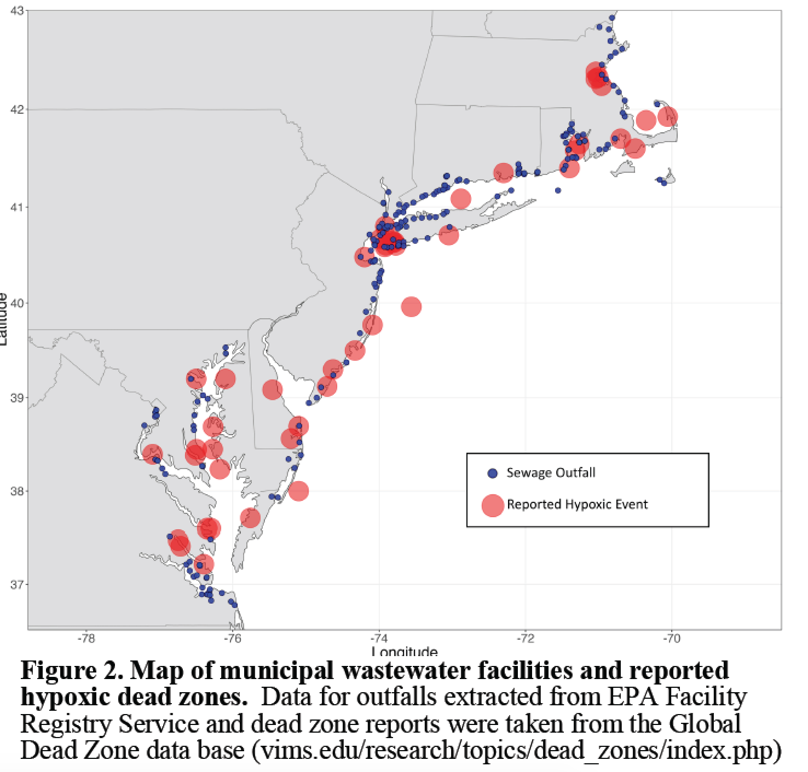

# RNASeq Analysis for Coastal Acidification, Sewage Effluent, and Multiple Stressors on Eastern Oyster Larvae -- [The Puritz Lab of Marine Evolutionary Ecology](http://www.marineevoeco.com/)

**The Rational Behind Studying Multiple Stressors**  

Over 50% of the population of the United States of America and over 60% of the population of
the world live in coastal areas (NOAA 2011; Vitousek 1997), and technological advances and
the rampant resource demands of growing human populations have led to massive alteration and
exploitation of coastal water ecosystems (USCOP 2004; POC 2003), particularly in areas with
higher human population densities (Halpern et al. 2008). Despite an overwhelming recognition
and focus on multiple stressors across the fields of marine science for the past 25 years, the
cumulative impact of multiple human stressors still remains relatively unknown (Crain et al.
2008, 2009, Griffen et al. 2016). Past reviews of the interactions and impacts of multiple stressors have failed to identify common patterns or unifying concepts across studies (Crain et al. 2008, Griffen et al. 2016). Griffen et al. (2016) suggest that this failure is due to most studies investigating multiples stressors focusing on “phenomenological” effects of multiple stressors (such as mortality or growth) without investigating the underlying mechanisms for these responses (such as protein expression or energy budgets).

_Coastal Acidification_  
For coastal and estuarine systems, atmospheric CO2 plays only a minor role in regulating overall pH dynamics (see Borgesa and Gypensb 2010, Provoost et al. 2010, Cai et al. 2011, Hofmann et al. 2011), and the most widespread driver of coastal carbonate chemistry is CO2 generated from microbial and macrofaunal respiration. Nutrient inputs from rivers and atmospheric deposition drive primary production which, in turn, stimulates respiration and acidification. The tight coupling between nutrient inputs and primary production makes the carbonate chemistry of coastal waters particularly sensitive to human activity. The anthropogenic acidification of coastal waters, or “coastal acidification” (CA) is driven largely by eutrophication, or excess nutrient loading.

_Sewage Effluent_  
One of the largest inputs of nutrients into coastal ecosystems is sewage effluent discharged from municipal wastewater treatment facilities. The sheer volume is staggering. For example, in Massachusetts, over 2.98 billion liters of treated sewage effluent enter local water ways (MIIC 2007) every dry day, with Massachusetts Water Resources Authority averaging 1.4 billion liters being discharged from the Deer Island Waste Water Treatment Plant daily. Narragansett Bay, RI has over 768 million liters discharged daily (Narragansett Bay Estuary Program 2017), and Long Island Sound has over 3.8 billion liters discharged everyday.

Recent work by Wallace et al. (2014) provided the first evidence that wastewater effluent from
sewage treatment plants is a point source of acidification in coastal and estuarine waters. The
authors found that estuarine water with in several kilometers of sewage outfall sites hat pCO2
levels near or above 1000 μatm, and found that surface
waters near sewage effluent had nearly the same low pH and high pCO2 levels commonly found
in bottoms waters during the summer and fall.

**Experimental Design and Treatments**

During the summer of 2017, exposure trials were conducted using larvae from the eastern oyster (_Crassostrea virginica_).  Wild adult broodstock were collected from Ipswich, MA and Barnstable, MA, and brought into the lab and conditioned for several weeks.  Oysters were spawned via thermal induction and eggs from 7 females were fertilized with sperm 11 males.  Larvae were kept in ambient, filtered sea water for 16 hours to ensure all embryos had developed to the trochophore larval stage.  After 16 hours, larvae were counted and approximately ~125,000 larvae were transferred to twelve 1 L glass mesocosms and four replicate 100,000 larvae subsamples were flash frozen.  Ambient water was adjusted to 100 mL and larvae were allowed to acclimate for 1 hour.  After acclimation, one of four treatments were randomly assigned to each mesocosm (4 per treatment): CON-Control conditions, CA- Coastal Acidification treatment of ~2800 µatm pCO2 sea water, SE- Sewage Effluent treatment of 5% volume to volume ratio of treated sewage effluent to sea water, CASE- Coastal Acidification and Sewage Effluent treatment of 5% volume to volume ratio of treated sewage effluent to sea water ~2800 µatm pCO2.

The larvae were then filtered out of their experimental bottles and flash frozen to preserve the DNA and RNA. For this project RNA extracted from 1 replicate block of CA, CON, SE, and CASE were prepped with the [KAPA Biosystems Stranded mRNA Seq kit](https://www.kapabiosystems.com/product-applications/products/next-generation-sequencing-2/rna-library-preparation-2/kapa-stranded-mrna-seq-kits/) and sequenced with one Full HiSeq lane from [Novogene](https://en.novogene.com/).
